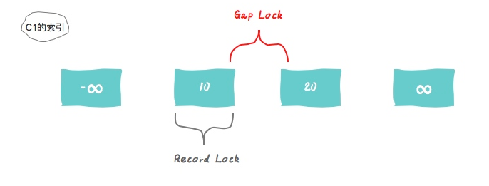
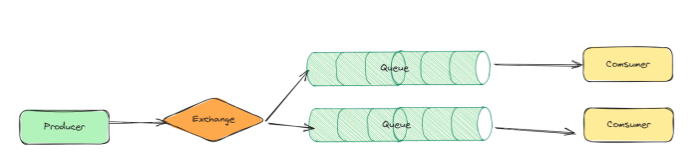
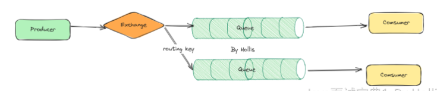

## Java

### 1、synchronized 和 reentrantLock区别？

1. 都是作用于线程间的同步控制。而且都是可重入锁。
2. synchronized 是 Java 内置的特性，是一个关键字。Lock 是 JUC 包中的工具类，通过代码实现。
3. synchronized 是自动获取 / 释放锁。Lock 需要手动的 lock 和 unlock。
4. synchronized 只有非公平锁。Lock 可以实现公平锁也可以实现非公平锁。
5. Lock 有响应中断、超时等待以及其他的特性。


### 2、如何理解 AQS？

1. 是抽象的队列同步器，是抽象类，因此是很多同步器的基础框架。如 ReentrantLock、CountDownLatch 和 Semaphore 都是基于 AQS 实现。
2. 在 AQS 内部，维护了一个队列（FIFO）和一个 volatile 的 int 类型的 state 变量。
    1. 在 state 为 1 时表示当前对象的锁已经被某个线程占有了。
    2. 队列中的每个结点表示一个线程，保存着线程的引用、当前结点的状态（是否有获取到对象锁）。
    3. 因此一条队列就是所有请求该临界资源的线程，一个对象锁对应一条队列。
    4. AQS 的目的在于多个线程竞争临界资源时，将暂时没有获取到锁的线程放到队列中进行阻塞等待，而被唤醒时进行锁的分配。
3. AQS 提供了两种锁的机制，共享锁（读锁）和排它锁（写锁）
    1. 如 ReentrantLock 的可重入就是 AQS 的排它锁功能。
    2. 如 CountDownLatch 和 Semaphore 使用到了 AQS 的共享锁功能。


### 3、AQS 是如何维护 CLH 队列的。

1. 公平锁：当前锁已经被其他线程持有时，新的线程会创建一个结点然后加入到 CLH 队列的尾部自旋等待，也就是按照请求锁的先后顺序加入队列。当锁释放时，会通知队列的下一个结点，这个节点在获取锁后，再通知下一个节点，以此类推。这样保证了队列中的线程按照 FIFO 的顺序逐个获取锁，实现公平性。
2. 非公平锁：与公平锁的区别时，如果一个线程还没有加入到 CLH 队列，第一次获取锁时，会与当前持有锁的线程同时竞争锁的拥有权。竞争的结果取决于具体实现的锁策略，可能是先到先得，也可能是其他策略。这意味着非公平锁不会强制等待线程按照它们进入等待队列的顺序获取锁。只有在竞争失败时，才会加入到 CLH 队尾。不一定遵循先到先得的原则。


### 4、synchronized 的锁升级过程是怎样的？

1. 无锁：当一个线程第一次访问临界资源时，JVM 在这个对象头中设置该线程的 ID，并将对象头的状态位设置为 “偏向”。
2. 偏向锁：只有一个线程访问临界资源时，该线程不需要同步操作。当有其他线程访问时，会检查对象头 “偏向锁” 状态和线程的 ID，如果相同则直接获取锁，如果不同则会升级为轻量锁状态。
3. 轻量级锁：在此状态时，JVM 将对象头中的标识设置为 “轻量级锁” 状态。当一个线程成功获取到对象锁时，会将对象头中的线程栈中存放自己的线程指针。此时如果有另一个线程想要获得对象锁，且对象处于 “轻量级锁” 状态时，会尝试使用 CAS 将对象头中的线程栈替换成自己的指针，如果成功则获得锁。如果失败则表示该锁已被其他线程获取，该锁状态会升级为重量级锁状态。
4. 重量级锁：在此状态时，JVM 在对象头中记录指向 CLH 队列的指针。当锁被释放时，根据规则从 CLH 队列中选择一个线程唤醒并获得锁，并将该线程的状态从 “等待” 置为 “就绪”。
5. 锁升级是线程竞争逐渐变多时，对象标识不断更改并使获取锁的难度不断增加的过程。
6. 其中，AQS 管理的是重量级锁，因为涉及到线程的阻塞和唤醒操作。


### 5、讲一下 JMM 内存模型。

1. JMM 为了屏蔽各种硬件和操作系统的访问差异，保证 Java 程序在各种平台下对内存的访问都能保持效果一致的规范和机制。
2. JMM 规定了所有的变量都存储在主内存中，每条线程有自己的工作内存，线程的工作内存中保存了该线程中使用到的变量的主内存副本的拷贝。线程对变量的操作都必须在自己的工作内存中进行，而不能直接读写主内存。不同线程之间无法直接访问对方的工作内存，需要主内存当桥梁。
3. 如果没有 Volatile 的修饰，变量刷回主内存的情况
    1. 线程退出临界资源时，会将工作内存中所有修改过的变量值刷新回主内存。
    2. 线程进入临界资源时，会先清空工作内存中的共享变量值，从主内存中读取最新的变量值。


### 6、实现多线程的方式有哪些？

1. 继承 Thread 类创建线程。
2. 实现 Runnable 接口创建线程。
3. 通过 Callable 和 FutureTask 创建线程。
4. 通过线程池创建线程。
5. Callable 可以使用本身的 `call()` 方法来获取返回值，但是并不灵活。如果直接调用 `call()`，则相当于一次同步调用，并且阻塞在当前位置
6. FutureTask 是 Future 接口的一个实现，通常使用 Future 来管理异步任务，比如通过线程池执行异步任务时，可以使用 Future 接收该任务：`Future<Integer> future = executorService.submit(callable);` ，并在需要返回值时进行 get 即可，也可以查询该任务的状态是否已经完成。
7. 因此需要与 FutureTask 需要配合使用，`Future<String> future = new FutureTask<>(callable);`


### 7、在线程池中，怎么把执行时间不一致的线程按照规定的顺序执行？（多线程编排问题）

1. 首先需要使用 Future 接口的实现类 CompletableFuture 去实现该功能。
2. CompletableFuture 可以通过 `supplyAsync()` 创建异步任务，并使用 `thenApply()` 在得到上一个异步任务的结果之后执行下一步的操作，也可以通过 `get()` 直接获取该异步任务的结果，或者使用 `handle()` 处理发生的异常。更复杂的还有 `thenCombine()` 等组合多个异步任务的结果。
3. 可以指定自定义的线程池，如果不指定，则会使用默认的 ForkJoinPool 线程池。


### 8、ConcurrentHashMap 是如何保证线程安全的？

1. 使用分段锁 + CAS + synchronized 的机制来保证线程安全。
2. 当 ConcurrentHashMap 在添加或删除元素时，首先使用 CAS 来尝试修改元素，如果 CAS 操作失败，就会使用 synchronized 锁住当前的哈希槽，然后再次尝试修改或删除元素。
3. 使用 synchronized 时使用了分段机制，只是锁住了当前的哈希槽，并非整个集合，降低了锁的颗粒度。
4. 而且 ConcurrentHashMap 不允许有 key 或 value 为 null 的情况。如果使用 `map.get(key)` 返回了 null 值，是不明确本来就存了一个 null 值进去还是因为没有找到而返回了 null，存在二义性。
5. HashMap 在单线程下是不存在这个问题的，所以 HashMap 允许 key 或 value 为 null 的情况。虽然 key 不存在时也会返回 null 有二义性的存在，但在单线程下是可以容忍二义性的。是因为 HashMap 可以用 map.contains(key) 来检测到底是存的 null 还是没有找到而返回的 null。而在多线程情况下使用 map.contains(key) 是不可靠的，可能在检测过程中被其他线程修改。
6. JDK8 版本中，使用了节点锁的方法，即 CAS + Synchronized，且锁的颗粒度更小，在使用容器时，会对某个节点进行阻塞处理，而不是全部的分段


### 9、ThreadLocal 了解吗？发生内存泄漏的原因？

1. `ThreadLocal` 实例通过 `ThreadLocalMap` 对象与当前线程建立关联的底层结构：`<Thread, Entry<ThreadLocal, Object>>`。即每一个线程有独立的 Entry，这个 Entry 中以 ThreadLocal 实例对象为 key，该 ThreadLocal 实例对象中存放的值为 value。（其中 `Entry<ThreadLocal, Object>` 称为 `ThreadLocalMap`，因此实际上数据存放在 ThreadLocalMap 中）
2. 其中 ThreadLocal 对象有两处引用：
    1. 在栈内存中，使用 ThreadLocal 对象方法时，对 ThreadLocal 的引用。（强引用）
    2. 在堆内存中，ThreadLocalMap 中的 key 对 ThreadLocal 的引用。（弱引用）
3. 发生 OOM 的两个原因：
    1. 当栈内存中的 ThreadLocal 引用不再使用，也就是方法结束后这个对象引用就不存在了，但因为还存在着一条引用链导致无法 GC，也就可能导致 OOM。因此设计时采用了弱引用，即这个对象只具有弱引用时，就会被 GC，防止 OOM。
    2. 但要注意另一个 OOM 的点是：key 虽然是 ThreadLocal 弱引用，可以被 GC，但值是强引用的，会存在 ThreadLocal 被 GC 了，但是 value 依然存在，然后导致 OOM。因此需要每次使用完 ThreadLocal 后，手动调用一下 remove，就会在下一次 GC 时，清理掉失效过期的 Entry。（当然，每次调用 ThreadLocal 的 get、set 时也会清理，但最好还是手动 remove 一下）
4. 在配合线程池使用时，更需要注意清理 ThreadLocal 内的数据。因为线程池的线程是复用的，而且在 ThreadLocal 中，一个线程对应自己的 Entry。如果上一个线程使用完之后没有清理 ThreadLocal，那么再次使用这个线程时，就会出现数据错乱的情况，仍然具有上一个线程所具有的数据。因此需要及时清理，也可以预防 OOM 的问题。


### 10、自旋锁和阻塞锁的区别

1. 自旋锁和阻塞锁同样都会让没有获取到锁的当前线程进行阻塞等待，但二者等待的方式区别很大
    1. 阻塞锁会让线程放弃 CPU 的执行时间，进入等待区，等待被唤醒。如果要阻塞或者唤醒一个线程需要系统从用户态转变为内核态，因此进行上下文的切换需要很多的处理器时间。
    2. 而自旋锁只是让线程不停的执行循环体，会一直持有 CPU 的执行权，不改变线程的状态，因此响应速度更快。
2. 但是线程数量增加时，每个线程都需要 CPU 进行自旋，占用 CPU，此时性能会急剧下降。因此如果线程竞争不激烈，并且保持较短的自旋时间，使用自旋锁是比较合适的。


### 11、volatile 关键字

1. 作用
    1. 禁止指令重排序：指令重排序在单线程下可以优化执行速度，但在多线程场景下线程执行的乱序可能会导致各种问题，如双端检索单例模式中，如果不禁止指令重排序，可能会因为重排序导致已经给对象分配了空间但是没有初始化对象，就让其他线程返回了未初始化的对象，出现空指针异常
    2. 可见性：一个变量被 volatile 修饰的话，在每次数据变化之后，其值都会被强制刷入主内存，其他线程会将该值刷入自己的线程内存中，因此保证了一个 volatile 变量在并发过程中，其值是在多个线程中可见的
    3. 非原子性：因为不像 synchronized 一样有加锁机制，因此修饰的变量可能会被多个线程同时进行修改
2. 场景
    1. 性能会比 synchronized 好，修饰的变量可以直接刷会主内存让其他线程可见，是非阻塞性质的。
    2. 但是只能修饰变量，不能修饰方法或代码块，因此常在多线程场景下修饰需要被多个线程访问的变量
    3. 没有做原子性的处理，但是原子类已经被 volatile 修饰，因此原子类会比简单的 volatile 修饰更适用于复合操作或复杂对象内部状态的线程安全
    4. volatile 适用于单次读或写共享变量的场景（如某个 bool 类型状态的变更）或双端检索中禁止重排序，复杂的多线程操作应使用原子类或 synchronized 锁机制来完善。因此使用 volatile 只是**个别场景**提升性能


## JVM

### 1、Java 的堆内存是如何分代的

1. 堆内存分代是将不同生命周期的堆内存对象存储在不同的堆内存区域中，不同的堆内存区域定义为“代”，目的是提升垃圾回收的效率，因为这样的话就可以为不同的“代”区域设置不同的回收策略，因此是根据对象的不同生命周期对应不同的 GC 回收策略处理
2. 区域划分
    1. 新生代（存放新分配的对象，约占总堆内存的 1/3）
        1. Eden 区（80%）
            1. 很多对象会出现在 Eden 区，当 Eden 区的内存容量用完时，会发起 GC，非存活对象会标记为死亡，存活的对象会被转移到 Survivor 区
        2. Survivor 区（20%）
            1. From Survivor 区（10%）
            2. To Survivor 区（10%）
            3. 如果 Survivor 区也被用完，那么存活对象会被移动到老年代
        3. 一般来讲，新生代的 Eden 区和 Survivor 区的大小比例是 8:2，也可以通过 -XX:SurvivorRatio 调整
    2. 老年代（存放长期存在的对象，约占总堆内存的 2/3）
        1. 该区域内的对象是存活时间最长的，只有单一的 Tenured 区，并且是经历若干轮 GC 但仍存活的对象移动而来
        2. 因为该区域内的对象存活了很久，因此 GC 回收他们会很慢


### 2、堆内存中对象的分代晋升

1. 对象在新生代进行分配，首先会尝试在 Eden 区分配对象，当 Eden 区耗尽，无法满足新对象分配请求时，将触发新生代的 GC（Young GC、Minor GC），在新生代 GC 过程中，没有被回收的对象会从 Eden 区搬运到 Survivor 区，该过程就是晋升
2. 同样，对象也会晋升到老年代，触发条件主要看对象的年龄和大小，三个条件满足其一即可
    1. -XX:MaxTenuringThreshold 参数：设置对象躲过多少次回收之后即可搬运到老年代，每次回收后，存活对象的年龄 +1，累积到15 岁（JVM 默认），就会认为该对象是经常使用的对象，就没必要在新生代了
    2. 动态年龄判断：如果在 Survivor 空间小于等于某个年龄所有对象大小的总和大于 Survivor 区空间的一半时，那么就把大于等于这个年龄的对象都晋升到老年代
    3. -XX:PretenureSizeThreshold 参数：设置大对象的临界值，大于该值就认为对象是大对象，直接进入老年代（JVM 参数默认是 0，因此默认情况下对象不会提前进入老年代，需要在新生代分配，然后根据回收次数和动态年龄判断来进入老年代）


### 3、Young GC 和 Full GC 的触发条件

1. Young GC
    1. 年轻代中的 Eden 区分配满时会触发回收
2. Full GC
    1. 老年代空间不足
        1. 创建一个超过指定阈值的大对象直接分配到老年代时，发现老年代空间不足，会触发 Full GC
        2. Young GC 之后，发现要移到老年代的对象，且老年代存放不下时，会触发 Full GC
    2. 空间分配担保失败
        1. 准备要触发一次 Young GC 时，会进行空间分配担保，在担保过程中，虚拟机会检查老年代最大可用的连续空间小于新生代所有对象的总空间时
            1. 且 HandlePromotionFailure=false，会触发一次 Full GC
            2. 且 HandlePromotionFailure=true，继续检查发现老年代最大可用连续空间小于历次晋升到老年代的对象平均大小时，会触发一次 Full GC
    3. 代码中显式执行 System.gc()
        1. 会触发 Full GC，但不保证会立即触发


### 4、STW 机制

1. Stop-The-World 机制，是在执行垃圾收集算法时，Java 应用程序其他所有线程都会被挂起，出现的一种全局停顿现象，所有的 Java 代码停止执行，native 代码可执行但不能与 JVM 交互
2. 不管采用哪种 GC 算法，STW 是不可避免的，只能尽可能降低 STW 的时长
3. STW 机制不可缺少
    1. 如果用户不停止线程，就意味着期间不断有垃圾产生，永远也清理不干净
    2. 用户线程的运行必然导致对象引用关系发生变化，就会导致漏标和多标的现象
        1. 多标：该对象原先应该是被回收的对象，但是被错误标记成了存活对象，从而导致该对象没有被回收掉。需要额外一次 GC 才能清理
        2. 漏标：一个对象本应是存活对象，但是没有被正确标记为存活，导致被错误的回收掉了


### 5、JVM 垃圾回收算法

1. 标记 - 清除
    1. JVM 识别出内存中的垃圾之后，直接将其清除，但是会导致内存空间不连续，产生很多的内存碎片。优点是速度快，不需要移动和复制对象
2. 标记 - 复制
    1. 将内存划分成两个区域，新创建的对象都放在其中一块内存上面，当快满时，就标记出存活的对象然后复制到另一块内存上
    2. 在复制移动时，内存空间是严格排序且连续的，因此不会产生内存碎片。复制移动后，另一块内存又腾空变成空闲内存，依次循环执行
    3. 内存空间连续，不会出现内存碎片，但是会浪费一半的内存空间，且复制对象会造成性能上的损耗
3. 标记 - 整理
    1. 标记阶段
        1. 遍历 GC Roots，然后将存活的对象标记
    2. 整理阶段
        1. 移动所有存活的对象，且按照内存地址依次排列，然后将末端的内存地址以后的内存全部回收
    3. 优点是不会浪费空间且不会产生内存碎片，但是性能很低，耗费很多时间


### 6、新生代和老年代的 GC 算法

1. 新生代
    1. 新生代的 GC 次数要比老年代高很多，因此要求算法效率要高且不能产生内存碎片，因为很多对象都是在新生代分配，碎片太多的话会导致很多对象无法正常分配
    2. 新生代选择的是标记 - 复制算法，该算法会浪费内存空间，因此新生代将区域进一步划分成了一个 Eden 区和两个 Survivor 区，同时工作的只有一个 Eden 区和一个 Survivor 区，另一个 Survivor 区只用来复制存活的对象
    3. 只需要调整 Eden 区和 Survivor 区的比例就可以降低空间浪费的问题
2. 老年代
    1. 标记 - 整理算法，虽然效率低，但是可以减少空间浪费并且没有内存碎片的问题
    2. 在有些回收器上，如 CMS，为了降低 STW 的时间，也会采用标记 - 清除算法


### 7、垃圾回收器

1. 串行垃圾收集器
    1. Serial GC
        1. 单线程串行垃圾回收器，采用标记-复制算法进行垃圾回收
        2. 单线程好处是能减少上下文的切换，减少系统资源的开销
        3. 但在 GC 过程中，会暂停其他所有线程的工作（STW），直到 Serial GC 收集器收集结束为止
    2. Serial Old GC
        1. 是 Serial GC 的老年代版本，适用于老年代，唯一的区别是使用标记-整理算法
2. 并行垃圾收集器
    1. ParNew GC
        1. Serial GC 的多线程版本，参数与回收算法与单线程版本一致，即标记-复制算法
        2. 依然会有 STW 现象，但因为是多线程并行进行垃圾回收，所以会比单线程版本性能好一点
    2. Parallel Scavenge GC
        1. 新生代垃圾处理器，多线程执行，标记-复制算法
        2. 与 ParNew GC 不同的是，该收集器更关注垃圾回收的吞吐量，以吞吐量优先
        3. 高吞吐量可以最高效率的利用 CPU 时间，尽快的完成程序的计算任务，所以适合在后台运算
    3. Parallel Old GC
        1. 是 Parallel Scavenge GC 的老年代版本，区别是使用标记-整理算法，同样是关注高吞吐量的收集器
    4. CMS（Concurrent Mark Sweep）
        1. 老年代收集器，与 Parallel 的区别是更加关注垃圾回收的停顿时间，采用耗时更短的标记-清除算法
        2. 工作流程
            1. 初始标记：标记所有从 GCRoot 直接可达的对象，会 STW，但由于只标记直接可达对象，因此这个阶段通常会很快，STW 时间也会比较短
            2. 并发标记：从初始阶段标记的对象出发，遍历整个对象图，标记所有可达对象。在此阶段，GC 线程与应用线程同时运行，不需要 STW
            3. 重新标记：为了修正并发标记期间因为应用线程继续运行而产生的更改，这是另一个 STW 的阶段
            4. 并发清理：GC 线程清理不可达的对象，并回收它们占用的内存空间，这个阶段与应用程序并发执行，不需要 STW
        3. 优点：高并发、低停顿
        4. 缺点
            1. 在并发阶段不会导致用户线程停顿，但仍会占据一部分的 CPU 使用户线程执行变慢
            2. 无法处理多标的垃圾，因为在多线程时，用户线程执行也会产生垃圾，该部分的垃圾只能由下次 GC 清理
            3. 标记-清理算法会产生大量的内存碎片，当碎片过多时，会出现老年代有很大的空闲区域但没有连续的空闲区域而导致无法分配大对象，不得不提前触发一次 Full GC 进行内存整理，且内存整理的过程是无法并发的


### 8、G1 全局垃圾回收器

1. JDK8 可用但非默认，JDK9 为默认回收器，是 CMS 的改进版，解决了 CMS 内存碎片的问题，可以提高系统吞吐量、降低停顿频率、并有效管理大型堆
2. 优势：
    1. 并发回收：G1 能充分利用多核 CPU 硬件优势，使用多个核心缩短 STW 的时间，部分需要停顿线程的 GC 动作，G1 仍然可以通过并发的方式让应用线程继续执行
    2. 分代收集：G1 可以独立管理整个堆而不需要其他收集器配合，但仍有分代的概念，能采用不同的方式去处理新创建和存活了一段时间的对象以获取更好的收集效果，G1 可以根据新生代和老年代的不同自行管理
    3. 空间整合：G1 使用了独立区域的概念，整体来看使用了标记-整理算法，但从局部上来看使用了标记-复制算法实现，因此 G1 运行期间不会产生内存碎片
    4. 可预测的停顿：G1 能建立可预测的停顿模型，能让使用者明确指定一个长度为 M 毫秒的时间段内，消耗在垃圾收集上的时间不超过 N 毫秒
    5. 支持热插拔：G1 可以在运行时动态调整堆的大小，以适应不同的内存需求
3. 适用场景：
    1. 大型内存环境：G1 对大内存环境进行了优化，超过 4G 的应用适合选择
    2. 对应用程序响应敏感的场景：G1 通过多线程分配来进行垃圾回收，以最大限度的减少回收时应用程序的暂停时间
    3. 对内存使用效率敏感的场景：G1 可以更好的评估哪些内存可以释放，以此来提高内存的利用率
    4. 动态内存需求的场景：G1 支持热插拔，可以在运行时动态调整堆大小，以适应不同的内存需求
    5. 要求回收时间具有可观测性的场景：G1 使用固定的内存分配块来管理内存，这样使得在回收时间上具有更高的可观测性
4. 与其他收集器最大的变化：G1 将整个堆空间划分为多个大小相等的独立区域，虽然保留了新生代和老年代的概念，但二者不再有物理隔离，而是变成了一部分区域的集合


### 9、强、软、弱、虚引用

1. 四个引用的是用于管理对象生命周期的不同类型的引用，主要作用是帮助 GC 决定何时回收对象，以便更高效的管理内存，按照顺序，引用的强度越来越弱

2. 强引用

    1. 是 Java 的默认引用形式，如果一个对象具有强引用，那 GC 决不会回收它，当内存空间不足时，JVM 会抛出 OOM 错误使异常程序终止也不会随意回收具有强引用的对象来解决内存不足的问题

3. 软引用

    1. 是一种相对弱的引用类型，使用 SoftReference 来创建对象，如 `SoftReference<Object> foo = new SoftReference<>()` 
    2. 当内存不足时，GC 会优先回收软引用指向的对象来释放内存。软引用在内存充足时可以保留对象以提高性能，相当于一种缓存机制，内存不足时能自动回收缓存避免 OOM

4. 弱引用

    1. 被弱引用指向的对象只能存活到下一次 GC 之前，使用 WeakReference 来创建对象，如 `WeakReference<Object> foo = new WeakReference<>()`

    2. 如果一个对象只有弱引用，即使系统内存充足，GC 也会立即回收，为了避免内存泄露，在 ThreadLocal 中用到了弱引用

    3. JDK 自带的一种弱引用类型实现的 HashMap —— WeakHashMap 中的键值对 Entry 的 Key 就是弱引用，创建用户变量 Key 为默认的强引用，传入的 Key 会被包装成弱引用类型，value 依然是强引用，当将 key 置为 null 移除强引用（也就是用户变量 Key 置为 null），就只剩下 Entry 中的 Key 弱引用，也就是该键值对的 Key 会被回收，而变成无效键值对，此时 WeakHashMap 则会清理无效的键值对（非 GC 清理）

    4. JDK 自带的一种弱引用类型实现的 HashMap —— WeakHashMap 中的键值对 Entry 中 Key 就是弱引用

        1. ```java
            String foo = new String();// 创建用户变量，默认为强引用
            WeakHashMap<Object, String> weakMap = new WeakHashMap<>();// 创建 WeakHashMap
            weakMap.put(foo, "value");// 建立一个 Entry 键值对，foo 传入 map 时，会处理成弱引用，因此 foo 这个变量现在有两个引用：一个是创建的用户变量强引用，一个是在 Entry 键值对中作为 key 的使用（弱引用）
            
            foo = null;// 用户变量置为 null，就移除了唯一一个强引用。
            // GC 时就会将 Entry 中的 key（也就是对 foo 的弱引用）回收，此时该键值对只剩下了 value，变成了没有 key 的 Entry。
            // WeakHashMap 在后续的 get、put、size 操作时，会清理掉无关联（无 key）的 Entry 键值对，而不是 GC 回收 Entry
            weakMap.size();// 会输出 0，经过上述的分析，唯一 put 进去的 Entry 键值对已被回收
            
            // 如果 value 是弱引用，会导致使用时 value 已经被回收为 null 的情况，因此 key 弱引用时，只要 key 有效，那么 value 是可以访问到的
            ```

5. 虚引用

    1. 虚引用的存在不会影响对象的生命周期，GC 时不会考虑虚引用，因此主要用于跟踪对象被回收的状态，并在对象被回收后进行一些后续的处理（如清理本地资源等）


### 10、GC 的正常频率

1. 正常情况，FullGC 次数一天不超过一次
2. 业务高峰期，FullGC 次数约两小时一次
3. FullGC 耗时 400ms - 700ms，不超过 1 秒钟
4. YoungGC 次数 100+/分钟，耗时约 20ms
5. 堆内存利用率持续在 50% 以下


### 11、Tomcat 服务器部署的后端应用 JVM 参数示例

```properties
-Djava.util.logging.config.file=/usr/local/tomcat/conf/logging.properties, 

-Djava.util.logging.manager=org.apache.juli.ClassLoaderLogManager,

-Duser.timezone=GMT+08,

-Xms6720m,

-Xmx6720m,

-XX:+UseContainerSupport,

-XX:NewSize=1792m,

-XX:MaxNewSize=1792m,

-XX:MaxDirectMemorySize=448m,

-XX:MetaspaceSize=224m,

-XX:MaxMetaspaceSize=448m,

-XX:+UseParNewGC,

-XX:+UseCMSInitiatingOccupancyOnly,

-XX:+UseGCLogFileRotation,

-XX:NumberOfGCLogFiles=10,

-XX:GCLogFileSize=1024M,

-XX:+ExplicitGCInvokesConcurrent,

-XX:-UseGCOverheadLimit,

-XX:+UseConcMarkSweepGC,

-XX:CMSInitiatingOccupancyFraction=65,

-XX:CMSFullGCsBeforeCompaction=2,

-XX:+PrintGCDetails,

-XX:+PrintGCTimeStamps,

-XX:+PrintGCDateStamps,

-javaagent:/usr/local/apm_agent/apm.agent.bootstrap.jar,

-Xloggc:/data/logs/skynet-tcwireless.java.member.center.job/tcwireless.java.member.center.job_gc.log,

-Dapm.applicationName=tcwireless.java.member.center.job,

-Dapm.agentId=10.206.106.237-127af09,

-Dapm.env=product,

-Djava.endorsed.dirs=/usr/local/tomcat/endorsed,

-Dcatalina.base=/usr/local/tomcat,

-Dcatalina.home=/usr/local/tomcat,

-Djava.io.tmpdir=/usr/local/tomcat/temp
```

1. `-Djava.util.logging.config.file=/usr/local/tomcat/conf/logging.properties`

    1. 作用：指定 JVM 使用 Tomcat 的日志配置文件路径
    2. 原因：在配置文件中可以设置 Tomcat 服务器输出的日志格式、级别和输出目标，确保日志符合生产环境的要求（如按日滚动存储）
    3. 替代参数：使用 Log4j2 日志管理系统时，可以设置为 -Dlog4j.configurationFile=配置文件路径

2. `-Djava.util.logging.manager=org.apache.juli.ClassLoaderLogManager`

    1. 作用：启用 Tomcat 自定义的日志管理器（支持每个 WebApp 独立日志）
    2. 原因：避免类加载器冲突，适应 Tomcat 多应用部署

3. `-Duser.timezone=GMT+08`

    1. 作用：强制设置 JVM 时区为东八区
    2. 原因：解决容器内时区不一致导致的日志时间错误，也是 new Date() 时的取值参数，默认 UTC 可能会与预期显示的不符
    3. 替代参数：使用挂载的宿主机的时间文件 /etc/localtime

4. **`-Xms6720m（值设置存在调优空间）`**

    1. 作用：设置 JVM 堆内存初始大小，也是 JVM 启动时立即向操作系统申请的内存量

    2. 原因：

        1. 避免堆扩容停顿：
            1. JVM 启动后，如果需要更多堆内存，会触发扩容机制，扩容过程需要暂停应用线程（GC 的 STW 机制）来分配和可能的内存布局调整。生产环境追求低延迟或稳定吞吐量的应用，一般将-Xms跟-Xmx设置相同的值，避免运行时堆扩容带来的停顿
        2. 提高启动性能：
            1. 虽然申请大内存本身耗时，但避免了后续多次小额扩容操作带来的其他开销（如 GC 停顿、系统调用），对于需要快速达到稳定性能的应用可以设置较大的初始堆
        3. 内存预算利用：
            1. 物理服务器或容器通常有固定的内存配额，如果应用启动后很快使用接近最大堆的内存，那么一开始就是申请到最大堆可以确保内存立即可用，并允许操作系统更早的进行内存优化
        4. 固定大小堆配置策略：
            1. 简化了内存管理，消除了堆大小波动带来的不确定性

    3. 替代参数：

        1. 设置更小的初始堆参数：
            1. 可以节省资源，因为申请内存不多，启动内存需求不高，因此启动速度快，适用于开发环境或测试环境这种对偶尔停顿不敏感、内存受限的环境（如低配服务器、低配容器）
        2. 完全不设置：
            1. 有默认值，但很小，会导致频繁扩容和 GC
        3. 大小堆设置不同：
            1. 根据应用的冷启动内存需求和稳定运行内存需求来设置，如 `-Xms2048m -Xmx6720m`。应用启动后，堆会在 2GB 到 6.56GB 之间自动伸缩。这平衡了启动资源占用和避免频繁扩容的需求。
        4. 基于容器内存限制自动计算
            1. 结合 `-XX:+UseContainerSupport`，JVM 可以自动根据容器（如 Docker）设置的内存限制 (`-m`) 来计算一个合适的初始堆大小（通常是容器内存限制的一部分）。但显式设置 `-Xms` 和 `-Xmx` 仍然是更精确控制的首选。

    4. 初始堆内存的值是怎么确定的（以 8G 内存容器为例）

        1. 容器总内存限制
            1. 假设容器启动时设置了 -m 8192m（8GB），这是容器可使用的最大内存上限
        2. 扣除关键的非堆内存
            1. 元空间 ：由 `-XX:MetaspaceSize=224m` 和 `-XX:MaxMetaspaceSize=448m` 控制。按最大值 `448m` 预留。
            2. 直接内存：由 `-XX:MaxDirectMemorySize=448m` 限制。按 `448m` 预留。
            3. JVM自身开销：JIT 编译缓存、GC 数据结构、本地库等，通常预留 `200-500m`。取 `300m` 估算
            4. 线程栈：每个线程约 `1MB`（默认 `-Xss1m`）。假设应用有 `200` 个线程，预留 `200m`。
                1. 注：该线程是 OS 层面的物理资源，非线程池中的应用线程，可以通过 jstck 或 Linux 的命令查看峰值时刻的活跃线程数，如总线程数 ≈ Tomcat maxThreads + 最大连接池大小 + GC 线程数 + 其他框架线程
            5. 非堆小计：`448m (MetaspaceMax) + 448m (DirectMem) + 200m (Threads) + 300m (JVM Overhead) ≈ 1396m`
        3. 扣除操作系统/其他进程开销
            1. 容器内可能运行监控 agent、日志采集器等小进程，加上 OS 内核开销。预留 `200-400m`。取 `300m`。
        4. 计算可用堆内存
            1. 可用堆内存 ≈ 容器总内存 - 非堆内存 - OS/其他开销
            2. `8192m - 1396m - 300m = 6496m ≈ 6496m`
            3. 因此 JVM 设置的堆内存约为 6496，可以适当缩小放大，但相应的会压缩和释放其他非堆内存的空间

    5. 内存分配过多被 Linux OOM Killer 终止 JVM 应用

        1. 容器内通常不只有 JVM 应用，当容器内的所有应用存在内存泄露或其他情况超过容器限定内存时，Linux 内核会调用 OOM Killer 终止内存消耗最多的程序，而容器内消耗最多的肯定是 JVM 应用，所以会被 shut down
        2. JVM 自己不会报 OOM Error，只在堆/元空间/直接内存达到 JVM 自设上限时抛出，因为内存泄露等情况是应用之外的情况，JVM 并不知情
        3. 因此 JVM 应用申请内存过多可能会压缩其他应用的内存，其实与 JVM 本身无关，关键在于要预留足够缓冲的内存

    6. GC 行为与堆大小设置的关系

        1. 堆大小 (`-Xms`/`-Xmx`) 直接影响垃圾收集的频率、时长和模式

        2. GC 频率

            1. 堆越大，对象填满堆的速度越慢，Young GC、Full GC 间隔就越长，反之堆空间会更快的被填满，触发更频繁的 GC

        3. 单次 GC 停顿时间（STW）

            1. 堆越大，需要扫描、移动的对象就更多，特别是 Full GC，但并发类型的收集器和 G1 受影响较小，反之每次处理的存活对象集更小

        4. 分代比例设置的影响

            1. 由参数得知：

                1. ```bash
                    -XX:NewSize=1792m      # 新生代初始大小
                    -XX:MaxNewSize=1792m   # 新生代最大大小
                    -Xmx6720m              # 堆最大 = 6720m
                    ```

            2. 新生代比例 = 1792m / 6720m ≈ 26.7%（通常建议 30%~50%，这里偏低）

            3. Young GC

                1. 若新生代过小 → 对象更快填满 Eden 区 → Young GC 频繁，但每次停顿短。
                2. 若新生代过大 → Young GC 间隔长，但单次需处理对象多 → 停顿时间可能增加。

            4. Full GC

                1. 新生代过小会导致存活对象大小 > Survivor 区容量，根据规则直接晋升到老年代，也就意味着部分存活对象年龄未到阈值，而因为 Survivor 区溢出造成了过早晋升到老年代
                2. 结合  `-XX:CMSInitiatingOccupancyFraction=65` 参数可知当老年代占用 ≥65% 时触发 CMS GC，若老年代过快填满（因晋升过多），会频繁触发 CMS，甚至退化为 Full GC

5. **`-Xmx6720m`**

    1. 作用：设置 JVM 堆内存的最大大小为 6720 MB (约 6.56 GB)。这是 JVM 堆内存可以增长到的上限
    2. 原因：
        1. 资源限制与稳定性：生产环境为了追求稳定性和可预测性，避免了运行时堆调整带来的停顿
        2. 内存容量规划：分析应用在高峰流量、大数据处理或长时间运行后的老年代稳定占用值和堆峰值使用量
        3. 防止堆自动扩容风险： 如果 -Xmx 设置过大（远超实际需求），虽然不会立即占用物理内存（按需提交），但存在风险
            1. 掩盖内存泄漏： 应用即使存在缓慢的内存泄漏，也可能因堆空间充足而长时间不触发 OOM，导致问题在后期爆发
            2. Full GC 停顿更长： 如果堆过大且发生 Full GC（尤其是 Serial Old / Parallel Old），STW 停顿时间会显著增加
            3. 碎片化问题加剧： 对于 CMS 这类不压缩的收集器，大堆更容易产生内存碎片，增加晋升失败风险
    3. 替代参数：
        1. 设置更大或更小的 -Xmx 与设置 -Xms 原理相同，通常影响扩容时的性能波动、内存空间不足时 GC 停顿
        2. 基于容器限制自动设置： 结合 -XX:+UseContainerSupport 和 -XX:MaxRAMPercentage (如 -XX:MaxRAMPercentage=75.0)，JVM 会根据容器内存限制自动计算 -Xmx (例如容器 8GB * 75% = 6GB)。这提供了灵活性，但不如显式设置精确可控
    4. 合理的最大堆限制空间值是严谨计算和监控验证的结果，目标是：
        1. 满足应用峰值内存需求 + 安全缓冲
        2. 避免不必要的内存浪费
        3. 防止因堆过大导致 GC 停顿过长或碎片化加剧
        4. 确保在容器限制内安全运行，规避 OOM Killer

6. `-XX:+UseContainerSupport`

    1. 作用：启用 JVM 对容器化环境（如 Docker/Kubernetes）的内存和 CPU 资源限制的自动感知，主要用在容器化部署场景
    2. 原因：
        1. 历史问题：
            1. 旧版 JVM 在容器中运行时，内存限制识别错误，如 容器限制 `-m 8GB`，但 JVM 仍读取宿主机物理内存（如 64GB） 计算默认堆大小，导致`-Xmx` 默认值可能高达宿主机内存的1/4（16GB）→ 严重超容器限制 → 被 OOM Killer 杀死
        2. 开启 JVM 对容器的感知机制：
            1. JVM 会正确读取到容器的内存限制和 CPU 配额，而非错误读取到宿主机的内存和 CPU 核心数
    3. 替代参数：
        1. 不设置参数：
            1. 极度危险，可能导致 JVM 误判导致堆过大突破容器限制被 Linux 终止进程、导致 JVM 误判核心数过多而实际核心数只有容器限制导致 CPU 资源争抢造成应用卡顿
        2. JDK10+ 会默认添加该参数
    4. 容器化部署时申请内存超限问题：
        1. JVM 启动时，根据 -Xms 申请的初始堆大小逐步扩容逐步超限，当堆扩容达到容器限制点时，Linux 内核会拒绝超限对 OS 申请更多的物理内存，并调用 OOM Killer 杀死得分最高的进程。因此容器设置的最大内存只是一个标尺，当 JVM 向 OS 申请物理内存超过这个标尺时，实际是 Linux 内核进行处理
    5. 非容器化环境部署时该参数的有效性问题：
        1. JVM 不依赖环境变量，而是直接读取 Linux 系统中 cgroup 文件系统中的内存限制值，该值合法且小于物理内存时，视为当前环境为容器
        2. JVM 检查挂载点（cgroup）并验证该值的有效性，从而进行判断是宿主机还是容器
        3. 如果 JVM 启动时识别到当前环境不是容器，会静默跳过该参数，回退到宿主机的资源检测，自动适配宿主机资源。因此无论是否容器环境，都可以添加该参数以确保容器和非容器环境下的行为一致性，且无需写两套配置参数

7. `-XX:NewSize=1792m`

    1. 作用：设置 JVM 堆内存中新生代的初始大小为 1792 MB (约 1.75 GB)。这是 JVM 启动时分配给新生代的内存。
    2. 原因：
        1. 启动优化：应用启动初期通常会创建大量短期对象（类加载、初始化缓存等）。较大的初始新生代可以减少启动期间的 Young GC 频率，加速启动过程。
        2. 性能预热：避免应用在初始阶段因新生代过小而频繁触发 Young GC，影响服务预热期的性能稳定性
        3. 与 -XX:MaxNewSize=1792m 配合： 这两个参数值相同，意味着新生代大小固定为 1792m，与堆的固定策略 (-Xms=-Xmx) 一致，追求运行时无伸缩停顿。
    3. 替代参数：
        1. 仅设置 `-Xmn`：`-Xmn1792m` 等价于同时设置 `-XX:NewSize=1792m -XX:MaxNewSize=1792m`。代码更简洁，但功能相同。
        2. 设置动态新生代（不推荐用于 CMS）： 不显式设置 `NewSize/MaxNewSize`，允许 JVM 根据 `-XX:NewRatio`（默认值 2，即新生代:老年代=1:2）自动调整新生代大小。但在固定堆中追求确定性，显式设置更优。
        3. 增大新生代比例：若监测到频繁晋升，可能是因为新生代过小导致 Survivor 区溢出，导致未到实际年龄就晋升，此时可适当提高新生代比例，相当于扩大 Survivor 区
        4. 使用 `-XX:NewRatio`：如 `-XX:NewRatio=3`（新生代:老年代=1:3，即新生代占堆 25%）。但不如绝对值精确，尤其在固定堆场景。
    4. CMS 无法有效支持动态新生代
        1. 当新生代需要动态扩容时，需要同步移动老年代的对象，但 CMS 使用清除算法导致的内存碎片过多，没有足够的连续空间，从而无法安全移动对象，进而导致晋升失败触发 Full GC 被迫整理空间
        2. 频繁的调整内存空间需要全局 STW，违背 CMS 高并发低停顿的设计理念
        3. 因此使用 CMS 时，一般新生代的初始和最大空间一致，从而减少动态扩容导致的全局停顿。
        4. 也可以使用 G1 收集器 + 动态新生代配合

8. `-XX:MaxNewSize=1792m`

    1. 作用：设置新生代内存的最大大小为 1792 MB。这是新生代可以扩容到的上限。
    2. 原因：
        1. 固定新生代策略：与 `-Xms=-Xmx` 理念一致，将 `-XX:NewSize` 和 `-XX:MaxNewSize` 设为相同值，完全锁定新生代大小。
        2. 彻底消除伸缩停顿：JVM 不会在运行时调整新生代大小，避免了因调整 Eden/Survivor 边界产生的潜在 STW 停顿。
        3. 行为完全可预测：GC 日志分析、性能调优基于恒定的新生代结构，排除了动态变化带来的干扰
        4. 与 `-XX:NewSize` 的协同：若只设 `-XX:MaxNewSize` 不设 `-XX:NewSize`，新生代初始值可能为 JVM 计算的较小值（需扩容）
    3. 替代参数：
        1. 新生代动态调整：设置 `-XX:MaxNewSize > -XX:NewSize`（如 `-XX:NewSize=1024m -XX:MaxNewSize=2048m`）。JVM 可能在运行时根据 GC 反馈（晋升率、回收效率）在范围内调整新生代大小。更自适应，但是调整可能引入短暂停顿，增加分析复杂性。
    4. 新生代大小如何确定
        1. 根据监控查看指标
            1. YoungGC 频率过高，则说明新生代不够用，需要扩大新生代
            2. Survivor 区利用率持续偏高，如长期 > 90%，则需要扩大 Survivor 区或整体新生代
            3. 对象晋升速率过快，则需要增加新生代减少过早晋升
            4. 老年代增速过快，同样需要增加新生代减少过早晋升达到老年代的间隔

9. `-XX:MaxDirectMemorySize=448m`

    1. 作用：设置直接内存的最大上限为 448 MB，直接内存是 JVM 堆外内存
    2. 原因：
        1. 防止内存泄露失控：
            1. 默认上限为 -Xmx 的值，第三方库可能直接吃满  -Xmx 拖垮容器
        2. 容器内存配额控制：
            1. 根据 Netty 链接数、JNI 本地库或安全缓冲设置的值
    3. 替代参数：
        1. 不设置：极度危险，默认值可能会出现堆外内存泄露拖垮容器
        2. 缩小值：无 Netty 等无 NIO 框架时可以适当缩小
        3. 框架级控制：Netty 可以适配  `-Dio.netty.maxDirectMemory`（优先级更高）

10. `-XX:MetaspaceSize=224m`

    1. 作用：设置元空间的初始容量阈值为 224MB，其中元空间存储 JVM 加载的类元数据（如 Class、Method 等）
    2. 原因：
        1. 启动优化：
            1. 中型应用（约 5000+ 类）启动时元数据约 200MB，如果启动时超过了限定的阈值会触发 Full GC 尝试回收并自动扩容
            2. 因此 224MB 可以提供缓冲，避免启动阶段频繁触发 Full GC
        2. 默认值不足：
            1. 默认约 20MB，会过早的触发 Full GC
    3. 替代参数：
        1. 不设置：如上会有默认值问题
        2. 更小值：适用于微服务应用，根据应用大小决定

11. `-XX:MaxMetaspaceSize=448m`

     1. 作用：设置元空间的绝对容量上限为 448MB，是元空间不可超越的硬限制
     2. 原因：
         1. 容器内存安全
             1. 当扩容超过该值时，会直接抛出 OOM:Metaspace Error，确保元空间内存不会无限膨胀导致容器 OOM Kill
         2. 类泄露保护
             1. 热部署场景下，可能会因为旧类加载器未卸载导致元空间持续增长而出现内存泄露问题
     3. 替代参数：
         1. 不设置：元空间无限制增长会吞噬所有系统内存
         2. 更小值：适用于微服务或无动态类加载场景
         3. 更大值：适用于大型应用，但过大的内存会压缩堆内存的空间

12. `-XX:+UseParNewGC`

     1. 作用：启用ParNew 垃圾收集器作为新生代的专用收集器。
     2. 原因：
         1. 强制启用：
             1. CMS 要求必须与 ParNew 或 Serial 收集器配队，否则会报 Error
         2. 性能优化：
             1. 会比单线程的 Serial 收集器性能高，在多核处理器上会显著缩短 Young GC 的停顿时间
         3. 线程数控制：
             1. 多线程的收集器线程是可配置的，默认线程数 = CPU 核数，可以通过 `-XX:ParallelGCThreads=N` 显式指定
             2. 在容器环境下使用 `-XX:+UseContainerSupport` 会自动按照容器 CPU 配额计算
     3. 替代参数：
         1. `-XX:+UseSerialGC`：单线程收集器（仅适合测试/微服务）
         2. `-XX:+UseParallelGC`：吞吐优先的并行收集器（与 CMS 不兼容）
         3. 升级到 G1：`-XX:+UseG1GC`（JDK9+ 默认，统一处理新/老代）

13. `-XX:+UseGCLogFileRotation`

     1. 作用：启用GC 日志文件的自动轮转（Rotation）机制。当单个 GC 日志文件达到指定大小时，JVM 会自动创建新文件继续写入，避免单个文件过大。
     2. 原因：
         1. 防止磁盘写满：
             1. 未启用时，GC 日志会持续写入单一的文件，可能会持续增长到数百 GB，占盘磁盘空间导致系统崩溃
         2. 历史日志保留：
             1. 故障排查需要追溯历史 GC 行为，如 Full GC 频率突变
             2. 轮转机制按文件/时间保留多份日志（配合 `-XX:NumberOfGCLogFiles`）
     3. 替代参数：
         1. 不启用：
             1. 生产环境必须使用，否则会出现磁盘写满的情况

14. `-XX:NumberOfGCLogFiles=10`

     1. 作用：定义GC 日志轮转时保留的历史文件数量为 10 个。与 `-XX:+UseGCLogFileRotation` 和 `-XX:GCLogFileSize` 协同工作，实现日志文件的滚动归档。
     2. 原因：
         1. 故障回溯周期匹配：
             1. 假设每日 GC 日志量：常规流量时约 50 MB/小时 × 24 ≈ 1.2 GB/日， 按 `-XX:GCLogFileSize=1024M`（1GB/文件）计算：10 文件 ≈ 10 GB 存储，可覆盖 8 天常规日志
             2. 超过 10 个时，会删除最旧的日志并生成一个新的日志作为新的轮转
             3. 根据容器挂载的磁盘和日志大小进行计算轮转归档的个数
     3. 替代参数：
         1. 不设置但启用轮转：默认只保留一个历史文件，对生产环境排查问题有极大的阻碍

15. `-XX:GCLogFileSize=1024M`

     1. 作用：设定单个 GC 日志文件的最大体积 为 1024 MB (1 GB)。当文件达到此大小时，触发日志轮转（需配合 `-XX:+UseGCLogFileRotation`）
     2. 原因：
         1. 值的设定：
             1. 确保单文件的日志尽量包含完整的业务场景
             2. 过大的日志会导致文本文件加载困难
             3. 大文件持续写入会导致 I/O 性能下降
             4. 频繁轮转频率平衡，避免频繁轮转导致消耗 CPU 性能影响主业务
     3. 替代参数：
         1. 默认值：
             1. 默认 8KB，会造成每秒轮转上千次，极大的影响磁盘 I/O 性能，导致服务不可用

16. `-XX:+ExplicitGCInvokesConcurrent`

     1. 作用：此参数强制将显式触发的 Full GC（即 `System.gc()` 调用）转为 CMS 并发收集周期，而非默认的 STW（Stop-The-World）Full GC。这是 CMS 调优的核心防御性参数。
     2. 原因：
         1. 防止第三方库意外调用显式 GC
             1. NIO 直接内存回收时清理时会隐式调用 `System.gc()`，如果使用 Full GC 的默认停顿，会因为 STW 而影响正常的业务流程。启用该参数后，任何调用  `System.gc()` 都会转为 CMS 的并发收集周期，而不会产生停顿
             2. 第三方库如 JDBC 驱动、XML 解析库可能会误调用  `System.gc()`，也是防止意外触发 STW 停顿而启用该参数
     3. 替代参数：
         1. `-XX:+DisableExplicitGC` 优先级更高 → `System.gc()` 被忽略 → 直接内存泄漏风险

17. `-XX:-UseGCOverheadLimit（负号标志代表禁用）`

     1. 作用：
         1. 此参数禁用 JVM 的 GC 开销限制保护机制。默认情况下，当 JVM 检测到超过 98% 的 CPU 时间用于 GC 且回收效率低于 2% 时，会抛出 `OutOfMemoryError: GC Overhead Limit Exceeded` 错误。禁用此机制后，JVM 将继续尝试 GC 直至堆完全耗尽。

     2. 原因：
         1. 避免误判导致的 OOM：
             1. 当应用存在大量短期对象时，GC 效率可能短暂的降低，禁用后不会因为临时性的 GC 效率下降就终止应用

         2. 配合 CMS：
             1. CMS 在并发收集阶段时间虽然长，但是不影响应用线程，而 GC 时间统计包括了后台的并发时间，因此并发期间不应该记入开销时间

     3. 替代参数：
         1. `-XX:GCTimeLimit=95` (默认98) `-XX:GCHeapFreeLimit=5` (默认2)，调整阈值来应对内存泄露时没有及时检测的风险

18. `-XX:+UseConcMarkSweepGC`

     1. 作用：
         1. 启用 CMS 垃圾收集器作为老年代的 GC 算法

     2. 原因：
         1. 与新生代 GC 协调：
             1. ParNew + CMS 是经典组合

         2. 内存碎片
             1. CMS 并发模式时无法压缩内存，可搭配使用 `-XX:CMSFullGCsBeforeCompaction=2`（每2次Full GC压缩）

         3. 并发模式失败
             1. 当对象回收速度 < 对象分配速度时会降级成为 Full GC 强制清理内存碎片，可搭配 `-XX:CMSInitiatingOccupancyFraction=65`（提前触发）

         4. 浮动垃圾
             1. CMS 并发阶段无法标记浮动对象，产生新的垃圾，可搭配 `-XX:CMSInitiatingOccupancyFraction=65`（预留35%缓冲），

     3. 替代参数：
         1. 使用 G1 收集器：`-XX:+UseG1GC -XX:MaxGCPauseMillis=200`

19. `-XX:+UseCMSInitiatingOccupancyOnly`

     1. 作用：参数强制 JVM 仅根据老年代内存占用率（`CMSInitiatingOccupancyFraction`的值）触发CMS垃圾回收。禁用 JVM 自行动态调整触发阈值的机制。
     2. 作用：
         1. 避免动态调整的不可预测性
             1. JVM 默认会根据历史 GC 数据动态调整 CMS 触发阈值（可能低于或高于设定值），导致行为不稳定
         2. 精准控制 Full GC 风险
             1. 明确在老年代占用 ≥65% 时启动 CMS，预留足够时间完成并发标记（避免并发模式失败）
         3. 与 `-XX:CMSInitiatingOccupancyFraction=65` 的强制绑定：
             1. 确保设定的 65% 阈值被严格执行，而非被 JVM 覆盖
     3. 替代参数：
         1. 默认：老年代占用增长时，JVM 会动态调整阈值，阈值过低就会过早的触发 CMS 并发收集，GC 过于频繁吞吐量下降；阈值过高会过晚触发 CMS 并发收集，致使并发模式失败降级为 Full GC
         2. 生产模式必须启动，不允许 JVM 动态调整导致不可控的 GC 行为

20. `-XX:CMSInitiatingOccupancyFraction=65`

     1. 作用：控制 CMS 垃圾收集器在老年代空间占用率达到指定百分比（65%）时启动并发收集周期，提前进行并发收集以免产生 Full GC
     2. 原因：
         1. 浮动垃圾预留：
             1. CMS 并发阶段应用线程仍在运行，会产生新垃圾（浮动垃圾），65% = 100% - 35% 缓冲空间，确保并发周期完成前老年代不会填满。

         2. 避免并发失败：
             1. 预防因缓冲不足导致 `Concurrent Mode Failure`，此时会退化为 Serial Old 收集器，造成长时间 STW

         3. 内存特征适配：
             1. 堆总大小 6720m，老年代约 4928m（73%），65% 触发即 3203m 时回收，预留 1725m 缓冲。

     3. 替代参数：
         1. 默认 92%，可能因为缓冲区不足导致并发周期过程中老年代被填满而触发 Full GC 停顿
         2. 取值过小会导致 GC 更频繁，吞吐量降低
         3. 取值过大会导致并发失败的几率增大

21. `-XX:CMSFullGCsBeforeCompaction=2`

     1. 作用：控制 CMS 在执行多少次 Full GC 后触发内存压缩（碎片整理），设置为 2 表示：每 2 次 Full GC 后执行 1 次内存压缩
     2. 原因：
         1. CMS 设计原理：
             1. CMS默认不压缩内存（并发清除阶段只回收空间不整理），内存碎片过多会导致大对象分配失败最终触发 Full GC 进行整理内存碎片操作，进行较长的停顿

         2. 关联风险：
             1. 碎片累积过多会导致无连续空间导致对象无法分配而提前触发 Full GC（即使老年代未满，但无连续空间继续分配对象）

     3. 替代参数：
         1. 默认是 0，也就是每次 Full GC 之后都会压缩进行内存碎片整理
         2. 需要平衡取值，值越大，压缩频率越低，Full GC 次数也就越低，允许内存碎片短期存在，但整理时会更耗时，因此需要监控之后取值

     4. 参数调优：
         1. 该参数是吞吐量与延迟的权衡。设置为 2 表明优先减少压缩次数，通过`-XX:CMSInitiatingOccupancyFraction=65`预留的空间来容忍短期碎片。

22. `-XX:+PrintGCDetails`

     1. 作用：启用详细垃圾回收日志输出，记录每次GC的完整信息，如各内存区域的变化（Eden/Survivor/Old/Metaspace）、GC 耗时、回收前后内存占用、收集器特定信息（如 CMS 各阶段耗时）
     2. 原因：
         1. 生产环境监控：
             1. 结合`-XX:+PrintGCTimeStamps -XX:+PrintGCDateStamps`提供完整时间戳，输出日志到指定路径

         2. 调优依据：
             1. 分析`Full GC`频率（检测内存泄漏），识别`concurrent mode failure`（CMS失败事件），验证`CMSInitiatingOccupancyFraction=65`的实际触发点

         3. APM 集成支持：
             1. 日志供 APM 使用解析，实现 GC 指标可视化监控

     3. 替代参数：
         1. 使用`-XX:-PrintGCDetails`，关闭日志输出，仅限于在开发测试环境使用

23. `-XX:+PrintGCTimeStamps`

     1. 作用：在GC日志中添加时间戳，记录从JVM启动开始计算的时间偏移量（单位：秒）
     2. 原因：
         1. 主要用于 APM 或日志定位时有时间维度的特征进行分析

24. `-XX:+PrintGCDateStamps`

     1. 作用：在GC日志中添加完整的日期时间戳（ISO 8601格式），记录GC事件发生的绝对时间。
     2. 原因：
         1. 同上


## MySQL

### 1、B+ 树，和 B 树有什么区别？

1. 二者都是 AVL 树的一种，又叫平衡多路查找树。
2. B 树的所有节点既存放键 key，也存放数据 Data；而 B+ 树只有叶子节点存放 key 和 Data，非叶子节点只存放 Key。因此 B+ 树的任何查找必须从根结点到叶子结点，所以 B+ 树的检索顺序是稳定的。
3. B 树的叶子节点是相互独立的；而 B+ 树的叶子节点之间有双向链表连接。
4. B+ 树效率更高
    1. 因为 B+ 树的所有非叶子节点只保存 key，因此大小同样的磁盘可以保存更多的节点元素，层数更少，IO 操作也更少
    2. B+ 树检索顺序稳定，性能也稳定


### 2、说一说 MySQL 一条 SQL 语句的执行过程？

1. 连接：使用连接器，与 MySQL 服务器建立连接，并查询是否有权限。
2. 解析：由解析器进行语法和语义的分析，并生成解析树。如查询的是什么表、哪个字段、条件是什么。
3. 优化：由优化器生成执行计划，并根据索引查看是否可以优化。
4. 执行：执行器执行 SQL 语句，根据指定的存储引擎执行并得到查询结果。


### 3、当前读和快照读有什么区别？

1. 快照读就是在普通的 SELECT 语句在不加锁的情况下查询的数据。
2. 当前读就是加锁的 SELECT 或者对数据进行 DDL 操作时，每次读取都是最新数据。
3. 只有在 RC 和 RR 隔离级别时才会使用快照读。隔离级别不同决定了快照读去读哪一份快照。
4. 在 RC 中，每次读取都会重新生成一个新的快照（和一个新的 Read View 接下题），即总是读取行的最新版本。因此可能会出现不可重复读的情况。（**即在 RC 下，快照读总是读取被锁定行的最新一份快照**）
5. 在 RR 中，快照会在事务中第一次 SELECT 语句执行时生成，只有在本事务中对数据进行更改才会更新快照（并更新 Read View 接下题）。因此解决了不可重复读的情况，也只解决了快照读下的幻读问题。（**即在 RR 下，快照读总是读取本事务开始时的行数据版本**）
6. Read View 决定了哪条快照读，因此生成时机是相同的，顺序是先后的关系。


### 4、讲一下 MVCC 机制。

1. 目的：不使用悲观锁的情况下，控制读写并发并保持相对较高的性能。读 - 读并发没有问题，写 - 写并发可以使用加锁的方式解决（悲观锁），而读 - 写并发则需要 MVCC 机制解决（乐观锁）。
2. 快照读：是 MVCC 实现的基础。（快照存放在哪里？见3）
3. undo log 日志：是实现 MVCC 的重要手段。因为事务没有提交之前，会将更新前的数据先放到日志中，而更新前的数据就是快照。（在日志中，一条记录可能有多个快照，那么在需要快照时，要读取哪个快照呢？见4）
4. 行记录的隐藏字段：最新一次修改的事务的 id、回滚指针指向日志中上一个版本的快照。这样就形成了一个快照链表，新 -> 旧 -> 更旧，方便回滚。（知道了快照之间的联系，但仍不知道具体要哪个快照，见5）
5. Read View：
    1. 生成时机：使用快照读时生成 Read View 表并决定使用哪条快照。
    2. 保存了正处于活跃未提交的事务 ID。
    3. 用来解决可见性问题，会告诉我们本次事务哪些事务可见，哪些不可见。
    4. 每开启一个事务，都会从数据库中得到一个事务 ID，事务的 ID 是自增的，因此可以通过 ID 大小来判断事务开启的时间顺序。
    5. 事务 ID 大的可以看到事务 ID 小的事务的变更结果，因此拿到一条可见的记录后就作为快照读返回。
    6. 如果没有可见的事务，就去 undo log 中根据快照链表依次取快照，并进行事务 ID 的对比判断，直到找到可见的事务并返回快照读，如果找不到就返回空。
6. 总结：undo log 用来保存历史快照，Read View 用来判断哪个快照是可见的。


### 5、QPS、TPS、RT 代表什么？

1. QPS：每秒接收了多少请求。（流量进来了多少）
2. TPS：接收请求之后实际每秒能处理多少。（服务端响应了多少）
3. RT：响应时间，response time。


### 6、MySQL 中有 A、B 两个字段，并分别建立了索引，查询 A、B 时会命中哪个索引？

1. 首先，全表扫描 / 只使用一个索引的速度比起来，去分析两个索引二叉树更加耗费时间，所以绝大多数情况下数据库都是是用一个索引。
2. 因此数据库只会选择 A 索引或者 B 索引中的一个，然后回表验证另一个条件是否成立。
3. 当单表存在多个索引，一个 SQL 语句的 where 中又含有多个索引字段，在执行 SQL 语句时每个索引都可能返回一个结果集，MySQL 会将其求交集或者并集，或者是交集和并集的组合。也就是可能会存在索引合并，这种情况下会用到多个索引，且在执行计划中，type 显示为 `index_merge`。
4. 但不建议自动进行索引合并，因此推荐建立联合索引。


### 7、DISTINCT、GROUPBY 与索引的关系

1. 当 GROUPBY 中的列都在同一个索引中时，MySQL 会利用该索引进行分组操作，并进行松索引扫描。如 GROUPBY C1 和 C2，且有联合索引 （C1，C2，C3）。
2. 有联合索引（C1，C2，C3），GROUPBY 的是 C2 和 C3 时，因为不满足最左匹配原则，无法使用索引进行分组，但如果使用了 WHERE C1 = 常数，此时可以就进行紧索引扫描，利用该索引进行分组（因此使用常数可以弥补索引不满足最左匹配的缝隙）。
3. DISTINCT 本质就是利用 GROUPBY 分组之后去重，因此与索引的关系与 GROUPBY 相同。即 DISTINCT 去重的字段被索引覆盖时，可以利用索引进行优化，如果没有覆盖则要看能不能触发紧索引扫描。
4. 总结：
    1. 如果索引可以覆盖 GROUPBY 中的字段时，会利用该索引进行分组操作，执行的是松索引扫描。
    2. 如果索引无法覆盖 GROUPBY 中的字段且有 WHERE 条件帮忙把未覆盖的字段进行常数相等，那么也会利用该索引进行分组操作，执行的是紧扫描索引。


### 8、SQL执行计划分析的时候，要关注哪些信息？

1. type：表示查询时所使用的索引类型
    1. system：系统表，少量数据，不需要进行磁盘的 IO。
    2. const：使用了常数索引，即查询时在 WHERE 中使用了常数值进行匹配。
    3. eq_ref：唯一索引扫描，且扫描索引树中的一个匹配行。
    4. ref：非唯一索引扫描，且扫描索引树中的一个匹配行。
    5. range：范围扫描，使用索引进行范围性查询。
    6. index：全索引扫描，不符合最左前缀匹配时的查询。
    7. ALL：全表扫描，未使用索引字段。
2. possible_key：表示可能被查询优化器选择使用的索引。
3. key：表示查询优化器实际选择使用的索引。
4. Extra：表示其他额外信息（下面为举例，实际还有很多）
    1. Using Where：表示使用了非索引字段查询或未覆盖索引，使用了联合索引的非前导列查询（即没有按照最左匹配，使用了联合索引中非收个字段进行查询）
    2. Using Index：使用了覆盖索引无需回表。
    3. Using Index Condition：查询的列无法覆盖索引，需要回表。


### 9、InnoDb 的锁机制

1. 按照锁的颗粒度可分为表级锁、行级锁、页级锁。
2. 行级锁：
    1. 是粒度最小的一种锁，只对当前操作的行进行上锁，但是加锁的开销也是最大的。
    2. 包括共享锁和排它锁。
    3. 特点是开销大，加锁慢，会出现死锁。但是粒度最小，发生锁冲突的概率最低，并发度也最高。
3. 表级锁：
    1. 是粒度最大的一种锁，表示对当前操作的整张表加锁，但是实现简单，且资源消耗较少。
    2. 特点是开销小，加锁快，不会出现死锁。但是粒度最大，发生锁冲突概率最高，并发度低。
4. 页级锁：
    1. 是粒度折中的一种锁，一次锁定相邻的一组记录。
    2. 特点是开销一般，会出现死锁，并发度一般。


### 10、MySQL 中的行级锁机制

1. 行锁是通过给索引上的索引项加锁来实现的，因此只有通过索引检索数据时，才会使用行级锁，否则会使用表级锁（即不通过索引条件查询的时候使用的是表锁而非行锁）

2. 由于行锁是针对索引加的锁而非查询的记录，因此如果访问的是不同行的记录，但如果使用的是同一个索引，会出现锁冲突的情况（也就是只操作同一条记录，也会发生死锁，因为锁的是索引记录而不是行记录）。

3. 如果一条语句操作了二级索引，那么 MySQL 会先锁定该二级索引，然后再锁定相关的聚簇索引。

4. 行级锁根据颗粒度不同也有不同的类型

    1. Record Lock，记录锁，锁的是索引记录（锁单个索引记录）。

        1. 在 RC 隔离级别下即可起作用。
        2. 如果表没有定义索引，MySQL会默认创建聚簇索引。聚簇索引的叶子结点不止保存了主键，还包括所有列，只不过聚簇索引的查询条件是主键列。

        

    2. Gap Lock，间隙锁，锁的是索引记录之间的间隙（锁一定范围内的索引记录）。

        1. 只有在 RR 隔离级别下才会起作用。
        2. 对于唯一搜索条件的唯一索引，MySQL 只锁定找到的索引记录，而不会锁定间隙（因为只有一条索引记录，无间隙可言）
        3. 对于其他的搜索条件，MySQL 会锁定扫描的索引范围，使用 Gap Lock 或 Next-Key Lock 来锁定这个范围，阻塞其他事务在这个范围内进行 DDL 操作。

        

    3. Next-Key Lock，上述二者的组合，同时锁索引记录和间隙，区间为左开右闭。

        1. 其实不是一种新锁，而是二者组合起来之后起了一个新名字而已。
        2. 因为其中包含 Gap Lock，因此只有在 RR 下才可使用。
        3. 需要锁定一个大范围内的索引记录，但是可能中间穿插着多个记录锁和间隙锁而已。

        


### 11、解释一下 MySQL 中的意向锁

1. 需要解决的问题：事务 A 对表 1 的某一行加了行级锁，此时该记录只能读不可写。事务 B 申请对 表 1 增加表级锁，如果申请成功，则事务 B 可以修改表中的任一记录，就发生了冲突。
2. 意向锁机制：当一个事务请求获取一个行级锁或表级锁时，MySQL 会自动获取相应表的意向锁。当其他事务请求获取锁时，就需要先基于意向锁的类型来判断是否可以获取锁。
3. 意向锁类型
    1. 意向共享锁：表明事务希望获取一个共享锁。
    2. 意向排它锁：表明事务希望获取一个排它锁。
4. 意向锁是表级锁，并且会在持有锁的事务提交或回滚后释放。


### 12、MySQL 深度分页问题与 LIMIT 优化

1. MySQL 中，LIMIT m n 的原理是先读取前面 m + n 条记录，然后抛弃掉前 m 条，最后返回后面 n 条。因此偏移量越大，性能越差。

2. 使用主键索引优化，减少回表（如果已经达成覆盖索引的话没办法）。如查询 20001 - 20010 这 10 条数据，就先查出 20001 的主键 id，然后再从该主键出发，一是相当于将偏移量改为了 0，二是直接走聚簇索引。

    ```mysql
    SELECT c1, c2, c3, ...., cn
    FROM table1
    WHERE id >=
    (
        SELECT id
        FROM table1
        LIMIT 20000, 1
    )
    LIMIT 10;
    ```

    主要目的就是减少回表次数，先通过子查询查询出最小的 id，然后再根据 id 查询。但是要求 id 一定是自增的。

3. 通过延迟链接优化

    ```mysql
    -- 优化前
    SELECT film_id, DESC
    FROM film
    ORDER BY title
    LIMIT 50, 5;
    
    -- 优化后
    SELECT film_id, DESC
    FROM film
    INNER JOIN 
    (
        SELECT 
        film_id 
        FROM
        film
        ORDER BY title
        LIMIT 50, 5
    ) AS lim
    USING (film_id)
    
    -- tips：USING 函数类似于 JOIN 查询时的 ON 条件。即 USING() 指定的列在两个表中都存在且作为 JOIN 的条件。
    ```

    使服务器在不访问行的情况下检查索引中尽可能少的数据，然后一旦找到所需的行，就将它们与整个表连接，以从该行中检索其他列。

4. 根据业务场景中，使用某个字段尽量的减少偏移量。如记住上一页的 id，下次查询时直接从 id + 1 开始查询。


### 13、分库分表

1. 分库
    1. 解决大并发量的问题。因为一旦并发量上来，数据库就可能成为瓶颈，如数据库的链接数是有限的，即使调整也不是无限的资源
    2. 当数据库读写的 QPS 过高时，会导致数据库链接数不足，通过增加数据库实例的方式来提供更多可用的数据库链接数，从而提升系统的并发度
    3. 典型的场景：
        1. 根据业务边界拆分，如电商业务拆分为订单库、物流库、商品库、会员库
        2. 历史订单迁移到历史库
2. 分表
    1. 解决数据量大的问题。单表数据量非常大，如果并发度不高，数据库链接还可用，但是存储和查询的性能会遇到瓶颈，即使优化查询还是无法提升效率时，就需要分表
    2. 单表 2000w 行数据或容量超 2G 后，需要将数据拆分到多张表中，来减少单表的数据量从而提升查询速度
3. 片键
    1. 也就是分表键，需要尽可能的高散列度，否则会出现数据倾斜的问题
4. 分表后的数据整合
    1. 数据库无法进行跨库间的事务，因此可以在应用层的代码中单独查询出单库的数据，然后多个数据进行整合，但是对服务器的内存和处理能力要求较高
    2. 也可以在多个表之间进行字段的冗余，这样多表查询可以变成单表查询，能提升系统的性能并减少跨网络的传输，但相应的也会存在数据一致性的问题，且会增加存储空间
    3. 推荐使用搜索引擎如 ES，基于宽表的思想将多张表关心的字段整合为一个文档，可以很好的解决跨库跨表数据整合的问题，在处理大数据和复杂搜索场景时有很高的效率。不仅如此，ES 可以解决如范围或模糊查询的问题，可以不携带片键查询


## Redis

### 1、Hash 结构的底层是什么数据结构？

1. 数组 + 链表，基本与 Java 的 HashMap 结构差不多，但是没有树化。


### 2、缓存更新策略

1. 旁路缓存模式（Cache Aside Pattern）
    1. 规定写操作的步骤为：更新数据库中的值、直接删除缓存（写操作不重建）。
    2. 规定读操作的步骤为：读取缓存的数据，如果存在则直接返回、没有命中则查询数据库、重建缓存。
    3. 会出现数据不一致性，但几率极低，例子：读请求读取缓存，值（15）不存在，根据规定步骤然后查询数据库取值（15），同时写请求并发，更新了该值（15 -> 20），根据规定并删除了缓存（假设此时没有重建完成），最后读请求完成缓存的重建（15）。两个请求完成后出现了数据不一致（数据库 20，缓存 15）。
        1. 查询的值不在缓存中（即缓存失效没有命中该值）。
        2. 读请求、写请求并发。
        3. 写请求更新数据库的时间要比读请求查询数据库 + 重建缓存的时间还要短。
2. 缓存延迟双删策略（对旁路缓存的优化）
    1. 规定写操作的步骤为：更新数据库中的值、直接删除缓存、休眠一段时间后再删除缓存（延迟删除给更新数据库充足的时间）。
    2. 读操作步骤不变。
    3. 也可以结合消息队列，在更新完数据库之后发送一条延时信息给队列，通知消费者删除缓存，从而达到延迟的效果（但增加了系统的复杂度）。


### 3、讲一下 RDB 持久化机制。

1. 规定在 n 秒之后，如果至少有 m 个 key 发生了变化时，Redis 就会自动触发 bgsave 命令创建当前时间点上的数据库的副本，并将副本持久化。
2. bgsave 会 fork 一个主进程进行异步生成快照，而 save 会阻塞主进程。
3. fork 采用的是写时复制技术（copy on write）
    1. 主进程执行读操作时，可以访问共享内存
    2. 主进程执行写操作时，会先拷贝出一份数据，执行写操作，此时 fork 进程可以读不受影响，主进程写完之后合并到内存。
4. 优点：快照文件小、恢复速度快，适合做备份和灾难恢复。
5. 缺点：定期更新可能会丢失数据。


### 4、讲一下 AOF 持久化机制。

1. 将 Redis 所有写操作追加到 AOF 文件的末尾，从而记录了 Redis 运行期间所有修改操作的记录。
2. AOF 有三种刷盘策略
    1. 同步回写：每个写命令执行完时立即刷盘。
    2. 每秒回写：每个写命令执行完，只是先把日志写到 AOF 的内存缓冲区，每隔一秒才把缓冲区中的内容刷盘。
    3. 操作系统控制：每个写命令执行完，只是先把日志写到 AOF 的内存缓冲区，由操作系统决定何时刷盘。
3. 优点：实现了更高的数据可靠性、支持更细粒度的数据恢复，适合做数据存档和数据备份。
4. 缺点：文件大占用空间多，每次写操作都需要写磁盘导致负载高。


### 5、全量同步和增量同步对应条件

1. 全量同步：初次建立主从关系时（replicaof 命令），从节点需要从主节点上复制所有的数据
    1. slave 节点请求数据同步。
    2. master 节点判断是否为第一次同步，如果是则执行全量同步，master 节点先发送主节点的 replid 和偏移量。
        1. 每个节点都有唯一的 replid 标识，未同步之前是不同的，同步后 slave 会集成 master 的 replid，从而判断是否是第一次同步。
    3. slave 节点接收 master replid 和偏移量并保存。
    4. master 节点执行 bgsave 生成 RDB，并发送给 slave 节点，在此期间如果有新的命令则写入到 repl_baklog 中。
        1. repl_baklog 的记录越多主节点的偏移量就越大，slave 完成同步时也会记录此时的偏移量，如果 slave 的偏移量小于 master 的偏移量，说明 slave 数据落后于 master，则需要更新。
    5. slave 节点清空本地数据并加载新的 RDB 文件。
    6. master 节点发送 repl_baklog 中的命令，slave 节点执行接收到的命令。
2. 增量同步：当主节点和从节点之间的网络断开，再次重新连接时，从节点只会请求主节点上部分缺失的数据，以减少同步数据量，提高同步效率和稳定性
    1. slave 节点向 master 节点同步 replid 和偏移量。
    2. master 节点判断请求的 replid 是否一致，是否不是第一次同步。
    3. 判断成功后，master 取 repl_baklog 中 slave 偏移量之后的命令并发送给 slave 节点。
    4. slave 节点执行命令进行增量同步。
3. 注意：repl_baklog 是环形数组大小有上限，写满之后会覆盖最早的数据。如果 slave 断开时间太久，偏移量被未同步的数据覆盖（或者说是 master 节点的偏移量套圈了 slave 的偏移量），就无法再做 repl_baklog 增量同步（因为未同步的数据已经被覆盖丢失了），此时只能做全量同步。


### 6、Redis 分布式锁在多线程下会遇到哪些问题？

1. 锁无法续期：线程 A 执行时间超过了锁的超时释放时间，会出现线程 A 在执行但是锁已经自己释放的问题。
2. 锁误删问题：线程 A 执行时间超过了锁的超时释放时间，锁超时释放，此时另一个线程 B 会正常获取锁，线程 A 执行完毕后，会执行释放锁的命令，此时会将线程 B 的锁释放掉，出现锁误删的问题。
    1. 解决方法：使用 UUID 标识唯一线程，只有同一线程删除锁时才会释放。
3. 不可重入：线程 A 获取到锁之后，如果遇到再获取锁的场景，无法获取该锁，造成业务无法执行。
    1. 解决方法：使用 Hash 结构处理，K-V 代表线程和重入次数。
4. 推荐使用 Redisson 去实现分布式锁。
    1. 锁的结构：key 是自定义的锁的名称，field 是线程 id，value 是该线程的加锁次数。（因为不是 String，没有 SETNX 的特性，因此需要在 Lua 脚本中执行获取、释放锁的流程）
    2. 获取锁：使用 Exist 判断该锁的值是否为 null，如果为 null 则正常获取锁，并将 value 值设置为当前线程的 ID 或者增加重入次数，否则 value 值就是已经获取锁的线程 ID。（实现了锁的互斥、可重入）
    3. 释放锁：校验 value 值是否为当前线程的 ID，如果是则正常释放。（实现了锁的正确释放）
    4. 自动续约：使用看门狗机制，也就是一个定时程序，只要业务持有 key 并且还在执行，就会不断的重置 TTL，防止锁超时释放但业务没有执行完。（如果业务挂了，看门狗线程也就没有了，因此不会出现业务挂了仍无限续约锁的情况）


### 7、什么是缓存击穿、缓存穿透、缓存雪崩？

1. 缓存穿透：
    1. 请求的数据在缓存中不存在，且数据库中也没有符合要求的数据，就会导致请求每次会绕过缓存服务器而直接打在数据库上。
    2. 缓存空值：对那些不存在值的 key 对应的值设置为 null 并放到缓存中，再出现查询该 key 的请求时直接返回 null，但要设置合适的 TTL 时间，防止对该 key 真正赋值的时候无法重建缓存的情况。
    3. 布隆过滤器：将查询数据首先根据条件哈希到布隆过滤器中，用户的请求首先会被布隆过滤器拦截，如果存在则可以查询缓存，如果不存在则直接拦截该请求。（因为哈希冲突的原因会误判）
2. 缓存击穿：
    1. 某一热点 key 的缓存 TTL 过期时大量的并发请求同时访问该 key，因为无法命中缓存，会瞬间击穿缓存服务器而直接将大量的请求直接打在数据库上，使数据库处于高负载的情况。
    2. 异步定时更新：如果某一热点数据的过期时间是 1 小时，那么可以每 58 分钟通过定时任务去更新这个热点 key，并重置 TTL 时间。
    3. 设置逻辑过期时间：不设置 TTL，但是在 Value 中指定一个过期时间。每次使用时首先查询是否到达过期时间，如果 TTL 过期意味着该热点数据出现了业务的更新，此时重建缓存更新该热点 key 即可。
    4. 互斥锁：当某次查询时发现没有命中缓存（也就是热点 key 突然过期了），立即重建缓存并对此次操作加锁，此时其他查询该 key 的请求全部阻塞，直至重建成功。
3. 缓存雪崩：
    1. 大量缓存同时过期或者缓存服务器宕机，所有的请求直接访问数据库，造成数据库的高负载。
    2. 设置不同的过期时间：不同 key 的 TTL 时间设置为不同，且通过定时刷新的方式更新过期时间。
    3. 集群模式：采用集群模式避免服务的单点故障。


### 8、Redis 怎么处理过期 Key

1. 采用定期删除和惰性删除相结合的删除方式
    1. 定期删除：Redis 隔一段时间随机抽取一些设置了过期时间的 Key 并检查是否过期，如果过期了才会去删除。定期删除是 Redis 的主动删除策略，可以确保过期的 Key 能被及时删除，但是会占用 CPU 资源去扫描 Key，可能会影响性能。
    2. 惰性删除：当一个 Key 过期时，不会立即从内存中删除，而是在访问这个 Key 的时候才会触发删除操作。惰性删除是 Redis 的被动删除策略，可以节省 CPU 资源，但是会导致过期的 Key 始终保存在内存中，占用内存空间。
2. 定期删除不会立即释放内存，只是将这些过期的键标记为 “已过期”，等到 Redis 的内存使用到达一定的阈值时，才会对这批键进行内存回收操作，释放空间给操作系统
3. 惰性删除则在键被访问时，如果过期了会直接进行删除并将空间释放


### 9、Redis 内存淘汰策略

#### 概述

1. Redis 内存淘汰机制主要是为了解决内存不足的问题，当 Redis 内存使用达到了 maxmemory 限制时，Redis 会根据设置的内存淘汰策略，淘汰一些键值对来释放内存空间。

#### 策略（注意 volatile 与 allkeys 的范围）

1. volatile-lru（least recently used）：**从已设置过期时间的数据集**（`server.db[i].expires`）中挑选**最近最少使用**的数据淘汰。
2. volatile-ttl：从已设置过期时间的数据集（`server.db[i].expires`）中挑选**将要过期**的数据淘汰。
3. volatile-random：从已设置过期时间的数据集（`server.db[i].expires`）中**任意选择**数据淘汰。
4. allkeys-lru（least recently used）：**从数据集（`server.db[i].dict`）中**，移除**最近最少使用**的 key（这个是最常用的）。
5. allkeys-random：从数据集（`server.db[i].dict`）中**任意选择**数据淘汰。
6. no-eviction：禁止驱逐数据，也就是说当内存不足以容纳新写入数据时，新写入操作会报错。没人使用
7. volatile-lfu（least frequently used）：从已设置过期时间的数据集（`server.db[i].expires`）中挑选**最不经常使用**的数据淘汰。
8. allkeys-lfu（least frequently used）：当内存不足以容纳新写入数据时，从数据集（`server.db[i].dict`）中，移除**最不经常使用**的数据。


### 10、如何解决热 Key 问题

1. 在同一个时间节点，Redis 的同一个 Key 被大量访问，就会导致流量过于集中，会使很多物理资源无法支撑，如网络带宽、物理存储空间、数据库连接等
2. 使用工具判定热 Key
    1. QPS 集中在特定的 Key
    2. 带宽使用频率集中在特定的 Key
    3. CPU 使用时间占比集中在特定的 Key
3. 添加多级缓存
    1. 通过缓存的方式尽量减少系统交互，使用户的请求可以提前返回，既可以提升用户体验，又可以减少系统压力
    2. 如数据可以缓存在用户的浏览器、或添加 Caffeine 二级缓存、离用户就近的 CDN、服务器本地缓存等。目的是减少用户访问的链路长度
4. 热 Key 备份
    1. 如果热点数据只存在一台服务器上，那么这台服务器存在单点故障和打挂的风险
    2. 同时部署多个服务器集群，实时的将热点数据同步分发到多个缓存服务器集群中，一旦某台服务器出现故障，立即切换
5. 热 Key 拆分
    1. 将一个热点 Key 拆分成多个 Key，在每一个 Key 后面加一个后缀名，然后把这些 Key 分散到不同的实例中，在用户请求时，根据一定的规则计算出一个固定的 Key，这样多次请求就会分散到不同的节点，分散热点 Key 的请求压力
    2. 如 \<foo> 是一个热点 Key，可以拆分成 foo_01、foo_02、foo_03，然后分别储存在集群中不同的节点机器，当用户在查询 \<foo> 的时候，先根据用户 ID 计算出一个下标，然后就访问其中一个节点即可
    3. 但是该方法只适用于，用户查询时不一定需要所有数据的情况，因为热 Key 拆分会导致请求返回部分数据而不是全量的数据。而且当热度过去后，需要重新将 Key 进行汇总存储


### 11、如何解决大 Key 问题

1. 概述
    1. key 或者对应的 value 占用空间很多
    2. String 类型体现在字符串值较大，list、set、zset 等类型主要体现在元素过多
2. 大 key 的影响
    1. 性能、占用内存、影响 Redis 备份和恢复、搜索困难、迁移困难、删除过期大 Key 执行耗时长
3. 识别大 Key
    1. String 类型：value 值超过 5M
    2. Set、List 类型：含有的成员数量超过 10000
    3. Hash 类型：含有的成员数量超过 1000，所有 value 总值大小超过 100M
    4. 在 Redis Cli 中可以使用命令 redis-cli-bigkeys 获取大 Key 的信息，一般情况下会有监控报告
4. 解决大 Key
    1. 有选择性的删除大 Key：针对一些访问频率低的进行有选择性的删除，来优化内存占用
    2. 设置合适的 TTL：避免过期缓存不及时删除而增加 Key 的大小
    3. 拆分：
        1. 在业务代码中，将一个 Big Key 进行业务拆分，如根据日期或用户账号的尾数等拆分成多个小 key，可以有效的减少存储空间，避免影响系统性能，但显著的会增加开发和维护成本，使用时可能需要进行组合
        2. 使用 Redis 集群模式，将大 Key 分散到不同的服务器上，以加快响应速度


## RabbitMQ

### 1、介绍一下 RabbitMQ 有几种工作模式？

1. 通过设置交换机的类型可以改变 RabbitMQ 的工作模式。

2. 简单模式：一个生产者将消息发送到一个队列中，一个消费者从队列中获取消息并处理。

    

3. 工作队列模式：一个生产者将消息发送到一个队列中，多个消费者从队列中获取并处理消息。在该模式下每个消息只能被一个消费者处理。

    

4. 发布 / 订阅模式：一个生产者将消息发送到交换机中，交换机通过 BindingKey 与每个队列绑定，每个队列再对应一个消费者，就达成了消息共享的模式（此时生产者指定发送消息的 RoutingKey 的值与 BindingKey 相同）。

    

5. 路由模式：根据消息中 RoutingKey 的不同将消息从交换机路由到不同的队列，，实现了根据不同的条件将消息发送到不同队列的模式（如指定 RoutingKey 的值为 foo，那么消息会被交换机投递到 BindingKey 为 foo 的队列中，BindingKey 为 bar 的队列虽然与交换机绑定，但不会接受到该消息，实现消息的筛选和分发）

    

6. 主题模式：实际上就是可以解析 RoutingKey 中的通配符，可以将消息路由到多个匹配规则的队列中。目的是实现复杂的路由需求，算是路由模式的更高级版。

    

7. RPC 模式：通过消息队列来实现远程调用功能。


### 2、RabbitMQ 如何实现延迟消费

1. 使用死信队列：
    1. 正常的消息可能会因为 TTL 过期、队列长度超限、被消费者拒绝等原因变为死信消息。死信消息可以通过死信交换机发送到指定的队列中（一般就称为死信队列）
    2. 基于上述机制，可以给该消息设定想要延迟的 TTL，但是并不消费该消息，过期后自然会进入死信队列中，最后再监听死信队列消费该消息即达成了延迟消息的功能。
    3. 缺点是队列先进先出，如果正常队列中队头消息延迟时间很长，而下一个消息延迟时间很短，此时就会出现队头消息迟迟不过期无法进入到死信队列而导致阻塞，使后面的消息无法按预期的 TTL 进入死信队列。
2. 基于官方插件：
    1. 解决了队头消息阻塞的问题。
    2. 生产者发布消息时，且该消息设置了 TTL，那么不会立即投递到队列，而是会先保存在 Mnesia 数据库中，然后通过一个定时器去轮询查询 TTL 是否过期，只有在过期后才会被投递到指定的目标队列。
    3. 缺点是 Mnesia 数据库在当前 Broker 节点具有单个磁盘副本，存在丢失的可能。
3. 总结来说，基于死信队列的方式可以设置一个 TTL 队列，进入该队列的消息 TTL 时间相同，可以解决一类问题。而基于插件可以更精准的控制每一条消息，用来解决更精细的问题。


### 3、RabbitMQ 消费消息的两种模式

1. 推模式：消息队列主动将消息推送给消费者
    1. 消息队列会自动、不断的将消息给匹配的消费者。
    2. 优点是实时性好，消费者能及时得到最新消息。
    3. 缺点是可能会出现消费者的缓冲区溢出。
2. 拉模式：消费者主动从消息队列中获取消息
    1. 只有消费者需要消息时，需要主动的从消息队列中获取单条消息。
    2. 优点是可以根据消费者的需要，主动拉取消息而不是持续订阅。
    3. 缺点是实时性差，且拉取消息时网络开销会增加消费延迟，降低系统吞吐量。


### 4、如何保证消息不被重复消费？保证消息消费的幂等性？

1. 出现重复消费的原因：正常情况下，消费者消费完消息会发送 ACK 通知 Broker 确认消费，将该消息从队列中移除。但因为网络原因等没有正常发送 ACK，Broker 会触发消息重投机制从而导致重复消费。
2. 消息中间件本身无法避免重复消费，需要从业务层面进行处理：
    1. 该消息的目的是写数据库，那么写之前可以先查库，如果该数据已经存在了可以 UPDATE 一下或者不做处理。
    2. 该消息的目的是写 Redis，因为 SET NX 其本身的特性，会天然具有幂等性。
    3. 其他场景，则可以手动添加如全局唯一 id 或版本号，目的在于更新时进行比对是否已经有过更改。


### 5、如何保证消息的可靠性传输？如何处理消息丢失的问题？

1. 消息的流转会经过生产者到 MQ，MQ 本身，消费者本身。
2. 生产者将消息投递到 MQ 过程中丢失数据
    1. 可能是因为网络原因半路搞丢了，可以考虑使用 MQ 的发布确认机制（不推荐使用 MQ 的事务机制，事务与发布确认只能开启一个，且事务是同步的，会出现阻塞现象导致性能下降）
    2. 采用发布确认的异步确认模式，在生产者将消息成功发送到 MQ，且该消息成功持久化后，MQ 会告知生产者消息投递成功，会触发成功回调函数，在该函数中可以记录哪条消息成功投递了。
    3. 如果投递失败，则会触发失败回调函数，在该函数中可以记录哪条消息投递失败和失败原因。
3. MQ 本身搞丢了数据
    1. 同时开启队列和消息持久化：在创建队列时设置持久化队列，这样可以保证 MQ 会持久化队列的元数据。发送消息时将消息模式设置为持久化，就可以将消息持久化到磁盘。
    2. 因为发布确认的机制存在，只有在持久化成功了才会触发成功回调函数，否则会触发失败回调函数告知生产者。
4. 消费者丢失数据
    1. 消费端在消费时可能进程挂了，或者服务器重启了，此时消息在消费端丢失，但 MQ 会认为已经消费完成了就会将消息从队列中移除。
    2. 此时就需要关闭自动 ACK，开启显式的手动 ACK，在后端中保证处理完成后手动 ACK 通知 MQ 已经消费完成。这样就确保消费者不会丢失消息。如果没有正常消费（即没有收到 ACK），MQ 会重新投递。
5. 注意 MQ 到消费者过程中丢失消息的情况。MQ 没有收到消费者的确认消费通知，会再次发送该消息，所以该流程不用担心消息丢失，而是重复消费的问题。


### 6、如何保证消息的顺序性消费？

1. 出现错乱的原因：一个队列对应多个消费者，虽然每个消费者是按照顺序拿到的消息，但执行完的时间是不定的，因此会产生错误。本质是多个消费者共同消费 “一个消息”，因此会出现不一致性。
2. 单队列单消费者：如果对一致性要求极高，可以使队列只有一个消费者消费，保证顺序。
3. 分区有序：拆分多个队列，每个队列只对应一个消费者。多个消费者同时顺序消费，即存在竞争关系，最后的结果取最快的消费者。
4. 消息分组标识：
    1. 在消息中添加标记，来标识该消息需要第几个被消费。
    2. 同时建立分区队列，比如 1 队列的消费者只消费顺序为 1 的消息。
    3. 通过 MQ 的一致性哈希算法确定消息会通过交换机投递到哪个分区队列中。
    4. 每个消费者只对应一个分区队列，消费者按照指定的顺序消费对应分区队列中的消息。
5. 缓存处理：将收集到的乱序消息缓存起来，通过一定的逻辑之后排序再处理。


### 7、 消息大量积压怎么解决？

1. 可能出现的场景：
    1. 消费端出了问题，不消费了。
    2. 消费速度变慢，大量的消息堆积，导致集群的磁盘写满。
    3. 积压时间太长，TTL 过期后会丢失数据。
2. 临时扩容增加消费速度（以扩大 10 倍为例）
    1. 首先修复消费者的问题，确保可以正常消费后，将现有的消费者全部停掉。准备启用临时的消费者消费。
    2. 新建 Topic 类型的交换机，并临时建立原先 10 倍的队列数量，这样分区大小就是原先的 10 倍。
    3. 临时写一个分发数据的消费者，该消费者获取到积压的消息后不做耗时的处理，立马投递到新建的交换机中，以便均匀轮询的将消息投递到 10 倍数量的队列中。（因此该消费者的作用是分发投递，角色差不多变为生产者）
    4. 临时部署 10 倍的正常消费者，每一批消费者消费一个临时队列的数据。
    5. 目的是将队列资源扩大 10 倍（道路变宽，消息的吞吐量更大），将消费者扩大 10 倍（干活的更多，处理的更快），以正常 10 倍的速度消费消息。
    6. 处理完积压的数据之后，需要恢复之前的架构，重新用原先的消费者消费消息。


## Spring

### 1、如何理解 Spring 中的事务？ 

1. Spring 的事务首先是基于数据库的，数据库将事务托管给 Spring 处理。因此不管出现数据库层面的异常还是业务方面的异常，都可以统一的进行处理。

2. Spring 事务的两种实现方式：

    1. 声明式事务：
        1. 通过 @Transaction 注解实现，本质是 AOP，在目标方法执行的前后进行拦截，在目标方法执行前加入或创建一个事务，在执行方法执行后，根据实际情况提交或回滚事务。
        2. 优点是对代码没有侵入，方法内只需要写业务操作即可。
        3. 缺点是最小的粒度在方法上，而不是具体的代码上。因此如果一个事务中嵌套进了 RPC 远程调用、消息发送、缓存更新、文件写入等操作，如果事务没有正常提交，但是已经操作的 RPC 调用等是无法回滚的。其次如果事务可以正常提交，但中间有 RPC 调用，会拉长整个事务的时间，导致本事务的数据库连接一直被占用，容易造成数据库连接池耗尽。
    2. 编程式事务：
        1. 对需要事务管理的代码块，进行手动的 try-catch，对事务进行手动的开启、提交、回滚等操作。

3. 总结：优先使用编程式事务。

4. 声明式事务的失效原因：

    1. 应用在了非 public 方法上。因为 @Transaction 的本质是动态代理，而 private 方法的调用不会走到代理对象。

    2. 注解属性中 propagation 传播机制设置错误。严格来说不是错误，而是设置的属性不支持事务。

        ```java
        public class Foo {
            
            @Transactional(propagation = Propagation.NOT_SUPPORTED)
            public void methodA() {
                // DDL 操作数据库
            }
            
            public void methodB() {
                // DDL 操作数据库
            }
        }
        
        public class Bar {
            
            @Resource
            private Foo foo;
            
            @Transactional
            public void doSomething() {
                foo.methodA();// 这个方法由于 NOT_SUPPORTED 属性，会在非事务下执行
                foo.methodB();
                // 在以上操作中，如果该方法发生回滚，则 methodA 不会回滚，其余操作会。因为 methodA 的属性不支持事务，因此也		就不会跟本方法一起回滚。
            }
        }
        ```

    3. 注解属性中 rollbackFor 捕获异常设置错误。如果发生的异常范围不在设置的范围内，则无法捕获则失效。

    4. 同一个类中出现了方法调用。同情况 1，无法走到代理服务。

    5. 有 @Transaction 的情况下在代码内仍然进行了 catch。因为异常被捕获，所以无法基于异常进行 rollback 回滚。

    6. 数据库引擎不支持事务。

5. 传播机制：

    1. required：如果不存在事务那么就开启一个事务，如果存在事务则加入之前的事务。即总是只有一个事务在执行。
    2. required_new：每次执行都会新开一个事务。
    3. supported：有事务则加入事务，没有事务则普通执行。
    4. not_supported：以非事务方式执行操作，如果当前存在事务，就把当前事务挂起。
    5. mandatory：如果当前存在事务，就加入该事务，如果当前不存在事务，就抛出异常。
    6. never：有事务则抛异常。
    7. nested：如果之前有事务，则嵌套创建事务。嵌套事务回滚不会影响父事务，但父事务回影响嵌套事务。


### 2、Spring 的声明式事务

1. 本质是 AOP 动态代理实现，在目标方法执行前后进行拦截：在目标方法执行前加入或创建一个事务，在目标方法执行后根据实际情况选择提交事务或回滚。
2. 但是 @Transanction 的颗粒度最小是方法，因此如果在方法内有 RPC 调用的话，是无法回滚的。
3. 如果是长事务，且有 RPC 这种的耗时操作，会导致事务一直占据数据库的连接池不释放，类似操作多的话会导致数据库连接池耗尽。
4. 因为本质是动态代理，因此如果在非 public 的方法上修饰，会导致无法代理失效。同一个类中的方法调用也会失效。
5. 可能会被其他的 AOP 切面影响，可以添加 @Order 注解来规定 AOP 的执行顺序。
6. 在多线程情况下会失效，因为 @Transaction 使用 ThreadLocal 存储上下文，新线程的操作不会包含原有的事务。


### 3、Spring 的循环依赖问题

1. 两个或多个 Bean 之间相互依赖，相互聚合，形成一个循环引用的情况，在 IOC 容器初始化时，会导致 Bean 初始化失败从而导致应用程序启动失败。
2. 三级缓存解决循环依赖问题
    1. 一级缓存：存储完整创建好的单例 Bean 对象。创建 Bean 对象时，首先尝试从一级缓存中获取，获取成功则直接返回，否则继续创建该 Bean。
    2. 二级缓存：存储 Bean 的半成品对象。创建 Bean 对象时，如果发现循环依赖的情况，先创建半成品对象（实例化但未初始化和属性注入），当循环依赖的 Bean 创建完成后，再将完整的 Bean 实例放到一级缓存中
    3. 三级缓存：存储 Bean 的创建工厂。Bean 被引用时，直接获取该 Bean 的创建工厂并创建出实例对象，放到一级缓存中。
3. 互相依赖的 Bean 必须是单例对象
    1. 因为解决方案主要是通过对象的提前暴露来实现的，当一个对象在创建过程中需要另一个 Bean 作为属性注入时，Spring 会提前暴露一个尚未完全初始化的 Bean 解决循环依赖问题。
    2. 单例是因为创建和初始化只会出现一次，并在 IOC 容器启动时就完成了，因此意味着单例对象的依赖关系不会发生变化。因此如果在后续过程中发生了依赖的变化，则无法缓存并复用半成品的 Bean，所以只能是单例对象。


### 4、SpringBoot 自动装配原理

1. 什么是自动装配

    1. SpringBoot 在启动时会扫描引用的外部 jar 包中的 META-INF 下的 spring.factories 文件，将文件中配置的类信息加载到 Spring 容器中，并执行配置类中定义的各项操作。外部 jar 包需要根据 SpringBoot 定义的标准就可以将配置类自动加载进 SpringBoot
    2. 引入 starter 之后，就可以使用第三方组件提供的功能，而非在 XML 文件中进行繁杂的声明和配置

2. 如何实现自动装配

    1. SpringBoot 应用的核心注解 `@SpringBootApplication` 包含注解 `@EnableAutoConfiguration`
    2. `@EnableAutoConfiguration` 启动 SpringBoot 的自动装配机制，用于获取所有符合条件的全限定类名，并加载到 IOC 容器中
    3. 在加载过程中，会有 `@ConditionalOnXXX` 类似的注解表明该配置类是否需要立即加载到容器中还是需要前置、后置的条件，因此配置类不是一次性的全量加载
        1. 如：`@ConditionalOnBean`：当容器里有指定 Bean 的条件下才自动加载配置类
        2. 如：`@ConditionalOnClass`：当类路径下有指定类的条件下才自动加载配置类

3. 如何实现 starter

    1. 创建自定义配置类，并在类中使用 `@Bean` 注解在方法上，该方法的返回值是需要交给 IOC 管理的类

    2. 在 Resource 资源包下创建 META-INF 下创建 spring.factories 文件，内容如下（即需要指定自动配置类的引用路径）

        ````properties
        org.springframework.boot.autoconfigure.EnableAutoConfiguration=\
        com.edu.api.ApiClientAutoConfiguration


## 分布式

### 1、常见的分布式事务有哪些？

1. 实现强一致性：
    1. 需要引入一个协调者，通过协调者来协调所有参与者来进行提交或回滚。
    2. 基于 XA 规范的二阶段（2PC）及三阶段提交（3PC）、支持二阶段提交的框架（如 Seata）
2. 实现最终一致性：
    1. 根据 BASE 理论和实际的业务，通过适当的解决方案实现最终一致性。
    2. 本地消息表、基于可靠消息的最终一致性、最大努力通知、分布式事务框架 Seata、TCC。


### 2、刚性分布式事务的解决方案-2PC、3PC

1. 2PC
    1. 2PC（Two-Phase Commit） 代表将事务的提交过程分为两个阶段：准备阶段和提交阶段
    2. 准备阶段：事务协调者询问事务参与者执行本地数据库事务操作是否成功
        1. 协调者向所有涉及到的参与者发送消息询问：是否可以执行本地事务操作。
        2. 参与者接收到消息后，开始执行本地事务的预操作（如写 redo、undo），此时并不会提交事务（锁定资源，并阻塞）。
        3. 参与者执行本地事务，如果成功回复 Yes 表示就绪，否则回复 No 表示未就绪，此时仍不会提交事务（锁定资源，并阻塞）。
    3. 提交阶段：事务协调者询问事务参与者提交本地事务是否成功
        1. 当协调者收集到的所有参与者的回复都是 Yes 就绪状态
            1. 协调者向所有参与者发送消息，提醒参与者开始提交本地的事务。
            2. 参与者收到提交提醒后，执行提交本地事务的操作，执行完成之后释放事务所占用的资源。
            3. 参与者完成提交后，回复协调者 ACK 消息，表明提交成功。
            4. 协调者收到所有参与者的 ACK 消息，整个分布式事务成功结束。
        2. 当任一参与者回复的是 No 未就绪状态
            1. 协调者向所有参与者发送消息，提醒参与者执行回滚操作。
            2. 参与者收到回滚提醒后，执行本地事务的回滚，执行完成之后释放事务所占用的资源。
            3. 参与者完成回滚后，回复协调者 ACK 消息，表明回滚成功。
            4. 协调者收到所有参与者的 ACK 消息，中断该分布式事务。
    4. 优点：
        1. 实现简单，MySQL 等数据库都有自己的实现。
        2. 可以实现数据的强一致性，但也存在数据不一致的情况。
    5. 缺点：
        1. 同步阻塞：事务参与者在二阶段正式提交事务之前会一直占用资源，如果其他事务要操作该资源，会阻塞。
        2. 数据不一致：网络波动或协调者挂掉会造成数据不一致的情况。
        3. 单点问题：协调者在二阶段之前挂掉的话，参与者会一直卡在事务执行完成但未提交的状态。
    6. Tips：如果协调者长时间没有收到参与者的 ACK，发生等待超时之后（任一阶段超时），也会触发整个分布式事务的回滚。
2. 3PC
    1. 在 2PC 的基础上进行了优化，将 2PC 中的准备阶段做了进一步的细分：准备阶段、预提交阶段
    2. 准备阶段：
        1. 协调者只是向参与者发送询问请求，是否可以执行本地事务。参与者回复就绪或未就绪。此时不会预操作。
    3. 预提交阶段：
        1. 协调者收到所有参与者的回复是就绪，那么协调者就会发送预提交请求，所有的参与者收到消息后执行本地数据库的预操作（如写 redo、undo）
        2. 协调者收到任一参与者的回复是未就绪或等待超时，那么协调者会向所有的参与者发送中断请求，参与者收到消息后中断事务。
    4. 提交阶段：
        1. 同 3PC，协调者只有收到了所有预提交阶段的就绪 ACK，才会通知所有的参与者正式开始提交事务。然后根据提交事务的情况进行分布式事务的提交或回滚。
    5. 总结：在准备阶段只是确认参与者是否可以执行事务，此时没有写日志的操作。在预提交阶段才会去写日志完成事务的预操作。在提交阶段才是事务正常提交的操作。
    6. 改进的点：
        1. 在预提交阶段，如果收到上一阶段的回复是未就绪，那么此时中断事务损失并不大，因为参与者并没有实质的操作如写redo、undo 日志等。因此相当于加了一段保险，只有可以操作事务了，才去预提交阶段写日志。
        2. 协调者和参与者都有了超时机制，双方一定时间内没有收到对方的应答就默认事务失败，避免一直阻塞占用资源。而在 2PC 中，只有协调者才有超时机制，会出现协调者挂了，参与者一直等待阻塞，无法释放资源。


### 3、柔性分布式事务的解决方案-TCC

1. TCC 分为 Try、Confirm、Cancel 三个阶段，每个阶段由业务代码控制，避免长事务。基于业务逻辑补偿机制，将整个分布式事务分解为若干了子事务，每个子事务都有一个 TCC 操作。
    1. Try 阶段：参与者尝试执行本地事务，并对全局事务预留资源。如果 try 阶段执行成功，参与者返回成功标识，否则返回失败标识。
    2. Confirm 阶段：如果所有参与者的 try 阶段都执行成功，那么协调者会通知所有参与者提交事务，即执行 Confirm 阶段。此时参与者会提交本地事务，并释放全局事务的资源。
    3. Cancel：如果任何一个参与者的 try 阶段执行失败，那么协调者通知所有参与者回滚事务，即执行 Cancel 阶段。同样的，如果在 Confirm 阶段有执行失败的参与者，也会触发执行 Cancel 阶段，释放预留资源。
2. 优点：
    1. 灵活：适用于不同类型的业务场景，如账户转账、库存扣减等，能够根据业务逻辑实现精细的事务控制。
    2. 高可用：TCC 使用分布式锁来保证分布式事务的一致性，即使中间一个节点出现故障，也不会影响整个系统。
    3. 可扩展：TCC 采用分阶段提交，支持横向扩展，可以适应更多的并发访问和业务场景。
    4. 性能：TCC 高于 2PC。
3. 缺点：
    1. 实现复杂：TCC 需要手动实现三个操作，每个操作都需要实现正确的业务逻辑和补偿机制，代码实现复杂。
    2. 业务代码入侵：需要将业务拆分为 Try、Confirm、Cancel 三个阶段，对代码有一定程度的入侵，需要针对不同的业务场景进行实现。
    3. 事务悬挂：try 阶段时，可能会出现网络拥堵超时，进而触发 TCC 服务的 Cancel 阶段回滚。在此之后，拥堵的 try 阶段数据包被 TCC 服务收到，就出现了 Cancel 阶段比 Try 阶段先执行的情况。此时就会导致该 Try 请求占用的资源无法释放，即事务悬挂。
    4. 空回滚：在 Try 过程中，有的参与者成功了，有的失败了，但所有的参与者都要执行 Cancel。对于没有 Try 成功的参与者而言，本身操作就没有成功，因此不存在回滚的说法，那么本次回滚就是一次空回滚。需要在业务中做好对空回滚的识别和处理，否则会出现异常报错，或者导致 Cancel 一直失败，导致整个分布式事务失败。
4. 可以新建一张分布式事务记录表来解决事务悬挂和空回滚问题
    1. 表中新建两个关键字段：tx_id（用来记录本次处理的子事务 id）、state（用来记录本次子事务的处理状态，如 0:try 1:Confirm 2:Cancel），其余业务数据需要记录什么就添加什么字段。
    2. 在每次 TCC 本地事务处理时，都需要创建或修改该记录。
    3. 空回滚解决：当一个参与者接收到 Cancel 请求时，先查询该表中本地事务的状态，如果是 Try 或 Confirm 状态，那么进行一次回滚，并更新状态为 Cancel。否则跳过。
    4. 事务悬挂解决：当一个参与者接收到 Try 请求时，查询是否有该事务，且状态为 Cancel，则拒绝本次 Try 请求。（网络拥堵时，我默认你失败了给你 Cancel，但网络正常了你请求又进来了，此时查看你的请求已经有了而且 Cancel 了，那么不理会此次请求）
5. Cancel 阶段失败的情况，在 Try 和 Confirm 阶段失败，会调用 Cancel，如果 Cancel 阶段也失败
    1. 记录日志并发送报警：注意是记录错误信息。
    2. 自动重试：在一定程度上通过自动重试多次执行 Cancel。
    3. 人工干预：尝试手动执行 Cancel 或进行数据修复。
6. 与 2PC 的区别：
    1. 实现机制不同，TCC 采用分段提交，2PC 采用协调者和参与者的方式。
    2. 处理方式不同，TCC 需要在不同的阶段执行不同的业务逻辑，2PC 需要在协调者和参与者之间多次网络通信。
    3. 异常处理不同，TCC 只需要处理业务异常，2PC 需要处理网络、节点故障。
    4. 适用场景不同，TCC 最终一致性，2PC 强一致性。


### 4、Seata 的工作模式与原理

1. Seata 有四种工作模式，其中 AT 模式基于 2PC 并做出了一定的优化。也包括实现了 TCC 模式。
2. // todo


### 5、分布式事务了解吗？你们是如何解决分布式事务问题的？

1. 2PC / XA 方案

    1. 二阶段提交方案，通过事务协调者负责协调多个数据库之间的事务。
    2. 因为是跨多个库的分布式事务，适合在单块应用中。因为严重依赖于数据库层面来搞定复杂的事务，效率低，不适合高并发。
    3. 某个系统内部如果出现跨多个库的操作，是不合规的。因为在微服务架构中，每个服务只能操作自己对应的数据库。如果要操作别的事务的库，需要调用别的服务的接口来实现，不允许交叉访问其他服务的数据库。

2. TCC 方案

    1. 事务回滚严重依赖于自己写的代码中的回滚补偿机制，会造成补偿代码巨大，难以维护。
    2. 金融、支付、交易相关的场景会用到 TCC，且要求每个业务执行时间较短，严格保证分布式事务要么全部成功，要么全部自动回滚，严格保证资金的安全性。

3. Saga 方案

    1. 业务流程中每个参与者都提交本地事务，若某一个参与者失败，则补偿前面已经成功的参与者。如依次执行 T1、T2、T3，在 T3 时发生了异常，那么反向执行 C3、C2、C1 补偿服务，将 T3、T2、T1 已经修改的数据补偿掉。

    

    2. 适用于容忍最终一致性、流程多、流程长、可能调用其他公司第三方接口的服务。可以避免 TCC 模式中加锁时间过长的问题。
    2. 优点：一阶段提交本地事务，无锁，高性能，参与者可以异步执行，补偿服务实现简单（因为一个更新操作的反向流程比较好理解）。
    2. 缺点：不能保证事务的隔离性。

4. 可靠消息最终一致性方案

    1. 基于 MQ 实现事务。
    2. 主要流程：
        1. A 先系统发送一个 prepared 消息到 MQ，如果 prepared 消息发送失败，则直接取消操作。
        2. 如果 prepared 消息发送成功，则执行本地事务。如果事务执行成功则发送确认消息给 MQ，执行失败则告诉 MQ 回滚消息。
        3. 如果发送了确认的消息，那么此时 B 系统会收到确认消息，然后 B 系统执行本地的事务。

    3. 设置 MQ 定时自动轮询发送了 prepared 消息但没有发送确认事务是否执行成功的回调接口，判断是重试还是回滚。此时需要查看数据库的本地事务是否执行了。如果发生了回滚，那么该接口也需要回滚。避免本地事务执行成功但是确认消息没有发送的情况。
    4. 当流程中某个服务的事务执行失败了，在该服务回滚后，需要发送消息通知前一个服务进行回滚或补偿，服务依次类推。
    5. 图为 RocketMQ 的流程，RabbitMQ 需要自己封装一套。

    


### 6、远程调用 RestTemplate、OpenFeign、Dubbo

1. RestTemplate
    1. 是传统的 HTTP 调用，需要手动编写 HTTP 的请求细节（如 URL、请求方法、请求体等），并需要手动处理响应。
2. OpenFeign
    1. 是声明式的 HTTP 调用，定义服务间的内部调用方法，并通过注册中心进行服务的发现。可以通过配置调整超时时间，并可以自定义 ErrorDecoder 来处理超时逻辑
3. Dubbo
    1. 是高性能的 RPC 调用，主要使用 Dubbo 协议进行通信，依靠注册中心进行服务间的注册与发现。


### 7、RPC 调用为什么比 HTTP 调用要快

1. RPC 的设计目的就是为了高效的的内部通信服务，而 HTTP 协议则因为更广泛的应用需要考虑到灵活性和可访问性上的设计，而不是只专注于性能。
2. 序列化协议更高效：Thrift 等格式比 HTTP 请求的标准文本格式（JSON、XML）更紧凑，解析更快。
3. 网络协议更优：Netty 不需要像 HTTP 协议有复杂的请求头 Header，从而不用传输太多的数据。
4. 长连接：RPC 和 HTTP 都是基于 TCP，但 RPC 基于 HTTP/2 实现，可以有效减少建立链接的时间，并允许多个请求在同一链接上有效的复用。
5. 定制优化：HTTP 是标准的 Web 协议，不如 RPC 框架允许更深层次的定制和优化，如调整底层的传输细节、序列化方式和错误处理机制。
6. 内部网络：RPC 通常用于企业内部，内部网络交互链路更短，而 HTTP 在公网上进行通信，一次交互需要经历多个中间节点的转换。


### 8、微服务之间的循环依赖

1. 订单服务依靠库存服务来验证库存是否充足，库存服务依靠订单服务来更新订单状态
    1. 存在流量放大的问题：100 QPS 到订单，势必会有 100 QPS 到库存，反之 100 QPS 会到订单，所以订单服务实质是 200 QPS
    2. 性能问题：循环依赖会造成服务间需要相互等待，拖长了接口请求的 RT，性能下降
    3. 级联故障：其中一个服务出现故障时，会通过循环依赖影响到另一个服务
    4. 服务发布问题：当其中一个服务需要发布时，需要考虑上下游服务问题。但存在循环依赖，无论先发布哪个都可能会出现问题
2. 解决循环依赖
    1. 重新设计！！！！一个服务不能既在上游又在下游，在架构中需要有明确的位置
    2. 库存通知订单更新状态，可以使用 MQ 解耦
    3. 引入共享库（或共享服务），将二者的共享部分抽取出来，然后二者都依赖共享库，而不是直接调用对方服务的接口
3. 识别循环依赖
    1. 通过链路追踪，当一个调用的 trace 中，一个应用被调用了多次，那么可能就存在循环依赖的问题


### 9、分布式和微服务之间的区别

1. 分布式是把一个集中式的系统拆分成多个系统，每一个系统单独对外提供部分功能，整个分布式系统对外提供完整的一整套服务
2. C/S 架构、P2P 架构、SOA 架构、微服务架构、Serverless 架构都可以实现分布式系统
3. 微服务架构
    1. 每个微服务专注于执行一个特定的业务功能
    2. 一个微服务可以拆分成多个小型、独立的服务模块单元，每个单元可以独立部署、运行和扩展
    3. 微服务之间通过轻量级通信机制进行互相调用（HTTP、RPC、MQ 等）
    4. 如一个商城服务可以根据业务拆分为订单、库存、用户服务，独立服务之间低耦合高内聚


### 10、分布式锁的实现方式

1. 条件
    1. 在分布式架构中所有服务可见
    2. 同一个方法在同一台机器上只能被一个线程访问
    3. 可重入且释放获取锁的性能高
2. 基于数据库表
    1. 创建一张锁表，关键字段是方法名，当获取锁时，插入一条记录，释放锁时，删除该条记录
    2. 强依赖数据库，数据库是单点，数据库挂掉会导致业务不可用（搞多节点）
    3. 锁没有失效时间，一旦释放锁失败，会导致锁记录一直在数据库中，其他线程无法获取锁（定时任务轮询）
    4. 非阻塞，插入失败会报错（代码手写自旋锁，直至插入成功）
    5. 不可重入（表中添加机器的主机信息和线程信息）
3. 基于缓存（Redis 篇）
    1. Redis 原生
    2. Redisson
    3. RedLock（废弃）


### 11、常见的限流算法

1. 漏桶算法
    1. 系统请求先进入漏桶，再从漏桶中以恒定的数量取出请求执行，控制漏桶的流量
    2. 1s 处理一个请求，如果在第 5s 时突然来了 5 个请求，那么还是只能处理一个请求，适用于限制数据平均传输速率确保数据传输的平滑性
2. 令牌桶算法
    1. 系统请求会得到一个令牌，从令牌桶中取出一个令牌执行，控制令牌桶中令牌的数量
    2. 1s 生成一个令牌并放到桶中，如果令牌没有被消费，会一直放在桶里，当第 5s 时突然来了 5 个请求，可以一次性将这 5 个令牌拿走并执行请求，适用于既要限制平均传输速率又需要允许一定程度上应对突发传输的场景
3. 滑动窗口算法
    1. 基于一个固定大小的时间窗口，允许在该时间窗口内的请求数不超过指定的阈值
    2. 这个时间窗口随时间推移可以不停滑动，调整滑动的上下限适应不同时间内的请求流量


### 12、负载均衡与其常见的算法

1. 四层负载均衡
    1. 在 OSI 网络七层中第四层传输层的负载均衡，该层有 TCP / UDP 协议，包含了请求源 IP、目标 IP、源端口、目标端口，因此该层的负载均衡在接收到客户端的请求后，通过修改数据包的地址信息（IP + 端口号）将流量转发到应用服务器
2. 七层负载均衡
    1. 在 OSI 网络七层中第七层应用层的负载均衡，有较多的协议，如 HTTP、DNS 等。除了根据 IP + 端口进行负载外，还可以根据七层的 URL 、浏览器类别、语言来决定是否要进行负载。典型的工具就是 Nginx。
3. 静态负载均衡算法
    1. 轮询
    2. 比例
    3. 优先权
4. 动态负载均衡算法
    1. 最少连接模式
        1. 最少的连接服务器
    2. 最快模式
        1. 响应最快的服务器
    3. 观察模式
        1. 连接数和响应最快的服务器
    4. 预测模式
        1. 利用收集器收集到的机器指标进行预测，分析出最佳服务器
    5. 动态性能分配
        1. 收集应用程序和应用服务器的各项性能参数，动态调整流量分配
    6. 动态服务器补充
        1. 集群中服务器因故障减少时，动态的将备份服务器补充到集群中


## Nacos

### 1、Nacos 如何实现的配置变化客户端可以感知到？

1. 客户端与配置中心的数据交互方式有两种：推模式、拉模式。
2. 推模式：客户端与服务端建立 TCP 长连接，当服务端数据发生变化时，立即通过这个已经建立好的长连接将数据推送到客户端。
    1. 长连接的优势：实时性，一旦数据变动，客户端立马就能感知到。
    2. 长连接的劣势：需要维护大量的 TCP 连接，占用大量的内存和 CPU 资源，同时容易受到网络抖动等因素的影响。
3. 拉模式：客户端轮询，通过不断轮询的方式检查数据是否发生变化，发生变化就拉取新数据。
    1. 轮询的优势：实现简单。
    2. 轮询的劣势：无法保证数据的实时性，而且还会对服务端产生压力。
4. Nacos 2.x 以上的版本使用 gRPC 长连接模式：
    1. 客户端向 Nacos 服务端发起一个长轮询请求，Nacos 不会立即返回结果，而是将请求挂起，直到有配置变化或者超时才会响应。
    2. 当配置发生变化时，Nacos 服务器将变化后的配置信息响应客户端，然后客户端再次发起新一轮的长轮询请求。以此保证客户端能实时感知到配置的变化。


### 2、Nacos 是 AP 的还是 CP 的？

1. Nacos 支持 AP（高可用和高伸缩性） 和 CP（强一致性） 两种模式，默认 AP，可以通过修改配置文件切换模式。
2. 对一致性业务有非常高的要求
    1. 金融、支付场景。
    2. 当发生网络分区或故障时，为了保证数据一致性，Nacos 会对服务进行自动隔离和恢复。但会导致部分服务不可用，因此可用性会有一定的影响。
3. 对可用性有非常高的要求
    1. 网站、在线游戏场景。
    2. 如果发生网络分区或故障时，Nacos 会保证一定的可用性的前提下，尽可能保存数据一致性。可能会导致数据不一致的情况，但是可以保证服务的可用性。


## Dubbo

### 1、Dubbo 实现服务调用的过程是什么样的？

1. Dubbo 的整体架构中，有服务提供者、服务调用者、注册中心三个角色。一次完整的服务调用过程分为服务注册、服务发现和服务调用三个过层。
2. 服务注册：服务提供者在启动时，向注册中心注册自己提供的服务，并将服务的相关信息（如服务名称、版本号、IP 地址、端口、协议、权重等）一并注册。一旦服务注册成功，服务提供者就可以等待服务调用请求。
3. 服务发现：服务调用者在启动时，需要向注册中心订阅自己所需的服务，注册中心会将服务提供者列表返回给服务调用者。当过程中，如果服务提供者列表发生了变化，那么 Dubbo 会通知客户端进行更新。
4. 服务调用：服务调用者通过负载均衡策略选择一个服务提供者，之后发送服务调用请求。Dubbo 客户端将调用请求序列化成二进制数据，并使用网络协议发送给服务提供者，服务提供者将调用请求反序列化后，调用目标方法并将结果序列化成二进制数据再返回给服务调用者。


### 2、Dubbo 的缓存机制了解吗？

1. Dubbo 提供了缓存机制，作用是缓存服务调用的响应结果，减少重复调用服务的次数，提高调用性能。
2. 服务端缓存：将服务端方法的返回结果缓存到内存中，以便下次请求时可以直接从缓存中获取结果，而不必再调用服务方法。服务端缓存可以提高响应速度和系统吞吐量，Dubbo 也提供了三种服务端缓存的实现方式。
    1. LRU Cache：基于 LRU（最近最少使用）算法的缓存，当缓存空间满时，会将最近最少使用的缓存清除掉。
    2. Thread Local Cache：使用线程本地缓存，即每个线程都有一个缓存实例，缓存结果只对当前线程可见。
    3. Concurrent Map Cache：基于 ConcurrentMap 的缓存，支持并发读写，相对二者来说，缓存效率更高。
3. 客户端缓存：客户端将调用远程服务方法的返回结果缓存到内存中，以便下次请求时可以直接从缓存中获取结果，而不必再调用远程服务方法。消费端缓存可以提高系统的响应速度和降低系统的负载，Dubbo 提供了三种消费端缓存的实现方式。
    1. LRU Cache：基于 LRU（最近最少使用）算法的缓存，当缓存空间满时，会将最近最少使用的缓存清除掉。
    2. Thread Local Cache：使用线程本地缓存，即每个线程都有一个缓存实例，缓存结果只对当前线程可见。
4. 注意：谨慎使用缓存，会出现数据不一致的问题。
5. 如果注册中心挂掉的话，消费者和提供者仍然可以通信，因为在启动 Dubbo 时，消费者会从注册中心拉取注册的提供者的地址、接口、端口等信息，缓存在本地，每次调用时，按照本地存储的地址进行调用。但如果新增了服务，则不会调用到新的服务。


### 3、Dubbo如何实现像本地方法一样调用远程方法的？

1. 核心是动态代理。Dubbo 使用 JDK 动态代理或字节码增强技术（如 CGLIB）生成一个代理类，该代理类实现了本地接口，具有本地接口所有的方法。在调用本地接口方法时，会通过代理类的 invoke 方法将请求转发到远程服务提供者上。
2. 生成代理类：Dubbo 在启动时会扫描配置文件或注解中指定的服务接口，并根据服务接口生成一个代理类。这个代理类实现了服务接口，并且在调用服务接口的方法时，将参数封装成请求信息，然后通过网络传输给服务提供方。
3. 网络通信：Dubbo 支持多种通信协议，如 Http 协议、Dubbo 协议、Hessian 协议等。在配置文件中指定通信协议后，Dubbo 会根据协议的不同，选择不同的序列化方式，将请求消息序列化成二进制流并发送给服务提供方。
4. 负载均衡：Dubbo 支持多种负载均衡算法，包括轮询、随机、加权随机、最小活跃数等。在客户端发起调用时，Dubbo 会根据负载均衡算法选择一台服务器进行调用。
5. 远程服务执行：当客户端发起远程调用后，服务提供方接收到请求后，会根据请求中的服务接口名和方法名，找到对应的实现类和方法，并将请求消息反序列化成参数列表，最终调用服务实现类的方法，并将执行结果序列化成响应消息返回给客户端。


### 4、如何基于 dubbo 进行服务治理、服务降级、失败重试以及超时重试？

1. 服务治理：

    1. 调用链路自动生成：

        1. 一个大型的分布式系统或者微服务架构，由大量的服务组成。此时就需要清楚服务之间是如何相互调用，调用的链路是怎样的。
        2. 基于 Dubbo 的分布式系统重，会对各个服务之间的调用记录下来，然后自动将各个服务之间的依赖关系和调用链路生成可视化的图片。

        

    2. 服务访问压力以及时长统计：

        1. 需要自动统计各个接口和服务之间的调用次数以及访问延时，目的是查看当前系统的主要压力在哪里，如何进行扩容和优化。统计主要分为两个级别。
        2. 接口粒度：每个服务的每个接口每天被调用的次数，TP50 / TP99 / TP99 三个档次的请求延时分别是多少。

    3. 其它：

        1. 服务分层（避免循环依赖）。
        2. 调用链路失败监控和报警。
        3. 服务鉴权。
        4. 每个服务的可用性监控（接口的调用成功率）。

2. 服务降级：

    1. 如服务 A 调用服务 B，结果服务 B 挂了，服务 A 在重试几次调用服务 B 之后，还是不行，那么直接降级，走一个备用的逻辑，给服务 A 返回请求，返回给客户响应。
    2. 在接口调用失败时，可以在配置中配置 mock 统一返回 null。
    3. 也可以跟实现类实现同一个接口，作为降级类，命名规则为 "接口名称 + Mock"，然后在该 Mock 实现类中实现自己的降级逻辑。

3. 失败重试和超时重试：

    1. 消费者调用提供者的接口失败抛异常或者调用超时了，是可以重试的。
    2. 根据业务设置 timeout 超时参数，指定不能超过给定的时间返回结果。设置 retries 重试参数，在读请求时没有读到数据，可以在指定次数内再次读取。


## ElasticSearch

### 1、ElasticSearch 为什么快

1. **分布式存储**：数据存储在多节点上，从而减轻单个节点的压力，提高整体性能
1. **索引分片**：每个索引划分成多个分片，可以让查询操作并行化，从而提高查询速度
1. **全文索引**（数据的存放方式）：把文档转化成可搜索的 Json 结构数据，使搜索操作快速高效
1. **倒排索引**（数据的查询方式）：倒排索引将文档中的每个词与该词出现在哪些文档中进行映射，并存储这些映射关系，当有搜索请求时，ES 可以快速查找包含所有搜索词的文档，从而返回结果
1. 预存储结果：ES 在插入数据时，对数据进行预处理，把结果预存储到索引中，从而在查询时不需要再重新计算，提高查询速度
1. 异步请求处理：ES 使用了异步请求处理机制，在请求到达时立即返回，避免长时间的等待，提高用户体验
1. 内存存储：使用内存存储关键数据，可以在读写数据时大大减少访问磁盘的次数，提高数据存储和查询效率


### 2、ES 的倒排索引

1. 传统索引是由文档构成，每个文档包含若干个词汇，然后根据这些词汇建立索引。倒排索引由词汇组成，每个词汇对应若干个文档，然后根据这些文档建立索引
2. 对于一个包含多个词汇的文档，倒排索引会将每个词汇作为一个关键字（term），然后记录该词汇所在的文档编号和词汇在文档中的位置。当用户输入一个 term 时，就可以快速的找到包含该关键字的文档编号，然后再通过文档编号找到对应的文档内容
3. 倒排索引优点是可以快速的定位包含关键字的文档，并支持复杂的搜索操作，如词组搜索、通配符搜索等
4. 倒排索引的建立
    1. 分词：将文档中的原始文本分成一个个的 term
    2. 生成倒排索引：将分开的关键词 term 当做索引，与对应的文档 ID 关联起来，形成倒排表
    3. 压缩倒排表：将生成的倒排表进行压缩存储，减少空间占用，最后将压缩后的倒排表存放在磁盘中，以便在后续的操作中快速访问倒排表


### 3、字符串 keyword 和 text 类型的区别

1. keyword
    1. 不进行分词，直接对原数据进行索引，支持模糊、精确、聚合、排序操作
    2. 场景：
        1. 存储手机号码、主机名、状态码、年龄、性别等数据
        2. 该字段的数据用于排序、筛选和聚合
        3. 直接将完整的文本保存在倒排索引中
2. text
    1. 支持分词，全文检索、模糊、精确查询，但是不能进行聚合和排序操作
    2. 场景：
        1. 存储全文搜索数据，如文章内容、代码块等


### 4、ElasticSearch 与 MySQL 结构对比

1. 对应关系表

    1. | ElasticSearch                                    | MySQL                           |
        | ------------------------------------------------ | ------------------------------- |
        | 索引（Index）                                    | 数据库（DataBase）              |
        | 类型（Type） - 已废弃                            | 表（Table）                     |
        | 表（Table）                                      | 表（Table）                     |
        | 文档（Document）                                 | 行（Row）                       |
        | 文档 ID（_id）                                   | 主键（Primary Key）             |
        | 字段（Filed）                                    | 字段（Column）                  |
        | 映射配置（Mapping）                              | 每个字段的约束、长度（Schema）  |
        | 倒排索引、正排索引（Inverted Index、Doc Values） | 索引（B+ Tree）                 |
        | 段（Lucene 存储引擎的存储结构）                  | 页（InnoDb 存储引擎的存储结构） |

    2. ES 7.x 以上废弃了 Type 的概念，然后将文档进行了逻辑分组，即字段相同的文档逻辑上归为一张表

    3. ES 中的每条文档是独立的存在，因此 ES 没有严格的表的定义，所以也不会定义某条文档归属于某张表

    4. 在 API 交互层面，文档是以 JSON 形式交互的，但在底层存储的数据结构实际是 Lucene 存储引擎进行处理后（倒排索引、正排索引、原始数据等写入一个段内 Segment）生成的，所以底层存储的并不是 JSON 结构，而是处理后的段结构（不可变基础单元）

    

### 5、ElasticSearch 的结构

1. Inverted Index - 倒排索引

    1. 在倒排索引建立过程中，会使用分词器将文档中的指定字段的原始文本分解成一个个词项（term），不建立倒排索引的词项无法被搜索到，但是可以节省磁盘空间

    2. 通过倒排索引，可以获取到包含 term 的整个文档，相应的可以拿到文档内其他字段的数据

    3. 记录每一个词项 term 在文档中的位置、出现的频率、偏移量和出现的文档 ID

        1. 如一个索引（MySQL 的一个库）内有以下文档（MySQL 一个表内的三条数据）

            | 文档 ID（相当于主键） | 文档内容（一条文档相当于一行）                               |
            | --------------------- | ------------------------------------------------------------ |
            | 1001                  | `{"id":1001,"title":"小苹果手机","price":8999,"category":"电子产品"}` |
            | 1002                  | `{"id":1002,"title":"华为手机","price":6999,"category":"电子产品"}` |
            | 1003                  | `{"id":1003,"title":"小米手机","price":199,"category":"手机配件"}` |

        2. 对 `title` 和 `category` 两个字段分别建立各自的倒排索引

            1. 对 `title` 字段分词后可以得出 term ：小苹果、华为、小米、手机，所以 `title` 字段的倒排索引为：

            | Term Dictionary（title 字段的每一个词项 term） | 文档 ID          | TF      | Position | Offset |
            | ---------------------------------------------- | ---------------- | ------- | -------- | ------ |
            | 手机                                           | [1001,1002,1003] | [1,1,1] | 略       | 略     |
            | 小苹果                                         | [1001]           | [1]     | 略       | 略     |
            | 华为                                           | [1002]           | [1]     | 略       | 略     |
            | 小米                                           | [1003]           | [1]     | 略       | 略     |

            2. 对 `category` 字段分词后可以得出 term ：电子、产品、手机、配件，所以 `category` 字段的倒排索引为：

            | Term Dictionary（category 字段的每一个词项 term） | 文档 ID     | TF   | Position | Offset |
            | ------------------------------------------------- | ----------- | ---- | -------- | ------ |
            | 手机                                              | [1003]      | [1]  | 略       | 略     |
            | 电子                                              | [1001,1002] | [1]  | 略       | 略     |
            | 产品                                              | [1002,1002] | [1]  | 略       | 略     |
            | 配件                                              | [1003]      | [1]  | 略       | 略     |

            2. 单词频率 TF 表示该词在该文档中出现的次数
            3. 位置 Position 记录单词在文档中分词的位置，一般用于语句搜索（Phrase Query）
            4. 偏移量 Offset 记录单词在文档中字段开始和结束位置，一般用于高亮显示
            5. 其中文档 ID、TF、Position、Offset 被称为 Posting List
            6. 一个词项 term 对应一个倒排列表，该字段的所有倒排列表和词项字典组成了这个字段的倒排索引，所以一个字段会生成一个倒排索引
            7. 词项字典会根据字母顺序保存 term，因此可以通过二分法快速找到需要的词项而不用遍历整个字典

2. Term Index - 词项索引

    1. 通常词项字典非常大，而且存放在磁盘中，每次搜索 term 时都会进行磁盘 IO 处理，效率低，因此产生了 Term Index 这种类似于二级索引的词项索引放在内存中，进行词项的快速搜索
    2. 在倒排索引中的词项字典 Term Dictionary 中，可以发现有些词项的前缀是相同的，如 `title` 字段的两个 term：小苹果和小米的前缀都是一个 `小`，因此可以根据前缀再构建出一个树形结构 - 目录树
    3. 目录树的节点有精确词项存放在磁盘中的偏移量。目录树结构小，适合放在内存中加速搜索
    4. 当需要查找某个词项时，先搜索 Term Index 就可以快速找到词项在 Term Dictionary 中的位置，然后定位到词项对应的倒排列表

3. _source - 原始数据

    1. ElasticSearch 默认会将发送的原始 JSON 文档作为一个特殊字段 `_source` 完整的保存起来（未解析的原始 JSON 结构数据），并进行压缩，以节省磁盘空间
    2. `_source` 也支持 Update API，可以通过修改该字段内的数据从而重新索引文档
    3. 在每次查询时，ES 会从磁盘中读取这个完整的 JSON，即使只需要其中的个别字段，每个文档的 `_source` 都很大，频繁的查询操作会导致大量的磁盘 I/O 进而导致性能瓶颈查询速度过慢
    4. 可以在创建文档索引时进行设置，将该功能关闭，意味着 ES 在保存文档时不会存储原始 JSON 数据，可以节省空间占用、提高查询速度，但是如果需要全量的文档数据时，禁用该功能不合适
    5. 如果只需要部分字段时，可以将该功能关闭并根据需要打开另一个功能 `Store_Fields`，允许选择性的存储文档中的某些字段，需要在创建索引时，指定需要的字段并开启。

4. Stored Fields - 存储字段

    1. 默认是关闭状态，开启后，Lucene 会将这个字段的原始值单独存储
    2. 在检索文档时，ES 通过读取 Doc Values 或 `_source` 字段来获取字段的值。显示的存储字段通常用于需要单独频繁的检索该原始值且不希望构建 `_source` 的场景
    3. 因此，在获取到文档 ID 后，需要 “回表” 找到文档内容本身才能将数据返回给用户，所以存储文档完整内容的地方就是 `stored_fields` 或 `_source`
    4. **注**：当关闭了 `_source` 且没有打开 Stored Fileds 时，会导致原始 JSON 丢失无法存储任何字段，只返回默认的文档 ID，因此原始数据只存在于 `stored_fields` 或 `_source` 中

5. Doc Values - 聚合数据

    1. 如果需要数据按某个字段排序返回，需要先获取文档 ID 然后取得对应的原始数据，再提取出排序字段进行排序，效率比较低，因此出现了 Doc Values 列式存储结构
    2. 在索引文档时，会对于需要排序、聚合、脚本访问的字段（如 keyword、number、date）生成 Doc Values，每一列代表一个字段，存储着该字段在所有文档中的值
    3. Doc Values 可以让 Lucene 非常高效的扫描整个字段的值进行排序、聚合，避免了从倒排索引或原始文档中收集数据的开销

6. Segment - 段

    1. 处理后的倒排索引、Doc Values、Term Index、原始数据会被写入到 Lucene 的 Segment 文件中，Segment 文件是 Lucene 索引的具备完整搜索的不可变基础单元
    2. 新写入的文档首先进入内存缓冲区，然后刷新成一个可搜索可用的 Segment（此时可能只在内存中未持久化），最终通过刷盘 flush 将该段持久化到磁盘，并通过后台 merge 将小的段合并成大的段以优化性能


### 6、ElasticSearch 的高性能与高可用架构

1. 分片（Shard）
    1. 一个索引默认是 5 个分片 shard，数据按照文档的 ID 通过哈希路由到不同的分片
    2. 查询和写入时拆分到所有分片并行执行。如查询时会查询所有的分片最后将数据进行聚合汇总再返回给用户
    3. 一个分片就是一个完整的 Lucene 索引，包含独立的倒排索引、Doc Values、原始数据和词项索引，其中分片是 ES 迁移的最小数据单元
    4. 通过分片，可以将请求进行并行分发，多个 shard 同步去操作，大大降低了单个 Lucene 的压力
    5. 为了实现高可用，分片包括主分片和副本分片，其中主分片是数据写入的入口，只负责索引的写操作。而副本分片是主分片的完整拷贝，只提供读服务，是查询高可用与负载均衡的基础
2. 多节点（Node）
    1. 节点角色分工
        1. Master Node：管理集群状态（索引创建、删除，分片分配）、可用节点选取
        2. Data Node：存储分片数据，执行 CRUD 和搜索工作
        3. Ingest Node：数据预处理（如解析 CSV、富文本抽取）
        4. Coordinating Node：请求路由、聚合分片的搜索结果（节点默认）
    2. 节点高可用
        1. 主分片和副本分片不允许在同一个节点，防止单点故障
        2. 主分片挂掉后，副本分片自动晋升为新的主分片，防止写入数据丢失
        3. 可以引入 Zookeeper 或默认的类一致性算法 Raft 来进行节点间的选举，防止网络分区故障导致的脑裂
    3. 节点高性能
        1. 新增 Data Node 类型节点时，ES 自动将分片均匀迁移到新节点，进行分片的重平衡
        2. Coordinating Node 协调节点会将搜索请求轮询分发到副本节点进行查询请求的处理


### 7、ElasticSearch 的写、查询流程

1. 写入流程
    1. 客户端应用发起数据写入请求，该请求首先发送到集群的 Coordinating Node 协调节点进行处理
    2. 协调节点根据哈希路由，判断数据该写入到哪个数据节点 Data Node 的哪个分片 Shard，找到主分片并写入。分片的底层是 Lucene，所以最终将数据写入到 Lucene 库的 Segment 内，将数据固化为倒排索引、Stored Fields 以及 Doc Values 等多种数据结构
    3. 主分片写入成功后会将数据同步给副本分片
    4. 副本分片同步写入成功后，主分片向协调节点发送 ACK，即写入完成
    5. 最后协调节点收到写入成功 ACK，响应客户端的写入请求
2. 搜索流程
    1. 查询阶段（Query Phase）
        1. 当客户端应用发起搜索请求，请求会先发到集群中的协调节点
        2. 协调节点根据哈希路由，将查询请求转发到对应数据节点 Data Node 的对应分片 Shard 上面
        3. 搜索请求到达分片后，分片底层的 lucene 库会并发搜索多个 segment，利用每个 segment 内部的倒排索引获取到对应文档 id，并结合 doc values 获得排序信息。分片将结果聚合返回给协调节点
        4. 协调节点对多个分片中拿到的数据进行一次排序聚合，舍弃大部分不需要的数据
    2. 获取阶段（Fetch Phase）
        1. 协调节点再次拿着文档 id 请求数据节点里的分片，分片底层的 lucene 库会从 segment 内的 Stored Fields 中取出完整文档内容，并返回给协调节点。
        2. 协调节点最终将数据结果返回给客户端。完成整个搜索过程
    3. 感觉查询阶段可以理解成通过倒排索引快速找到符合条件的文档 ID，获取阶段就是回表，拿着 ID 获取到完整的文档数据


### 8、深度分页优化

1. 传统分页方式

    1. 进行分页查询时，通常会使用 from 和 size 参数。ES 会首先遍历所有匹配的文档直到达到指定的起始点 from，然后从这一点开始返回 size 个文档
    2. 因此在分页时，ES 需要先处理 from 前的数据，尔后才会获取到请求的数据，随着分页深度的增加，会消耗大量的 CPU 和内存资源
    3. 如果在分布式场景下，会去查询多个分片 shard，然后再从协调节点中获取聚合的数据，翻页越多，shard 返回的数据也越多，节点处理的时间也越长，因此基础分页性能几乎非常差

2. scroll_id

    1. 实质上是非深度分页，也是需要一页一页的获取数据，不允许直接访问某一页，因为 scroll 会一次性的生成所有数据的快照，每次翻页都是通过游标 scroll_id 移动并获取下一页的数据，性能毫米级，很高

    2. 初始化一个带有 scroll 参数的搜索请求，该请求会返回一个 scroll_id，用于后续的滚动查询。其中 scroll 参数指定了 scroll 的有效期，如

        ```java
        GET /foo_index/_search?scroll=1m
         {
             "size":10,
             "query":{
                 "match_all":{}
             }
         }
        ```

    3. 接下来就可以使用返回的 scroll_id 获取下一批数据，并刷新 scroll_id 的有效期，重复使用 scroll_id 操作就可以达到想要的页数

    4. ES 会保持快照的热更新，即使数据被修改了也会返回最新的结果

    5. scroll_id 适用于数据导出或大规模数据分析，因为会遍历整个索引或大量的数据，因此不适用于快速访问特定页数的数据

3. search_after

    1. search_after 允许基于上一次查询的结果来获取下一批数据，如该查询按 timestamp 排序，并在 timestamp 相同时使用 id 排序

        ```java
        GET /foo_index/_search
        {
            "size":10,
            "query":{
                "match_all":{}
            },
            "sort":[
                {"timestamp":"desc"},
                {"id":"asc"}
            ]
        }
        ```

    2. 在后续的查询中，使用上一次查询结果中最后一条记录的排序值，其中 search_after 包含了上一次查询结果的最后一条记录

        ```java
        GET /foo_index/_search
        {
            "size":10,
            "query":{
                "match_all":{}
            },
            "sort":[
                {"timestamp":"desc"},
                {"id":"asc"}
            ],
            "search_after":[1609459200000,10000]
        }
        ```

    3. search_after 避免了重复处理数据，不需要处理每个分页请求中所有先前页面上的数据，但是依赖上一次查询的结果

    4. 同样不允许随机页访问


### 9、查询性能优化

1. filesystem cache
    1. 往 ES 中写数据时，实际上都写到磁盘文件中了，查询的时候操作系统会将磁盘文件中的数据自动缓存到 filesystem cache 中
    2. ES 的搜索引擎 Lucene 严重依赖底层的 filesystem cache，因此需要给 filesystem cache 足够多的内存能容纳更多的 Segment 索引数据文件，这样搜索时基本是走内存查询，性能比较高
    3. 在高性能情况下，要求精简文档的字段数量，假如有 30 个字段，那么 ES 会将所有字段的数据写入 filesystem cache 中，但实际用到的字段只有 2 个，那么就会导致 filesystem cache 大量浪费，存储了大量不用来搜索的字段
    4. 因此在设计时如果是高性能场景，那么文档的字段数量就要提前设计，在给 filesystem cache 尽量多内存的同时，容纳更多有效的搜索字段，这样搜索时就会走内存而不是硬盘
2. 数据预热
    1. 构建专门的预热子系统，通过该系统提前感知热点数据，并每隔一段时间就访问一下热点数据，提前让热点数据进入 filesystem cache 中
3. 冷热分离
    1. 类似于 MySQL 的分库操作，将大量访问的少、频率低的数据单独写一个索引，然后将频繁访问的热数据写另一个索引，这样就可以确保热数据尽量的留在 filesystem cache 中不被冷数据冲刷掉
4. document 文档模型设计
    1. ES 的复杂关联操作性能很差，因此如果想高效的查询性能，尽量在文档模型设计之初写入的时候就完成，复杂的聚合操作留给后端去处理，ES 只专注于单索引的高性能查询


### 10、段合并

1. 段不可变原则
    1. Lucene 的架构设计中，段是不可变的，一旦一个段被生成并写入磁盘后，就不能被修改
        1. 极简并发控制：索引新文档时，总是被添加到一个新的、活动的段（老规矩了，先缓冲区最后再刷盘），写操作只写新段，因此不需要锁住已有的旧段。读操作时会同时读取所有已提交、不可变的段，完全不需要读锁，Lucene 引擎通过`segments_N` 文件获取有效段然后并发的读取，这样可以极大提高查询操作的并发能力和吞吐量。
        2. 文件缓存与简单数据一致性：操作系统可以将刷盘后的段安全的放到内存中，因为段不可变所以不会有缓存磁盘数据不一致的问题，相应的可以大大减少磁盘 I/O，提高了缓存命中率，查询速度高，效率显著
        3. 崩溃恢复简单：如果写入过程中发生崩溃，只需要丢弃未完全写入的段即可（通常是在内存缓冲区或正在写入的部分）。已提交的段是完整且一致的，不会被破坏。
    2. 因为段的不可变性，删除文档时，Lucene 会使用一个 `.del` 删除文档文件，然后标记当前分片对应的删除文档文件中记录下该文档在哪个段中被标记为删除。查询时会过滤掉这些标记删除的文档
    3. 因此更新文档相当于先删除文档，然后再将更新后的文档写入新段的过程
    4. 频繁生成新的段和删除旧的段会导致磁盘和内存中含有大量小的段，也就意味着索引内会有更多小段
2. 段合并
    1. 概述
        1. Lucene 会在后台运行一个线程，负责将多个较小的段选取出来，然后进行合并成一个大段
        2. 合并完成后，新的、更大的段会被创建并写入磁盘，被合并的旧的小段会被彻底删除，新的段添加到索引中替换掉旧段，索引的 `segments_N` 文件被更新，指向新的段集合
    2. 核心目的
        1. 清除已删除文档：在段合并过程中，只有那些未被标记为删除的文档会被复制到新的段中，标记为已删除的文档不会被复制，合并完成后，旧段被删除，这些已删除文档占用的磁盘空间就会真正释放
        2. 提升查询性能：查询操作需要打开并搜索每一个相关段，段越多那么开销越大，减少段数量可以显著降低查询延迟
        3. 优化索引结结构：合并过程会对文档 ID 进行重排序，并应用最新的索引优化设置，会使后续查询更快
        4. 控制磁盘空间：通过彻底清除标记的文档，可以回收磁盘空间
    3. 合并策略
        1. 默认使用 `TieredMergePolicy` 来决定哪些段需要在何时被合并
            1. 优先合并小的段
            2. 将大小相近的段合并到一起
            3. 避免一次性合并非常大的段，因为代价太高
        2. 也可以通过索引的设置调整合并策略参数，如一次合并的最大段、大小、频率等，但一般采用默认策略
    4. 性能损耗
        1. I/O 压力：合并操作需要读取多个旧段数据，处理后再写入新段，会产生大量的磁盘读写操作，高 I/O 操作会与正常查询操作竞争有限的磁盘带宽
        2. filesystem cache 文件抖动：合并操作的数据可能会挤占 filesystem cache 中原本缓存的热点数据，导致热点数据内存无法命中继而查询更慢速的磁盘
        3. CPU 损耗：合并过程涉及解压、处理、重新压缩文档数据，构建新倒排索引、文档值等数据结构需要大量 CPU 计算，而且合并线程会减少可用于查询或索引新文档的 CPU 资源
        4. 文件句柄：合并期间需要同时打开多个输入段文件和新的输出段文件，如果系统或进程文件句柄限制较低，可能会导致问题


### 11、ElasticSearch 的非实时性

1. `refresh` 操作影响
    1. `refresh` 会将内存缓冲区中的文档情况，创建一个新的不可变的 Lucene 段，这个新段会被打开，使其包含的文档变的可被搜索
    2. 因此新文档写入缓冲区后，只有被 `refresh` 到一个新段并打开后，才能被搜索到
    3. 默认 `refresh_interval` 是 1s，因此文档从新写入到完全变的可搜索会有显性的延迟，也是 `refresh` 操作造成新文档搜索延迟的直接原因
2. 段合并操作影响
    1. 索引新文档时，段合并前删除只是进行简单的标记文档，段合并本身的删除文档和回收空间操作需要一定的时间，会导致在底层存储层面有一定的延迟
    2. 如果旧的文档物理删除没有结束，那么更新后有可能查到的还是旧数据
    3. 参考上面段合并的过程，所以查询时间忽快忽慢是因为段合并操作在进行
3. 总结
    1. `refresh` 影响写操作
        1. `refresh` 影响写入新文档后，多久延迟之后能看到新写入的数据
    2. 段合并影响读操作
        1. 段合并会占用一定的搜索性能，而且删除重建段的延迟也会导致非实时读。主要还是段合并的过程占用性能


### 12、基础 ElasticSearch 生产环境集群架构

1. 集群部署约 5 台机器，每台机器 6C64G，集群总内存是 320G
2. 集群数据日增量约 2000w，500MB。月增量约 6E，15G。现集群总量约 100G
3. 线上环境有 5 个索引，每个索引的数据量约 5E 条数据 10G，在这个数据量之内每个索引分配了 8 个 Shard（默认是 5 个）


## 网络

### 1、TCP 的三次握手和四次挥手

1. 三级握手（客户端主动请求服务器建立链接）
    1. client 向 server 发送 syn（同步序列编号），此时 client 验证 client 发送能力正常，client 置为 SYN_SENT 状态。
    2. server 收到 syn，此时 server 验证 client 发送能力正常，server 接收能力正常。server 向 client 发送 ack，此时 server 验证 server 发送能力正常。server 置为 SYN_RCVD 状态。
    3. client 收到 ack，此时 client 验证 client 接收能力正常，server 接收、发送能力正常。client 向 server 发送 ack，server 接收到后验证 client 接收能力正常。client 置为 ESTABALISH 状态。
2. 四次挥手（客户端主动请求服务器关闭连接）
    1. client 向 server 发送 fin（结束信号）。client 置为 FIN_WAIT_1 状态。
    2. server 向 client 发送 ack。server 置为 CLOSE_WAIT 状态，client 置为 FIN_WAIT_2 状态。（此时 server 传输、处理剩余数据）
    3. 等 server 传输数据完毕后，server 向 client 发送 fin。server 置为 LAST_ACK 状态。
    4. client 向 server 发送 ack。client 置为 TIME_WAIT，之后等待 2MSL（2 倍的最大报文段生存时间，确保网络中的所有剩余数据报文段都被丢弃，防止旧数据报文段在之后的链接中引发混淆冲突），client 关闭。server 接收到后置为 CLOSED 状态。
3. 三次握手为了验证 client 和 server 的接收和发送能力正常。
4. 四次挥手是因为主动关闭后，server 端可能还在继续发送数据，不能立即关闭二者之间的通道，需等待发送完成后的信号。


### 2、Cookie、Session、Token 的区别

1. 三者都是在 Web 应用中管理用户状态和识别身份验证的技术，因为在 web 应用中，HTTP 的通信是无状态的，每个请求完全独立，服务端无法根据上一次的请求辨别这次的请求是否为同一个人。
2. Cookie 由服务器发送给用户浏览器，并存放在客户端的浏览器中
    1. 浏览器下次请求时会将 Cookie 发送到服务器
    2. Cookie 不可跨域
    3. 因为存放在客户端，所以安全性不高
3. Session 由服务器创建和管理的一种会话机制，并存放在服务器中
    1. 用户首次访问网站时，服务端会为该用户创建一个唯一的 SessionId
    2. Session 基于 Cookie 实现，Session 存放在服务端中，但是 SessionId 会放在 Cookie 中储存在用户端
4. Token 是用户登录成功后，返回给用户端的一个令牌
    1. 用户在接下来的请求中，将 Token 放在请求头或参数中发送给服务端，服务端进行 Token 解析校验，确定用户的身份
    2. Token 支持分布式场景，解决 Session 存放在单服务器的问题
    3. 在 API 调用中，如果是使用 Dubbo 协议进行 RPC 调用，无法使用 Cookie，这时使用 Token 更方便
    4. 跨平台应用程序、前后端分离项目使用 Token 也更加便捷


### 3、HTTP 和 HTTPS 的区别

1. 二者都是网络模型中应用层的协议，提供应用程序之间的交互功能。
2. 安全性
    1. HTTP 明文传输
    2. HTTPS 使用 SSL 或 TLS 加密传输数据
3. URL
    1. HTTP 的 URL 以 http:// 开头
    2. HTTPS 的 URL 以 https:// 开头
4. 证书
    1. HTTP 不需要数字证书
    2. HTTPS 需要受信任的第三方机构如 AC 颁发的数字证书，用于验证网站的身份
5. 默认端口
    1. HTTP 默认 80
    2. HTTPS 默认 443
6. 性能
    1. HTTP 不需要加解密，性能更高
    2. HTTPS 需要加解密，会增加计算开销


### 4、浏览器输入 `www.xxx.com` 后的解析过程

1. URL 解析
    1. 进行 URL 编码，检查长度，并根据 URL 查询浏览器是否缓存了该页面
2. DNS 查询
    1. 依次通过浏览器缓存、OS Hosts 缓存、路由器缓存、ISP 缓存和根域名服务器去查询域名对应的 IP 地址
3. 请求封装
    1. 浏览器将请求封装为 HTTP 报文，在客户端和服务端通过三次握手建立链接
4. 发送请求
    1. 将报文封装成以太网首部 + ip 首部 + tcp 首部 + http 首部，经过网关和路由器发送给服务器
5. 负载均衡
    1. 请求先到 Nginx 服务器，然后通过负载均衡算法，携带请求浏览器的 ip 将报文发送给 Servlet 容器
6. 解析请求
    1. Servlet 容器收到请求后，解析请求行、请求头、请求体，然后交给 MVC 处理
7. DispatchServlet 分发请求
    1. DispatchServlet 收到请求后，解析请求路径，将请求返回给相应的拦截器和 Controller
8. 逻辑执行
    1. Controller 进行业务逻辑处理
9. 返回请求
    1. Controller 处理完毕后，产生 Response
10. 浏览器接收响应
    1. 浏览器收到 Response，HTTP 响应报文包含请求的状态码，并进行缓存和解码，最后由浏览器进行渲染