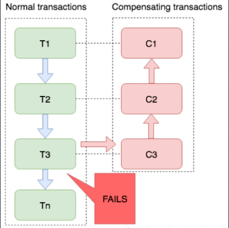
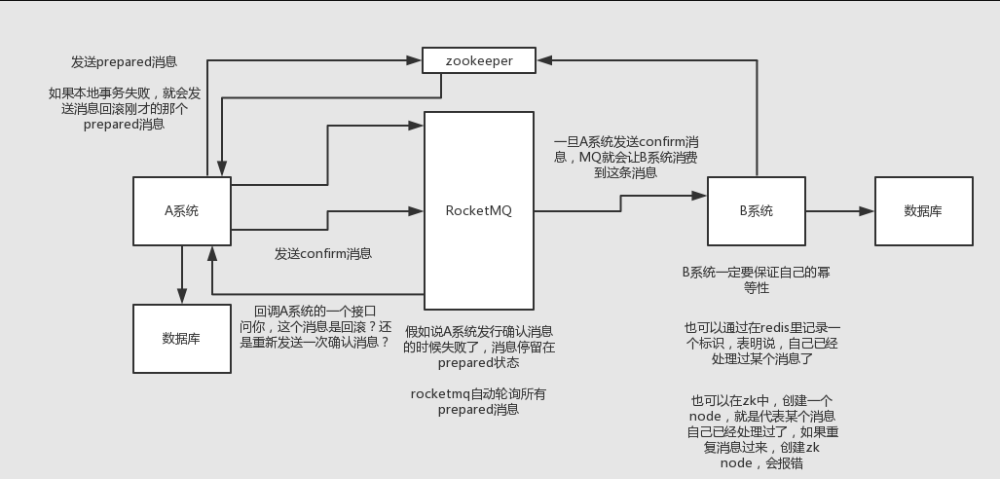

## Java

### 1、synchronized 和 reentrantLock区别？

1. 都是作用于线程间的同步控制。而且都是可重入锁。
2. synchronized 是 Java 内置的特性，是一个关键字。Lock 是 JUC 包中的工具类，通过代码实现。
3. synchronized 是自动获取 / 释放锁。Lock 需要手动的 lock 和 unlock。
4. synchronized 只有非公平锁。Lock 可以实现公平锁也可以实现非公平锁。
5. Lock 有响应中断、超时等待以及其他的特性。


### 2、如何理解 AQS？

1. 是抽象的队列同步器，是抽象类，因此是很多同步器的基础框架。如 ReentrantLock、CountDownLatch 和 Semaphore 都是基于 AQS 实现。
2. 在 AQS 内部，维护了一个队列（FIFO）和一个 volatile 的 int 类型的 state 变量。
    1. 在 state 为 1 时表示当前对象的锁已经被某个线程占有了。
    2. 队列中的每个结点表示一个线程，保存着线程的引用、当前结点的状态（是否有获取到对象锁）。
    3. 因此一条队列就是所有请求该临界资源的线程，一个对象锁对应一条队列。
    4. AQS 的目的在于多个线程竞争临界资源时，将暂时没有获取到锁的线程放到队列中进行阻塞等待，而被唤醒时进行锁的分配。
3. AQS 提供了两种锁的机制，共享锁（读锁）和排它锁（写锁）
    1. 如 ReentrantLock 的可重入就是 AQS 的排它锁功能。
    2. 如 CountDownLatch 和 Semaphore 使用到了 AQS 的共享锁功能。


### 3、AQS 是如何维护 CLH 队列的。

1. 公平锁：当前锁已经被其他线程持有时，新的线程会创建一个结点然后加入到 CLH 队列的尾部自旋等待，也就是按照请求锁的先后顺序加入队列。当锁释放时，会通知队列的下一个结点，这个节点在获取锁后，再通知下一个节点，以此类推。这样保证了队列中的线程按照 FIFO 的顺序逐个获取锁，实现公平性。
2. 非公平锁：与公平锁的区别时，如果一个线程还没有加入到 CLH 队列，第一次获取锁时，会与当前持有锁的线程同时竞争锁的拥有权。竞争的结果取决于具体实现的锁策略，可能是先到先得，也可能是其他策略。这意味着非公平锁不会强制等待线程按照它们进入等待队列的顺序获取锁。只有在竞争失败时，才会加入到 CLH 队尾。不一定遵循先到先得的原则。


### 4、synchronized 的锁升级过程是怎样的？

1. 无锁：当一个线程第一次访问临界资源时，JVM 在这个对象头中设置该线程的 ID，并将对象头的状态位设置为 “偏向”。
2. 偏向锁：只有一个线程访问临界资源时，该线程不需要同步操作。当有其他线程访问时，会检查对象头 “偏向锁” 状态和线程的 ID，如果相同则直接获取锁，如果不同则会升级为轻量锁状态。
3. 轻量级锁：在此状态时，JVM 将对象头中的标识设置为 “轻量级锁” 状态。当一个线程成功获取到对象锁时，会将对象头中的线程栈中存放自己的线程指针。此时如果有另一个线程想要获得对象锁，且对象处于 “轻量级锁” 状态时，会尝试使用 CAS 将对象头中的线程栈替换成自己的指针，如果成功则获得锁。如果失败则表示该锁已被其他线程获取，该锁状态会升级为重量级锁状态。
4. 重量级锁：在此状态时，JVM 在对象头中记录指向 CLH 队列的指针。当锁被释放时，根据规则从 CLH 队列中选择一个线程唤醒并获得锁，并将该线程的状态从 “等待” 置为 “就绪”。
5. 锁升级是线程竞争逐渐变多时，对象标识不断更改并使获取锁的难度不断增加的过程。
6. 其中，AQS 管理的是重量级锁，因为涉及到线程的阻塞和唤醒操作。


### 5、讲一下 JMM 内存模型。

1. JMM 为了屏蔽各种硬件和操作系统的访问差异，保证 Java 程序在各种平台下对内存的访问都能保持效果一致的规范和机制。
2. JMM 规定了所有的变量都存储在主内存中，每条线程有自己的工作内存，线程的工作内存中保存了该线程中使用到的变量的主内存副本的拷贝。线程对变量的操作都必须在自己的工作内存中进行，而不能直接读写主内存。不同线程之间无法直接访问对方的工作内存，需要主内存当桥梁。
3. 如果没有 Volatile 的修饰，变量刷回主内存的情况
    1. 线程退出临界资源时，会将工作内存中所有修改过的变量值刷新回主内存。
    2. 线程进入临界资源时，会先清空工作内存中的共享变量值，从主内存中读取最新的变量值。


### 6、实现多线程的方式有哪些？

1. 继承 Thread 类创建线程。
2. 实现 Runnable 接口创建线程。
3. 通过 Callable 和 FutureTask 创建线程。
4. 通过线程池创建线程。
5. Callable 可以使用本身的 `call()` 方法来获取返回值，但是并不灵活。如果直接调用 `call()`，则相当于一次同步调用，并且阻塞在当前位置
6. FutureTask 是 Future 接口的一个实现，通常使用 Future 来管理异步任务，比如通过线程池执行异步任务时，可以使用 Future 接收该任务：`Future<Integer> future = executorService.submit(callable);` ，并在需要返回值时进行 get 即可，也可以查询该任务的状态是否已经完成。
7. 因此需要与 FutureTask 需要配合使用，`Future<String> future = new FutureTask<>(callable);`


### 7、在线程池中，怎么把执行时间不一致的线程按照规定的顺序执行？（多线程编排问题）

1. 首先需要使用 Future 接口的实现类 CompletableFuture 去实现该功能。
2. CompletableFuture 可以通过 `supplyAsync()` 创建异步任务，并使用 `thenApply()` 在得到上一个异步任务的结果之后执行下一步的操作，也可以通过 `get()` 直接获取该异步任务的结果，或者使用 `handle()` 处理发生的异常。更复杂的还有 `thenCombine()` 等组合多个异步任务的结果。
3. 可以指定自定义的线程池，如果不指定，则会使用默认的 ForkJoinPool 线程池。


### 8、ConcurrentHashMap 是如何保证线程安全的？

1. 使用分段锁 + CAS + synchronized 的机制来保证线程安全。
2. 当 ConcurrentHashMap 在添加或删除元素时，首先使用 CAS 来尝试修改元素，如果 CAS 操作失败，就会使用 synchronized 锁住当前的哈希槽，然后再次尝试修改或删除元素。
3. 使用 synchronized 时使用了分段机制，只是锁住了当前的哈希槽，并非整个集合，降低了锁的颗粒度。
4. 而且 ConcurrentHashMap 不允许有 key 或 value 为 null 的情况。如果使用 `map.get(key)` 返回了 null 值，是不明确本来就存了一个 null 值进去还是因为没有找到而返回了 null，存在二义性。
5. HashMap 在单线程下是不存在这个问题的，所以 HashMap 允许 key 或 value 为 null 的情况。虽然 key 不存在时也会返回 null 有二义性的存在，但在单线程下是可以容忍二义性的。是因为 HashMap 可以用 map.contains(key) 来检测到底是存的 null 还是没有找到而返回的 null。而在多线程情况下使用 map.contains(key) 是不可靠的，可能在检测过程中被其他线程修改。


### 9、ThreadLocal 了解吗？发生内存泄漏的原因？

1. `ThreadLocal` 实例通过 `ThreadLocalMap` 对象与当前线程建立关联的底层结构：`<Thread, Entry<ThreadLocal, Object>>`。即每一个线程有独立的 Entry，这个 Entry 中以 ThreadLocal 实例对象为 key，该 ThreadLocal 实例对象中存放的值为 value。（其中 `Entry<ThreadLocal, Object>` 称为 `ThreadLocalMap`，因此实际上数据存放在 ThreadLocalMap 中）
2. 其中 ThreadLocal 对象有两处引用：
    1. 在栈内存中，使用 ThreadLocal 对象方法时，对 ThreadLocal 的引用。（强引用）
    2. 在堆内存中，ThreadLocalMap 中的 key 对 ThreadLocal 的引用。（弱引用）
3. 发生 OOM 的两个原因：
    1. 当栈内存中的 ThreadLocal 引用不再使用，也就是方法结束后这个对象引用就不存在了，但因为还存在着一条引用链导致无法 GC，也就可能导致 OOM。因此设计时采用了弱引用，即这个对象只具有弱引用时，就会被 GC，防止 OOM。
    2. 但要注意另一个 OOM 的点是：key 虽然是 ThreadLocal 弱引用，可以被 GC，但值是强引用的，会存在 ThreadLocal 被 GC 了，但是 value 依然存在，然后导致 OOM。因此需要每次使用完 ThreadLocal 后，手动调用一下 remove，就会在下一次 GC 时，清理掉失效过期的 Entry。（当然，每次调用 ThreadLocal 的 get、set 时也会清理，但最好还是手动 remove 一下）
4. 在配合线程池使用时，更需要注意清理 ThreadLocal 内的数据。因为线程池的线程是复用的，而且在 ThreadLocal 中，一个线程对应自己的 Entry。如果上一个线程使用完之后没有清理 ThreadLocal，那么再次使用这个线程时，就会出现数据错乱的情况，仍然具有上一个线程所具有的数据。因此需要及时清理，也可以预防 OOM 的问题。


## MySQL

### 1、B+ 树，和 B 树有什么区别？

1. 二者都是 AVL 树的一种，又叫平衡多路查找树。
2. B 树的所有节点既存放键 key，也存放数据 Data；而 B+ 树只有叶子节点存放 key 和 Data，非叶子节点只存放 Key。因此 B+ 树的任何查找必须从根结点到叶子结点，所以 B+ 树的检索顺序是稳定的。
3. B 树的叶子节点是相互独立的；而 B+ 树的叶子节点之间有双向链表连接。
4. B+ 树效率更高
    1. 因为 B+ 树的所有非叶子节点只保存 key，因此大小同样的磁盘可以保存更多的节点元素，层数更少，IO 操作也更少
    2. B+ 树检索顺序稳定，性能也稳定


### 2、说一说 MySQL 一条 SQL 语句的执行过程？

1. 连接：使用连接器，与 MySQL 服务器建立连接，并查询是否有权限。
2. 解析：由解析器进行语法和语义的分析，并生成解析树。如查询的是什么表、哪个字段、条件是什么。
3. 优化：由优化器生成执行计划，并根据索引查看是否可以优化。
4. 执行：执行器执行 SQL 语句，根据指定的存储引擎执行并得到查询结果。


### 3、当前读和快照读有什么区别？

1. 快照读就是在普通的 SELECT 语句在不加锁的情况下查询的数据。
2. 当前读就是加锁的 SELECT 或者对数据进行 DDL 操作时，每次读取都是最新数据。
3. 只有在 RC 和 RR 隔离级别时才会使用快照读。隔离级别不同决定了快照读去读哪一份快照。
4. 在 RC 中，每次读取都会重新生成一个新的快照（和一个新的 Read View 接下题），即总是读取行的最新版本。因此可能会出现不可重复读的情况。（**即在 RC 下，快照读总是读取被锁定行的最新一份快照**）
5. 在 RR 中，快照会在事务中第一次 SELECT 语句执行时生成，只有在本事务中对数据进行更改才会更新快照（并更新 Read View 接下题）。因此解决了不可重复读的情况，也只解决了快照读下的幻读问题。（**即在 RR 下，快照读总是读取本事务开始时的行数据版本**）
6. Read View 决定了哪条快照读，因此生成时机是相同的，顺序是先后的关系。


### 4、讲一下 MVCC 机制。

1. 目的：不使用悲观锁的情况下，控制读写并发并保持相对较高的性能。读 - 读并发没有问题，写 - 写并发可以使用加锁的方式解决（悲观锁），而读 - 写并发则需要 MVCC 机制解决（乐观锁）。
2. 快照读：是 MVCC 实现的基础。（快照存放在哪里？见3）
3. undo log 日志：是实现 MVCC 的重要手段。因为事务没有提交之前，会将更新前的数据先放到日志中，而更新前的数据就是快照。（在日志中，一条记录可能有多个快照，那么在需要快照时，要读取哪个快照呢？见4）
4. 行记录的隐藏字段：最新一次修改的事务的 id、回滚指针指向日志中上一个版本的快照。这样就形成了一个快照链表，新 -> 旧 -> 更旧，方便回滚。（知道了快照之间的联系，但仍不知道具体要哪个快照，见5）
5. Read View：
    1. 生成时机：使用快照读时生成 Read View 表并决定使用哪条快照。
    2. 保存了正处于活跃未提交的事务 ID。
    3. 用来解决可见性问题，会告诉我们本次事务哪些事务可见，哪些不可见。
    4. 每开启一个事务，都会从数据库中得到一个事务 ID，事务的 ID 是自增的，因此可以通过 ID 大小来判断事务开启的时间顺序。
    5. 事务 ID 大的可以看到事务 ID 小的事务的变更结果，因此拿到一条可见的记录后就作为快照读返回。
    6. 如果没有可见的事务，就去 undo log 中根据快照链表依次取快照，并进行事务 ID 的对比判断，直到找到可见的事务并返回快照读，如果找不到就返回空。
6. 总结：undo log 用来保存历史快照，Read View 用来判断哪个快照是可见的。


### 5、QPS、TPS、RT 代表什么？

1. QPS：每秒接收了多少请求。（流量进来了多少）
2. TPS：接收请求之后实际每秒能处理多少。（服务端响应了多少）
3. RT：响应时间，response time。


### 6、MySQL 中有 A、B 两个字段，并分别建立了索引，查询 A、B 时会命中哪个索引？

1. 首先，全表扫描 / 只使用一个索引的速度比起来，去分析两个索引二叉树更加耗费时间，所以绝大多数情况下数据库都是是用一个索引。
2. 因此数据库只会选择 A 索引或者 B 索引中的一个，然后回表验证另一个条件是否成立。
3. 当单表存在多个索引，一个 SQL 语句的 where 中又含有多个索引字段，在执行 SQL 语句时每个索引都可能返回一个结果集，MySQL 会将其求交集或者并集，或者是交集和并集的组合。也就是可能会存在索引合并，这种情况下会用到多个索引，且在执行计划中，type 显示为 `index_merge`。
4. 但不建议自动进行索引合并，因此推荐建立联合索引。


### 7、DISTINCT、GROUPBY 与索引的关系

1. 当 GROUPBY 中的列都在同一个索引中时，MySQL 会利用该索引进行分组操作，并进行松索引扫描。如 GROUPBY C1 和 C2，且有联合索引 （C1，C2，C3）。
2. 有联合索引（C1，C2，C3），GROUPBY 的是 C2 和 C3 时，因为不满足最左匹配原则，无法使用索引进行分组，但如果使用了 WHERE C1 = 常数，此时可以就进行紧索引扫描，利用该索引进行分组（因此使用常数可以弥补索引不满足最左匹配的缝隙）。
3. DISTINCT 本质就是利用 GROUPBY 分组之后去重，因此与索引的关系与 GROUPBY 相同。即 DISTINCT 去重的字段被索引覆盖时，可以利用索引进行优化，如果没有覆盖则要看能不能触发紧索引扫描。
4. 总结：
    1. 如果索引可以覆盖 GROUPBY 中的字段时，会利用该索引进行分组操作，执行的是松索引扫描。
    2. 如果索引无法覆盖 GROUPBY 中的字段且有 WHERE 条件帮忙把未覆盖的字段进行常数相等，那么也会利用该索引进行分组操作，执行的是紧扫描索引。


### 8、SQL执行计划分析的时候，要关注哪些信息？

1. type：表示查询时所使用的索引类型
    1. system：系统表，少量数据，不需要进行磁盘的 IO。
    2. const：使用了常数索引，即查询时在 WHERE 中使用了常数值进行匹配。
    3. eq_ref：唯一索引扫描，且扫描索引树中的一个匹配行。
    4. ref：非唯一索引扫描，且扫描索引树中的一个匹配行。
    5. range：范围扫描，使用索引进行范围性查询。
    6. index：全索引扫描，不符合最左前缀匹配时的查询。
    7. ALL：全表扫描，未使用索引字段。
2. possible_key：表示可能被查询优化器选择使用的索引。
3. key：表示查询优化器实际选择使用的索引。
4. Extra：表示其他额外信息（下面为举例，实际还有很多）
    1. Using Where：表示使用了非索引字段查询或未覆盖索引，使用了联合索引的非前导列查询（即没有按照最左匹配，使用了联合索引中非收个字段进行查询）
    2. Using Index：使用了覆盖索引无需回表。
    3. Using Index Condition：查询的列无法覆盖索引，需要回表。


### 9、InnoDb 的锁机制

1. 按照锁的颗粒度可分为表级锁、行级锁、页级锁。
2. 行级锁：
    1. 是粒度最小的一种锁，只对当前操作的行进行上锁，但是加锁的开销也是最大的。
    2. 包括共享锁和排它锁。
    3. 特点是开销大，加锁慢，会出现死锁。但是粒度最小，发生锁冲突的概率最低，并发度也最高。
3. 表级锁：
    1. 是粒度最大的一种锁，表示对当前操作的整张表加锁，但是实现简单，且资源消耗较少。
    2. 特点是开销小，加锁快，不会出现死锁。但是粒度最大，发生锁冲突概率最高，并发度低。
4. 页级锁：
    1. 是粒度折中的一种锁，一次锁定相邻的一组记录。
    2. 特点是开销一般，会出现死锁，并发度一般。


### 10、MySQL 中的行级锁机制

1. 行锁是通过给索引上的索引项加锁来实现的，因此只有通过索引检索数据时，才会使用行级锁，否则会使用表级锁（即不通过索引条件查询的时候使用的是表锁而非行锁）

2. 由于行锁是针对索引加的锁而非查询的记录，因此如果访问的是不同行的记录，但如果使用的是同一个索引，会出现锁冲突的情况（也就是只操作同一条记录，也会发生死锁，因为锁的是索引记录而不是行记录）。

3. 如果一条语句操作了二级索引，那么 MySQL 会先锁定该二级索引，然后再锁定相关的聚簇索引。

4. 行级锁根据颗粒度不同也有不同的类型

    1. Record Lock，记录锁，锁的是索引记录（锁单个索引记录）。

        1. 在 RC 隔离级别下即可起作用。
        2. 如果表没有定义索引，MySQL会默认创建聚簇索引。聚簇索引的叶子结点不止保存了主键，还包括所有列，只不过聚簇索引的查询条件是主键列。

        

    2. Gap Lock，间隙锁，锁的是索引记录之间的间隙（锁一定范围内的索引记录）。

        1. 只有在 RR 隔离级别下才会起作用。
        2. 对于唯一搜索条件的唯一索引，MySQL 只锁定找到的索引记录，而不会锁定间隙（因为只有一条索引记录，无间隙可言）
        3. 对于其他的搜索条件，MySQL 会锁定扫描的索引范围，使用 Gap Lock 或 Next-Key Lock 来锁定这个范围，阻塞其他事务在这个范围内进行 DDL 操作。

        

    3. Next-Key Lock，上述二者的组合，同时锁索引记录和间隙，区间为左开右闭。

        1. 其实不是一种新锁，而是二者组合起来之后起了一个新名字而已。
        2. 因为其中包含 Gap Lock，因此只有在 RR 下才可使用。
        3. 需要锁定一个大范围内的索引记录，但是可能中间穿插着多个记录锁和间隙锁而已。

        


### 11、解释一下 MySQL 中的意向锁

1. 需要解决的问题：事务 A 对表 1 的某一行加了行级锁，此时该记录只能读不可写。事务 B 申请对 表 1 增加表级锁，如果申请成功，则事务 B 可以修改表中的任一记录，就发生了冲突。
2. 意向锁机制：当一个事务请求获取一个行级锁或表级锁时，MySQL 会自动获取相应表的意向锁。当其他事务请求获取锁时，就需要先基于意向锁的类型来判断是否可以获取锁。
3. 意向锁类型
    1. 意向共享锁：表明事务希望获取一个共享锁。
    2. 意向排它锁：表明事务希望获取一个排它锁。
4. 意向锁是表级锁，并且会在持有锁的事务提交或回滚后释放。


### 12、MySQL 深度分页问题与 LIMIT 优化

1. MySQL 中，LIMIT m n 的原理是先读取前面 m + n 条记录，然后抛弃掉前 m 条，最后返回后面 n 条。因此偏移量越大，性能越差。

2. 使用主键索引优化，减少回表（如果已经达成覆盖索引的话没办法）。如查询 20001 - 20010 这 10 条数据，就先查出 20001 的主键 id，然后再从该主键出发，一是相当于将偏移量改为了 0，二是直接走聚簇索引。

    ```mysql
    SELECT c1, c2, c3, ...., cn
    FROM table1
    WHERE id >=
    (
        SELECT id
        FROM table1
        LIMIT 20000, 1
    )
    LIMIT 10;
    ```

    主要目的就是减少回表次数，先通过子查询查询出最小的 id，然后再根据 id 查询。但是要求 id 一定是自增的。

3. 通过延迟链接优化

    ```mysql
    -- 优化前
    SELECT film_id, DESC
    FROM film
    ORDER BY title
    LIMIT 50, 5;
    
    -- 优化后
    SELECT film_id, DESC
    FROM film
    INNER JOIN 
    (
        SELECT 
        film_id 
        FROM
        film
        ORDER BY title
        LIMIT 50, 5
    ) AS lim
    USING (film_id)
    
    -- tips：USING 函数类似于 JOIN 查询时的 ON 条件。即 USING() 指定的列在两个表中都存在且作为 JOIN 的条件。
    ```

    使服务器在不访问行的情况下检查索引中尽可能少的数据，然后一旦找到所需的行，就将它们与整个表连接，以从该行中检索其他列。

4. 根据业务场景中，使用某个字段尽量的减少偏移量。如记住上一页的 id，下次查询时直接从 id + 1 开始查询。


## Redis

### 1、Hash 结构的底层是什么数据结构？

1. 数组 + 链表，基本与 Java 的 HashMap 结构差不多，但是没有树化。


### 2、缓存更新策略

1. 旁路缓存模式（Cache Aside Pattern）
    1. 规定写操作的步骤为：更新数据库中的值、直接删除缓存（写操作不重建）。
    2. 规定读操作的步骤为：读取缓存的数据，如果存在则直接返回、没有命中则查询数据库、重建缓存。
    3. 会出现数据不一致性，但几率极低，例子：读请求读取缓存，值（15）不存在，根据规定步骤然后查询数据库取值（15），同时写请求并发，更新了该值（15 -> 20），根据规定并删除了缓存（假设此时没有重建完成），最后读请求完成缓存的重建（15）。两个请求完成后出现了数据不一致（数据库 20，缓存 15）。
        1. 查询的值不在缓存中（即缓存失效没有命中该值）。
        2. 读请求、写请求并发。
        3. 写请求更新数据库的时间要比读请求查询数据库 + 重建缓存的时间还要短。
2. 缓存延迟双删策略（对旁路缓存的优化）
    1. 规定写操作的步骤为：更新数据库中的值、直接删除缓存、休眠一段时间后再删除缓存（延迟删除给更新数据库充足的时间）。
    2. 读操作步骤不变。
    3. 也可以结合消息队列，在更新完数据库之后发送一条延时信息给队列，通知消费者删除缓存，从而达到延迟的效果（但增加了系统的复杂度）。


### 3、讲一下 RDB 持久化机制。

1. 规定在 n 秒之后，如果至少有 m 个 key 发生了变化时，Redis 就会自动触发 bgsave 命令创建当前时间点上的数据库的副本，并将副本持久化。
2. bgsave 会 fork 一个主进程进行异步生成快照，而 save 会阻塞主进程。
3. fork 采用的是写时复制技术（copy on write）
    1. 主进程执行读操作时，可以访问共享内存
    2. 主进程执行写操作时，会先拷贝出一份数据，执行写操作，此时 fork 进程可以读不受影响，主进程写完之后合并到内存。
4. 优点：快照文件小、恢复速度快，适合做备份和灾难恢复。
5. 缺点：定期更新可能会丢失数据。


### 4、讲一下 AOF 持久化机制。

1. 将 Redis 所有写操作追加到 AOF 文件的末尾，从而记录了 Redis 运行期间所有修改操作的记录。
2. AOF 有三种刷盘策略
    1. 同步回写：每个写命令执行完时立即刷盘。
    2. 每秒回写：每个写命令执行完，只是先把日志写到 AOF 的内存缓冲区，每隔一秒才把缓冲区中的内容刷盘。
    3. 操作系统控制：每个写命令执行完，只是先把日志写到 AOF 的内存缓冲区，由操作系统决定何时刷盘。
3. 优点：实现了更高的数据可靠性、支持更细粒度的数据恢复，适合做数据存档和数据备份。
4. 缺点：文件大占用空间多，每次写操作都需要写磁盘导致负载高。


### 5、全量同步和增量同步对应条件

1. 全量同步：初次建立主从关系时（replicaof 命令），从节点需要从主节点上复制所有的数据
    1. slave 节点请求数据同步。
    2. master 节点判断是否为第一次同步，如果是则执行全量同步，master 节点先发送主节点的 replid 和偏移量。
        1. 每个节点都有唯一的 replid 标识，未同步之前是不同的，同步后 slave 会集成 master 的 replid，从而判断是否是第一次同步。
    3. slave 节点接收 master replid 和偏移量并保存。
    4. master 节点执行 bgsave 生成 RDB，并发送给 slave 节点，在此期间如果有新的命令则写入到 repl_baklog 中。
        1. repl_baklog 的记录越多主节点的偏移量就越大，slave 完成同步时也会记录此时的偏移量，如果 slave 的偏移量小于 master 的偏移量，说明 slave 数据落后于 master，则需要更新。
    5. slave 节点清空本地数据并加载新的 RDB 文件。
    6. master 节点发送 repl_baklog 中的命令，slave 节点执行接收到的命令。
2. 增量同步：当主节点和从节点之间的网络断开，再次重新连接时，从节点只会请求主节点上部分缺失的数据，以减少同步数据量，提高同步效率和稳定性
    1. slave 节点向 master 节点同步 replid 和偏移量。
    2. master 节点判断请求的 replid 是否一致，是否不是第一次同步。
    3. 判断成功后，master 取 repl_baklog 中 slave 偏移量之后的命令并发送给 slave 节点。
    4. slave 节点执行命令进行增量同步。
3. 注意：repl_baklog 是环形数组大小有上限，写满之后会覆盖最早的数据。如果 slave 断开时间太久，偏移量被未同步的数据覆盖（或者说是 master 节点的偏移量套圈了 slave 的偏移量），就无法再做 repl_baklog 增量同步（因为未同步的数据已经被覆盖丢失了），此时只能做全量同步。


### 6、Redis 分布式锁在多线程下会遇到哪些问题？

1. 锁无法续期：线程 A 执行时间超过了锁的超时释放时间，会出现线程 A 在执行但是锁已经自己释放的问题。
2. 锁误删问题：线程 A 执行时间超过了锁的超时释放时间，锁超时释放，此时另一个线程 B 会正常获取锁，线程 A 执行完毕后，会执行释放锁的命令，此时会将线程 B 的锁释放掉，出现锁误删的问题。
    1. 解决方法：使用 UUID 标识唯一线程，只有同一线程删除锁时才会释放。
3. 不可重入：线程 A 获取到锁之后，如果遇到再获取锁的场景，无法获取该锁，造成业务无法执行。
    1. 解决方法：使用 Hash 结构处理，K-V 代表线程和重入次数。
4. 推荐使用 Redisson 去实现分布式锁。
    1. 锁的结构：key 是自定义的锁的名称，field 是线程 id，value 是该线程的加锁次数。（因为不是 String，没有 SETNX 的特性，因此需要在 Lua 脚本中执行获取、释放锁的流程）
    2. 获取锁：使用 Exist 判断该锁的值是否为 null，如果为 null 则正常获取锁，并将 value 值设置为当前线程的 ID 或者增加重入次数，否则 value 值就是已经获取锁的线程 ID。（实现了锁的互斥、可重入）
    3. 释放锁：校验 value 值是否为当前线程的 ID，如果是则正常释放。（实现了锁的正确释放）
    4. 自动续约：使用看门狗机制，也就是一个定时程序，只要业务持有 key 并且还在执行，就会不断的重置 TTL，防止锁超时释放但业务没有执行完。（如果业务挂了，看门狗线程也就没有了，因此不会出现业务挂了仍无限续约锁的情况）


### 7、什么是缓存击穿、缓存穿透、缓存雪崩？

1. 缓存穿透：
    1. 请求的数据在缓存中不存在，且数据库中也没有符合要求的数据，就会导致请求每次会绕过缓存服务器而直接打在数据库上。
    2. 缓存空值：对那些不存在值的 key 对应的值设置为 null 并放到缓存中，再出现查询该 key 的请求时直接返回 null，但要设置合适的 TTL 时间，防止对该 key 真正赋值的时候无法重建缓存的情况。
    3. 布隆过滤器：将查询数据首先根据条件哈希到布隆过滤器中，用户的请求首先会被布隆过滤器拦截，如果存在则可以查询缓存，如果不存在则直接拦截该请求。（因为哈希冲突的原因会误判）
2. 缓存击穿：
    1. 某一热点 key 的缓存 TTL 过期时大量的并发请求同时访问该 key，因为无法命中缓存，会瞬间击穿缓存服务器而直接将大量的请求直接打在数据库上，使数据库处于高负载的情况。
    2. 异步定时更新：如果某一热点数据的过期时间是 1 小时，那么可以每 58 分钟通过定时任务去更新这个热点 key，并重置 TTL 时间。
    3. 设置逻辑过期时间：不设置 TTL，但是在 Value 中指定一个过期时间。每次使用时首先查询是否到达过期时间，如果 TTL 过期意味着该热点数据出现了业务的更新，此时重建缓存更新该热点 key 即可。
    4. 互斥锁：当某次查询时发现没有命中缓存（也就是热点 key 突然过期了），立即重建缓存并对此次操作加锁，此时其他查询该 key 的请求全部阻塞，直至重建成功。
3. 缓存雪崩：
    1. 大量缓存同时过期或者缓存服务器宕机，所有的请求直接访问数据库，造成数据库的高负载。
    2. 设置不同的过期时间：不同 key 的 TTL 时间设置为不同，且通过定时刷新的方式更新过期时间。
    3. 集群模式：采用集群模式避免服务的单点故障。


## RabbitMQ

### 1、介绍一下 RabbitMQ 有几种工作模式？

1. 通过设置交换机的类型可以改变 RabbitMQ 的工作模式。

2. 简单模式：一个生产者将消息发送到一个队列中，一个消费者从队列中获取消息并处理。

    

3. 工作队列模式：一个生产者将消息发送到一个队列中，多个消费者从队列中获取并处理消息。在该模式下每个消息只能被一个消费者处理。

    

4. 发布 / 订阅模式：一个生产者将消息发送到交换机中，交换机通过 BindingKey 与每个队列绑定，每个队列再对应一个消费者，就达成了消息共享的模式（此时生产者指定发送消息的 RoutingKey 的值与 BindingKey 相同）。

    

5. 路由模式：根据消息中 RoutingKey 的不同将消息从交换机路由到不同的队列，，实现了根据不同的条件将消息发送到不同队列的模式（如指定 RoutingKey 的值为 foo，那么消息会被交换机投递到 BindingKey 为 foo 的队列中，BindingKey 为 bar 的队列虽然与交换机绑定，但不会接受到该消息，实现消息的筛选和分发）

    

6. 主题模式：实际上就是可以解析 RoutingKey 中的通配符，可以将消息路由到多个匹配规则的队列中。目的是实现复杂的路由需求，算是路由模式的更高级版。

    

7. RPC 模式：通过消息队列来实现远程调用功能。


### 2、RabbitMQ 如何实现延迟消费

1. 使用死信队列：
    1. 正常的消息可能会因为 TTL 过期、队列长度超限、被消费者拒绝等原因变为死信消息。死信消息可以通过死信交换机发送到指定的队列中（一般就称为死信队列）
    2. 基于上述机制，可以给该消息设定想要延迟的 TTL，但是并不消费该消息，过期后自然会进入死信队列中，最后再监听死信队列消费该消息即达成了延迟消息的功能。
    3. 缺点是队列先进先出，如果正常队列中队头消息延迟时间很长，而下一个消息延迟时间很短，此时就会出现队头消息迟迟不过期无法进入到死信队列而导致阻塞，使后面的消息无法按预期的 TTL 进入死信队列。
2. 基于官方插件：
    1. 解决了队头消息阻塞的问题。
    2. 生产者发布消息时，且该消息设置了 TTL，那么不会立即投递到队列，而是会先保存在 Mnesia 数据库中，然后通过一个定时器去轮询查询 TTL 是否过期，只有在过期后才会被投递到指定的目标队列。
    3. 缺点是 Mnesia 数据库在当前 Broker 节点具有单个磁盘副本，存在丢失的可能。
3. 总结来说，基于死信队列的方式可以设置一个 TTL 队列，进入该队列的消息 TTL 时间相同，可以解决一类问题。而基于插件可以更精准的控制每一条消息，用来解决更精细的问题。


### 3、RabbitMQ 消费消息的两种模式

1. 推模式：消息队列主动将消息推送给消费者
    1. 消息队列会自动、不断的将消息给匹配的消费者。
    2. 优点是实时性好，消费者能及时得到最新消息。
    3. 缺点是可能会出现消费者的缓冲区溢出。
2. 拉模式：消费者主动从消息队列中获取消息
    1. 只有消费者需要消息时，需要主动的从消息队列中获取单条消息。
    2. 优点是可以根据消费者的需要，主动拉取消息而不是持续订阅。
    3. 缺点是实时性差，且拉取消息时网络开销会增加消费延迟，降低系统吞吐量。


### 4、如何保证消息不被重复消费？保证消息消费的幂等性？

1. 出现重复消费的原因：正常情况下，消费者消费完消息会发送 ACK 通知 Broker 确认消费，将该消息从队列中移除。但因为网络原因等没有正常发送 ACK，Broker 会触发消息重投机制从而导致重复消费。
2. 消息中间件本身无法避免重复消费，需要从业务层面进行处理：
    1. 该消息的目的是写数据库，那么写之前可以先查库，如果该数据已经存在了可以 UPDATE 一下或者不做处理。
    2. 该消息的目的是写 Redis，因为 SET NX 其本身的特性，会天然具有幂等性。
    3. 其他场景，则可以手动添加如全局唯一 id 或版本号，目的在于更新时进行比对是否已经有过更改。


### 5、如何保证消息的可靠性传输？如何处理消息丢失的问题？

1. 消息的流转会经过生产者到 MQ，MQ 本身，消费者本身。
2. 生产者将消息投递到 MQ 过程中丢失数据
    1. 可能是因为网络原因半路搞丢了，可以考虑使用 MQ 的发布确认机制（不推荐使用 MQ 的事务机制，事务与发布确认只能开启一个，且事务是同步的，会出现阻塞现象导致性能下降）
    2. 采用发布确认的异步确认模式，在生产者将消息成功发送到 MQ，且该消息成功持久化后，MQ 会告知生产者消息投递成功，会触发成功回调函数，在该函数中可以记录哪条消息成功投递了。
    3. 如果投递失败，则会触发失败回调函数，在该函数中可以记录哪条消息投递失败和失败原因。
3. MQ 本身搞丢了数据
    1. 同时开启队列和消息持久化：在创建队列时设置持久化队列，这样可以保证 MQ 会持久化队列的元数据。发送消息时将消息模式设置为持久化，就可以将消息持久化到磁盘。
    2. 因为发布确认的机制存在，只有在持久化成功了才会触发成功回调函数，否则会触发失败回调函数告知生产者。
4. 消费者丢失数据
    1. 消费端在消费时可能进程挂了，或者服务器重启了，此时消息在消费端丢失，但 MQ 会认为已经消费完成了就会将消息从队列中移除。
    2. 此时就需要关闭自动 ACK，开启显式的手动 ACK，在后端中保证处理完成后手动 ACK 通知 MQ 已经消费完成。这样就确保消费者不会丢失消息。如果没有正常消费（即没有收到 ACK），MQ 会重新投递。
5. 注意 MQ 到消费者过程中丢失消息的情况。MQ 没有收到消费者的确认消费通知，会再次发送该消息，所以该流程不用担心消息丢失，而是重复消费的问题。


### 6、如何保证消息的顺序性消费？

1. 出现错乱的原因：一个队列对应多个消费者，虽然每个消费者是按照顺序拿到的消息，但执行完的时间是不定的，因此会产生错误。本质是多个消费者共同消费 “一个消息”，因此会出现不一致性。
2. 单队列单消费者：如果对一致性要求极高，可以使队列只有一个消费者消费，保证顺序。
3. 分区有序：拆分多个队列，每个队列只对应一个消费者。多个消费者同时顺序消费，即存在竞争关系，最后的结果取最快的消费者。
4. 消息分组标识：
    1. 在消息中添加标记，来标识该消息需要第几个被消费。
    2. 同时建立分区队列，比如 1 队列的消费者只消费顺序为 1 的消息。
    3. 通过 MQ 的一致性哈希算法确定消息会通过交换机投递到哪个分区队列中。
    4. 每个消费者只对应一个分区队列，消费者按照指定的顺序消费对应分区队列中的消息。
5. 缓存处理：将收集到的乱序消息缓存起来，通过一定的逻辑之后排序再处理。


### 7、 消息大量积压怎么解决？

1. 可能出现的场景：
    1. 消费端出了问题，不消费了。
    2. 消费速度变慢，大量的消息堆积，导致集群的磁盘写满。
    3. 积压时间太长，TTL 过期后会丢失数据。
2. 临时扩容增加消费速度（以扩大 10 倍为例）
    1. 首先修复消费者的问题，确保可以正常消费后，将现有的消费者全部停掉。准备启用临时的消费者消费。
    2. 新建 Topic 类型的交换机，并临时建立原先 10 倍的队列数量，这样分区大小就是原先的 10 倍。
    3. 临时写一个分发数据的消费者，该消费者获取到积压的消息后不做耗时的处理，立马投递到新建的交换机中，以便均匀轮询的将消息投递到 10 倍数量的队列中。（因此该消费者的作用是分发投递，角色差不多变为生产者）
    4. 临时部署 10 倍的正常消费者，每一批消费者消费一个临时队列的数据。
    5. 目的是将队列资源扩大 10 倍（道路变宽，消息的吞吐量更大），将消费者扩大 10 倍（干活的更多，处理的更快），以正常 10 倍的速度消费消息。
    6. 处理完积压的数据之后，需要恢复之前的架构，重新用原先的消费者消费消息。


## Spring

### 1、如何理解 Spring 中的事务？ 

1. Spring 的事务首先是基于数据库的，数据库将事务托管给 Spring 处理。因此不管出现数据库层面的异常还是业务方面的异常，都可以统一的进行处理。

2. Spring 事务的两种实现方式：

    1. 声明式事务：
        1. 通过 @Transaction 注解实现，本质是 AOP，在目标方法执行的前后进行拦截，在目标方法执行前加入或创建一个事务，在执行方法执行后，根据实际情况提交或回滚事务。
        2. 优点是对代码没有侵入，方法内只需要写业务操作即可。
        3. 缺点是最小的粒度在方法上，而不是具体的代码上。因此如果一个事务中嵌套进了 RPC 远程调用、消息发送、缓存更新、文件写入等操作，如果事务没有正常提交，但是已经操作的 RPC 调用等是无法回滚的。其次如果事务可以正常提交，但中间有 RPC 调用，会拉长整个事务的时间，导致本事务的数据库连接一直被占用，容易造成数据库连接池耗尽。
    2. 编程式事务：
        1. 对需要事务管理的代码块，进行手动的 try-catch，对事务进行手动的开启、提交、回滚等操作。

3. 总结：优先使用编程式事务。

4. 声明式事务的失效原因：

    1. 应用在了非 public 方法上。因为 @Transaction 的本质是动态代理，而 private 方法的调用不会走到代理对象。

    2. 注解属性中 propagation 传播机制设置错误。严格来说不是错误，而是设置的属性不支持事务。

        ```java
        public class Foo {
            
            @Transactional(propagation = Propagation.NOT_SUPPORTED)
            public void methodA() {
                // DDL 操作数据库
            }
            
            public void methodB() {
                // DDL 操作数据库
            }
        }
        
        public class Bar {
            
            @Resource
            private Foo foo;
            
            @Transactional
            public void doSomething() {
                foo.methodA();// 这个方法由于 NOT_SUPPORTED 属性，会在非事务下执行
                foo.methodB();
                // 在以上操作中，如果该方法发生回滚，则 methodA 不会回滚，其余操作会。因为 methodA 的属性不支持事务，因此也		就不会跟本方法一起回滚。
            }
        }
        ```

    3. 注解属性中 rollbackFor 捕获异常设置错误。如果发生的异常范围不在设置的范围内，则无法捕获则失效。

    4. 同一个类中出现了方法调用。同情况 1，无法走到代理服务。

    5. 有 @Transaction 的情况下在代码内仍然进行了 catch。因为异常被捕获，所以无法基于异常进行 rollback 回滚。

    6. 数据库引擎不支持事务。

5. 传播机制：

    1. required：如果不存在事务那么就开启一个事务，如果存在事务则加入之前的事务。即总是只有一个事务在执行。
    2. required_new：每次执行都会新开一个事务。
    3. supported：有事务则加入事务，没有事务则普通执行。
    4. not_supported：以非事务方式执行操作，如果当前存在事务，就把当前事务挂起。
    5. mandatory：如果当前存在事务，就加入该事务，如果当前不存在事务，就抛出异常。
    6. never：有事务则抛异常。
    7. nested：如果之前有事务，则嵌套创建事务。嵌套事务回滚不会影响父事务，但父事务回影响嵌套事务。


## 分布式

### 1、常见的分布式事务有哪些？

1. 实现强一致性：
    1. 需要引入一个协调者，通过协调者来协调所有参与者来进行提交或回滚。
    2. 基于 XA 规范的二阶段（2PC）及三阶段提交（3PC）、支持二阶段提交的框架（如 Seata）
2. 实现最终一致性：
    1. 根据 BASE 理论和实际的业务，通过适当的解决方案实现最终一致性。
    2. 本地消息表、基于可靠消息的最终一致性、最大努力通知、分布式事务框架 Seata、TCC。


### 2、刚性分布式事务的解决方案-2PC、3PC

1. 2PC
    1. 2PC（Two-Phase Commit） 代表将事务的提交过程分为两个阶段：准备阶段和提交阶段
    2. 准备阶段：事务协调者询问事务参与者执行本地数据库事务操作是否成功
        1. 协调者向所有涉及到的参与者发送消息询问：是否可以执行本地事务操作。
        2. 参与者接收到消息后，开始执行本地事务的预操作（如写 redo、undo），此时并不会提交事务（锁定资源，并阻塞）。
        3. 参与者执行本地事务，如果成功回复 Yes 表示就绪，否则回复 No 表示未就绪，此时仍不会提交事务（锁定资源，并阻塞）。
    3. 提交阶段：事务协调者询问事务参与者提交本地事务是否成功
        1. 当协调者收集到的所有参与者的回复都是 Yes 就绪状态
            1. 协调者向所有参与者发送消息，提醒参与者开始提交本地的事务。
            2. 参与者收到提交提醒后，执行提交本地事务的操作，执行完成之后释放事务所占用的资源。
            3. 参与者完成提交后，回复协调者 ACK 消息，表明提交成功。
            4. 协调者收到所有参与者的 ACK 消息，整个分布式事务成功结束。
        2. 当任一参与者回复的是 No 未就绪状态
            1. 协调者向所有参与者发送消息，提醒参与者执行回滚操作。
            2. 参与者收到回滚提醒后，执行本地事务的回滚，执行完成之后释放事务所占用的资源。
            3. 参与者完成回滚后，回复协调者 ACK 消息，表明回滚成功。
            4. 协调者收到所有参与者的 ACK 消息，中断该分布式事务。
    4. 优点：
        1. 实现简单，MySQL 等数据库都有自己的实现。
        2. 可以实现数据的强一致性，但也存在数据不一致的情况。
    5. 缺点：
        1. 同步阻塞：事务参与者在二阶段正式提交事务之前会一直占用资源，如果其他事务要操作该资源，会阻塞。
        2. 数据不一致：网络波动或协调者挂掉会造成数据不一致的情况。
        3. 单点问题：协调者在二阶段之前挂掉的话，参与者会一直卡在事务执行完成但未提交的状态。
    6. Tips：如果协调者长时间没有收到参与者的 ACK，发生等待超时之后（任一阶段超时），也会触发整个分布式事务的回滚。
2. 3PC
    1. 在 2PC 的基础上进行了优化，将 2PC 中的准备阶段做了进一步的细分：准备阶段、预提交阶段
    2. 准备阶段：
        1. 协调者只是向参与者发送询问请求，是否可以执行本地事务。参与者回复就绪或未就绪。此时不会预操作。
    3. 预提交阶段：
        1. 协调者收到所有参与者的回复是就绪，那么协调者就会发送预提交请求，所有的参与者收到消息后执行本地数据库的预操作（如写 redo、undo）
        2. 协调者收到任一参与者的回复是未就绪或等待超时，那么协调者会向所有的参与者发送中断请求，参与者收到消息后中断事务。
    4. 提交阶段：
        1. 同 3PC，协调者只有收到了所有预提交阶段的就绪 ACK，才会通知所有的参与者正式开始提交事务。然后根据提交事务的情况进行分布式事务的提交或回滚。
    5. 总结：在准备阶段只是确认参与者是否可以执行事务，此时没有写日志的操作。在预提交阶段才会去写日志完成事务的预操作。在提交阶段才是事务正常提交的操作。
    6. 改进的点：
        1. 在预提交阶段，如果收到上一阶段的回复是未就绪，那么此时中断事务损失并不大，因为参与者并没有实质的操作如写redo、undo 日志等。因此相当于加了一段保险，只有可以操作事务了，才去预提交阶段写日志。
        2. 协调者和参与者都有了超时机制，双方一定时间内没有收到对方的应答就默认事务失败，避免一直阻塞占用资源。而在 2PC 中，只有协调者才有超时机制，会出现协调者挂了，参与者一直等待阻塞，无法释放资源。


### 3、柔性分布式事务的解决方案-TCC

1. TCC 分为 Try、Confirm、Cancel 三个阶段，每个阶段由业务代码控制，避免长事务。基于业务逻辑补偿机制，将整个分布式事务分解为若干了子事务，每个子事务都有一个 TCC 操作。
    1. Try 阶段：参与者尝试执行本地事务，并对全局事务预留资源。如果 try 阶段执行成功，参与者返回成功标识，否则返回失败标识。
    2. Confirm 阶段：如果所有参与者的 try 阶段都执行成功，那么协调者会通知所有参与者提交事务，即执行 Confirm 阶段。此时参与者会提交本地事务，并释放全局事务的资源。
    3. Cancel：如果任何一个参与者的 try 阶段执行失败，那么协调者通知所有参与者回滚事务，即执行 Cancel 阶段。同样的，如果在 Confirm 阶段有执行失败的参与者，也会触发执行 Cancel 阶段，释放预留资源。
2. 优点：
    1. 灵活：适用于不同类型的业务场景，如账户转账、库存扣减等，能够根据业务逻辑实现精细的事务控制。
    2. 高可用：TCC 使用分布式锁来保证分布式事务的一致性，即使中间一个节点出现故障，也不会影响整个系统。
    3. 可扩展：TCC 采用分阶段提交，支持横向扩展，可以适应更多的并发访问和业务场景。
    4. 性能：TCC 高于 2PC。
3. 缺点：
    1. 实现复杂：TCC 需要手动实现三个操作，每个操作都需要实现正确的业务逻辑和补偿机制，代码实现复杂。
    2. 业务代码入侵：需要将业务拆分为 Try、Confirm、Cancel 三个阶段，对代码有一定程度的入侵，需要针对不同的业务场景进行实现。
    3. 事务悬挂：try 阶段时，可能会出现网络拥堵超时，进而触发 TCC 服务的 Cancel 阶段回滚。在此之后，拥堵的 try 阶段数据包被 TCC 服务收到，就出现了 Cancel 阶段比 Try 阶段先执行的情况。此时就会导致该 Try 请求占用的资源无法释放，即事务悬挂。
    4. 空回滚：在 Try 过程中，有的参与者成功了，有的失败了，但所有的参与者都要执行 Cancel。对于没有 Try 成功的参与者而言，本身操作就没有成功，因此不存在回滚的说法，那么本次回滚就是一次空回滚。需要在业务中做好对空回滚的识别和处理，否则会出现异常报错，或者导致 Cancel 一直失败，导致整个分布式事务失败。
4. 可以新建一张分布式事务记录表来解决事务悬挂和空回滚问题
    1. 表中新建两个关键字段：tx_id（用来记录本次处理的子事务 id）、state（用来记录本次子事务的处理状态，如 0:try 1:Confirm 2:Cancel），其余业务数据需要记录什么就添加什么字段。
    2. 在每次 TCC 本地事务处理时，都需要创建或修改该记录。
    3. 空回滚解决：当一个参与者接收到 Cancel 请求时，先查询该表中本地事务的状态，如果是 Try 或 Confirm 状态，那么进行一次回滚，并更新状态为 Cancel。否则跳过。
    4. 事务悬挂解决：当一个参与者接收到 Try 请求时，查询是否有该事务，且状态为 Cancel，则拒绝本次 Try 请求。（网络拥堵时，我默认你失败了给你 Cancel，但网络正常了你请求又进来了，此时查看你的请求已经有了而且 Cancel 了，那么不理会此次请求）
5. Cancel 阶段失败的情况，在 Try 和 Confirm 阶段失败，会调用 Cancel，如果 Cancel 阶段也失败
    1. 记录日志并发送报警：注意是记录错误信息。
    2. 自动重试：在一定程度上通过自动重试多次执行 Cancel。
    3. 人工干预：尝试手动执行 Cancel 或进行数据修复。
6. 与 2PC 的区别：
    1. 实现机制不同，TCC 采用分段提交，2PC 采用协调者和参与者的方式。
    2. 处理方式不同，TCC 需要在不同的阶段执行不同的业务逻辑，2PC 需要在协调者和参与者之间多次网络通信。
    3. 异常处理不同，TCC 只需要处理业务异常，2PC 需要处理网络、节点故障。
    4. 适用场景不同，TCC 最终一致性，2PC 强一致性。


### 4、Seata 的工作模式与原理

1. Seata 有四种工作模式，其中 AT 模式基于 2PC 并做出了一定的优化。也包括实现了 TCC 模式。
2. // todo


### 5、分布式事务了解吗？你们是如何解决分布式事务问题的？

1. 2PC / XA 方案

    1. 二阶段提交方案，通过事务协调者负责协调多个数据库之间的事务。
    2. 因为是跨多个库的分布式事务，适合在单块应用中。因为严重依赖于数据库层面来搞定复杂的事务，效率低，不适合高并发。
    3. 某个系统内部如果出现跨多个库的操作，是不合规的。因为在微服务架构中，每个服务只能操作自己对应的数据库。如果要操作别的事务的库，需要调用别的服务的接口来实现，不允许交叉访问其他服务的数据库。

2. TCC 方案

    1. 事务回滚严重依赖于自己写的代码中的回滚补偿机制，会造成补偿代码巨大，难以维护。
    2. 金融、支付、交易相关的场景会用到 TCC，且要求每个业务执行时间较短，严格保证分布式事务要么全部成功，要么全部自动回滚，严格保证资金的安全性。

3. Saga 方案

    1. 业务流程中每个参与者都提交本地事务，若某一个参与者失败，则补偿前面已经成功的参与者。如依次执行 T1、T2、T3，在 T3 时发生了异常，那么反向执行 C3、C2、C1 补偿服务，将 T3、T2、T1 已经修改的数据补偿掉。

    

    2. 适用于容忍最终一致性、流程多、流程长、可能调用其他公司第三方接口的服务。可以避免 TCC 模式中加锁时间过长的问题。
    2. 优点：一阶段提交本地事务，无锁，高性能，参与者可以异步执行，补偿服务实现简单（因为一个更新操作的反向流程比较好理解）。
    2. 缺点：不能保证事务的隔离性。

4. 可靠消息最终一致性方案

    1. 基于 MQ 实现事务。
    2. 主要流程：
        1. A 先系统发送一个 prepared 消息到 MQ，如果 prepared 消息发送失败，则直接取消操作。
        2. 如果 prepared 消息发送成功，则执行本地事务。如果事务执行成功则发送确认消息给 MQ，执行失败则告诉 MQ 回滚消息。
        3. 如果发送了确认的消息，那么此时 B 系统会收到确认消息，然后 B 系统执行本地的事务。

    3. 设置 MQ 定时自动轮询发送了 prepared 消息但没有发送确认事务是否执行成功的回调接口，判断是重试还是回滚。此时需要查看数据库的本地事务是否执行了。如果发生了回滚，那么该接口也需要回滚。避免本地事务执行成功但是确认消息没有发送的情况。
    4. 当流程中某个服务的事务执行失败了，在该服务回滚后，需要发送消息通知前一个服务进行回滚或补偿，服务依次类推。
    5. 图为 RocketMQ 的流程，RabbitMQ 需要自己封装一套。

    


## Nacos

### 1、Nacos 如何实现的配置变化客户端可以感知到？

1. 客户端与配置中心的数据交互方式有两种：推模式、拉模式。
2. 推模式：客户端与服务端建立 TCP 长连接，当服务端数据发生变化时，立即通过这个已经建立好的长连接将数据推送到客户端。
    1. 长连接的优势：实时性，一旦数据变动，客户端立马就能感知到。
    2. 长连接的劣势：需要维护大量的 TCP 连接，占用大量的内存和 CPU 资源，同时容易受到网络抖动等因素的影响。
3. 拉模式：客户端轮询，通过不断轮询的方式检查数据是否发生变化，发生变化就拉取新数据。
    1. 轮询的优势：实现简单。
    2. 轮询的劣势：无法保证数据的实时性，而且还会对服务端产生压力。
4. Nacos 2.x 以上的版本使用 gRPC 长连接模式：
    1. 客户端向 Nacos 服务端发起一个长轮询请求，Nacos 不会立即返回结果，而是将请求挂起，直到有配置变化或者超时才会响应。
    2. 当配置发生变化时，Nacos 服务器将变化后的配置信息响应客户端，然后客户端再次发起新一轮的长轮询请求。以此保证客户端能实时感知到配置的变化。


### 2、Nacos 是 AP 的还是 CP 的？

1. Nacos 支持 AP（高可用和高伸缩性） 和 CP（强一致性） 两种模式，默认 AP，可以通过修改配置文件切换模式。
2. 对一致性业务有非常高的要求
    1. 金融、支付场景。
    2. 当发生网络分区或故障时，为了保证数据一致性，Nacos 会对服务进行自动隔离和恢复。但会导致部分服务不可用，因此可用性会有一定的影响。
3. 对可用性有非常高的要求
    1. 网站、在线游戏场景。
    2. 如果发生网络分区或故障时，Nacos 会保证一定的可用性的前提下，尽可能保存数据一致性。可能会导致数据不一致的情况，但是可以保证服务的可用性。


## Dubbo

### 1、Dubbo 实现服务调用的过程是什么样的？

1. Dubbo 的整体架构中，有服务提供者、服务调用者、注册中心三个角色。一次完整的服务调用过程分为服务注册、服务发现和服务调用三个过层。
2. 服务注册：服务提供者在启动时，向注册中心注册自己提供的服务，并将服务的相关信息（如服务名称、版本号、IP 地址、端口、协议、权重等）一并注册。一旦服务注册成功，服务提供者就可以等待服务调用请求。
3. 服务发现：服务调用者在启动时，需要向注册中心订阅自己所需的服务，注册中心会将服务提供者列表返回给服务调用者。当过程中，如果服务提供者列表发生了变化，那么 Dubbo 会通知客户端进行更新。
4. 服务调用：服务调用者通过负载均衡策略选择一个服务提供者，之后发送服务调用请求。Dubbo 客户端将调用请求序列化成二进制数据，并使用网络协议发送给服务提供者，服务提供者将调用请求反序列化后，调用目标方法并将结果序列化成二进制数据再返回给服务调用者。


### 2、Dubbo 的缓存机制了解吗？

1. Dubbo 提供了缓存机制，作用是缓存服务调用的响应结果，减少重复调用服务的次数，提高调用性能。
2. 服务端缓存：将服务端方法的返回结果缓存到内存中，以便下次请求时可以直接从缓存中获取结果，而不必再调用服务方法。服务端缓存可以提高响应速度和系统吞吐量，Dubbo 也提供了三种服务端缓存的实现方式。
    1. LRU Cache：基于 LRU（最近最少使用）算法的缓存，当缓存空间满时，会将最近最少使用的缓存清除掉。
    2. Thread Local Cache：使用线程本地缓存，即每个线程都有一个缓存实例，缓存结果只对当前线程可见。
    3. Concurrent Map Cache：基于 ConcurrentMap 的缓存，支持并发读写，相对二者来说，缓存效率更高。
3. 客户端缓存：客户端将调用远程服务方法的返回结果缓存到内存中，以便下次请求时可以直接从缓存中获取结果，而不必再调用远程服务方法。消费端缓存可以提高系统的响应速度和降低系统的负载，Dubbo 提供了三种消费端缓存的实现方式。
    1. LRU Cache：基于 LRU（最近最少使用）算法的缓存，当缓存空间满时，会将最近最少使用的缓存清除掉。
    2. Thread Local Cache：使用线程本地缓存，即每个线程都有一个缓存实例，缓存结果只对当前线程可见。
4. 注意：谨慎使用缓存，会出现数据不一致的问题。
5. 如果注册中心挂掉的话，消费者和提供者仍然可以通信，因为在启动 Dubbo 时，消费者会从注册中心拉取注册的提供者的地址、接口、端口等信息，缓存在本地，每次调用时，按照本地存储的地址进行调用。但如果新增了服务，则不会调用到新的服务。


### 3、Dubbo如何实现像本地方法一样调用远程方法的？

1. 核心是动态代理。Dubbo 使用 JDK 动态代理或字节码增强技术（如 CGLIB）生成一个代理类，该代理类实现了本地接口，具有本地接口所有的方法。在调用本地接口方法时，会通过代理类的 invoke 方法将请求转发到远程服务提供者上。
2. 生成代理类：Dubbo 在启动时会扫描配置文件或注解中指定的服务接口，并根据服务接口生成一个代理类。这个代理类实现了服务接口，并且在调用服务接口的方法时，将参数封装成请求信息，然后通过网络传输给服务提供方。
3. 网络通信：Dubbo 支持多种通信协议，如 Http 协议、Dubbo 协议、Hessian 协议等。在配置文件中指定通信协议后，Dubbo 会根据协议的不同，选择不同的序列化方式，将请求消息序列化成二进制流并发送给服务提供方。
4. 负载均衡：Dubbo 支持多种负载均衡算法，包括轮询、随机、加权随机、最小活跃数等。在客户端发起调用时，Dubbo 会根据负载均衡算法选择一台服务器进行调用。
5. 远程服务执行：当客户端发起远程调用后，服务提供方接收到请求后，会根据请求中的服务接口名和方法名，找到对应的实现类和方法，并将请求消息反序列化成参数列表，最终调用服务实现类的方法，并将执行结果序列化成响应消息返回给客户端。


### 4、如何基于 dubbo 进行服务治理、服务降级、失败重试以及超时重试？

1. 服务治理：

    1. 调用链路自动生成：

        1. 一个大型的分布式系统或者微服务架构，由大量的服务组成。此时就需要清楚服务之间是如何相互调用，调用的链路是怎样的。
        2. 基于 Dubbo 的分布式系统重，会对各个服务之间的调用记录下来，然后自动将各个服务之间的依赖关系和调用链路生成可视化的图片。

        

    2. 服务访问压力以及时长统计：

        1. 需要自动统计各个接口和服务之间的调用次数以及访问延时，目的是查看当前系统的主要压力在哪里，如何进行扩容和优化。统计主要分为两个级别。
        2. 接口粒度：每个服务的每个接口每天被调用的次数，TP50 / TP99 / TP99 三个档次的请求延时分别是多少。

    3. 其它：

        1. 服务分层（避免循环依赖）。
        2. 调用链路失败监控和报警。
        3. 服务鉴权。
        4. 每个服务的可用性监控（接口的调用成功率）。

2. 服务降级：

    1. 如服务 A 调用服务 B，结果服务 B 挂了，服务 A 在重试几次调用服务 B 之后，还是不行，那么直接降级，走一个备用的逻辑，给服务 A 返回请求，返回给客户响应。
    2. 在接口调用失败时，可以在配置中配置 mock 统一返回 null。
    3. 也可以跟实现类实现同一个接口，作为降级类，命名规则为 "接口名称 + Mock"，然后在该 Mock 实现类中实现自己的降级逻辑。

3. 失败重试和超时重试：

    1. 消费者调用提供者的接口失败抛异常或者调用超时了，是可以重试的。
    2. 根据业务设置 timeout 超时参数，指定不能超过给定的时间返回结果。设置 retries 重试参数，在读请求时没有读到数据，可以在指定次数内再次读取。