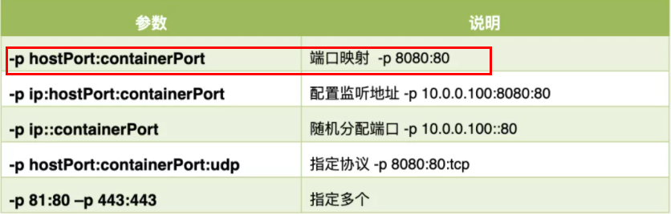

##### 一、Docker简介

###### 1、概述

- 是一种系统平滑移植，容器虚拟化技术
- 通过镜像(images)将作业系统核心除外，运作应用程式所需要的系统环境，由下而上打包，达到应用程式跨平台间的无缝接轨运作
- Docker的主要目标是使用户的APP（可以是一个WEB应用或数据库应用等等）及其运行环境能够做到“一次镜像，处处运行”
- Linux容器技术的出现就解决了这样一个问题，而 Docker 就是在它的基础上发展过来的，将应用打成镜像，通过镜像成为运行在Docker容器上面的实例，而 Docker容器在任何操作系统上都是一致的，这就实现了跨平台、跨服务器
- 总结：解决了运行环境和配置问题的软件容器，方便做持续集成并有助于整体发布的容器虚拟化技术

###### 2、容器与虚拟机比较

- 传统虚拟机技术是虚拟出一套硬件后，在其上运行一个完整的操作系统，在该系统上再运行所需应用进程
- 容器内的应用进程直接运行于宿主的内核，容器内没有自己的内核且也没有进行硬件虚拟，因此容器要比传统虚拟机更为轻便
- 每个容器之间互相隔离，每个容器有自己的文件系统，容器之间进程不会相互影响，能区分计算资源


##### 二、Docker安装

###### 1、前提条件

- Docker不是一个通用的容器工具，它依赖于已存在并运行的Linux内核环境，Docker实质上是已经运行的Linux下制造了一个隔离的文件环境，因此执行效率几乎等同于所部署的Linux主机，所以Docker必须部署在Linux内核的系统上

###### 2、Docker的基本组成

- 镜像（Image）：是一个只读的模板，镜像可以用来创建Docker容器，一个镜像可以创建很多容器
- 容器（Container）：
    - Docker 利用容器（Container）独立运行的一个或一组应用，应用程序或服务运行在容器里面，容器就类似于一个虚拟化的运行环境，容器是用镜像创建的运行实例
    - 可以把容器看做是一个简易版的 Linux 环境（包括root用户权限、进程空间、用户空间和网络空间等）和运行在其中的应用程序
- 仓库（Repository）：集中存放镜像文件的场所
- 工作原理：Docker是一个Client-Server结构的系统，Docker守护进程运行在主机上， 然后通过Socket连接从客户端访问，守护进程从客户端接受命令并管理运行在主机上的容器

###### 3、安装步骤

- 安装gcc相关
    - `yum -y install gcc`
    - `yum -y install gcc-c++`
- 安装需要的软件包
    - `yum install -y yum-utils`
- 设置stable镜像仓库（自定义为阿里云的仓库）
    - `yum-config-manager --add-repo http://mirrors.aliyun.com/docker-ce/linux/centos/docker-ce.repo`
- 更新yum软件包索引（非官方推荐，只是为了yum下载速度快一点）
    - `yum makecache fast`
- 安装Docker CE
    - `yum -y install docker-ce docker-ce-cli containerd.io`
- 启动Docker
    - `systemctl start docker`
- 测试是否安装成功
    - `docker version`
    - `docker run hello-world`

- 阿里云镜像加速器（非官方推荐）

    - ```shell
        sudo mkdir -p /etc/docker
        sudo tee /etc/docker/daemon.json <<-'EOF'
        {
          "registry-mirrors": ["https://eplysjiq.mirror.aliyuncs.com"]
        }
        EOF
        sudo systemctl daemon-reload
        sudo systemctl restart docker
        ```

###### 4、原理

- 开始（run命令）->Docker在本机中寻找该镜像
    - ->有该镜像->以该镜像为模板生产容器实例运行
    - ->没有镜像->去DockerHub上查找该镜像
        - ->Hub上可以找到->下载镜像到本地->以该镜像为模板生产容器实例运行
        - ->Hub上没有该镜像->返回失败错误，找不到该镜像


##### 三、Docker常用命令

###### 1、帮助启动类命令

- 启动docker： `systemctl start docker`
- 停止docker： `systemctl stop docker`
- 重启docker： `systemctl restart docker`
- 查看docker状态： `systemctl status docker`
- 开机启动： `systemctl enable docker`
- 查看docker概要信息： `docker info`
- 查看docker总体帮助文档： `docker --help`
- 查看docker命令帮助文档： `docker 具体命令 --help`

###### 2、镜像命令

- `docker images`
    - 列出本地主机上的镜像，其中TAG表示镜像的标签版本号，同一仓库源可以有多个TAG版本，如果不指定一个镜像的版本标签，将默认使用latest（最新版）
    - OPTIONS说明：
        - -a：列出本地所有的镜像（含历史映像层）
        - -q：只显示镜像ID（镜像主键在所有仓库中是唯一的）
- `docker search 镜像名字`
    - 去DockerHub查询该镜像的资源
    - OPTIONS说明：
        - --limit N：只列出N个镜像，默认25个
- `docker pull 镜像名字`
    - 将远程库的镜像下载到本地库
    - OPTIONS说明：
        - [:TAG]：表示下载该镜像TAG版本，如果不加，则默认下载latest最新版，如docker pull redis:6.0.8，则表示下载Redis的6.08版本
- `docker system df`
    - 查看镜像/容器/数据卷所占的空间
- `docker rmi 镜像名字`
    - 删除镜像
    - OPTIONS说明：
        - `docker rmi -f 镜像id`：删除单个（其中-f是强制删除的意思，也可以不加，可以用镜像名或镜像id来指定要删除的镜像）
        - `docker rmi -f 镜像名1:TAG 镜像名2:TAG`：批量删除指定的多个镜像
        - `docker rmi -f ${docker images -qa}`：删除所有镜像，也可以组合使用`docker images`删除筛选出来的镜像
- 补充：什么是虚悬镜像
    - 仓库名、TAG都是none的镜像，称为虚悬镜像（dangling image），会在DockerFile中介绍

###### 3、容器命令

- `docker run [OPTIONS] IMAGES [COMMAND] [AGR...]`

    - 新建并启动容器

    - OPTIONS说明：

        - --name="容器新名字"    为容器指定一个名称

        - -d: 后台运行容器并返回容器ID，也即启动守护式容器(后台运行)

        - -i：以交互模式运行容器，通常与 -t 同时使用

        - -t：为容器重新分配一个伪输入终端，通常与 -i 同时使用。也即启动交互式容器(前台有伪终端，等待交互)；

        - -P: 随机端口映射，大写P

        - -p: 指定端口映射，小写p

            

- `docker ps [OPTIONS]`

    - 列出当前所有正在运行的容器
    - OPTIONS说明：
        - -a：列出当前所有正在运行的容器+历史上运行过的
        - -l：显示最近创建的容器
        - -n：显示最近n个创建的容器
        - -q：静默模式，只显示容器编号

- 退出容器：

    - `exit`：run进去容器，exit退出，容器停止
    - `ctrl+p+q`：run进去容器，ctrl+p+q退出，容器不停止

- `docker start 容器id或容器名`

    - 启动已经停止运行的容器

- `docker restart 容器id或容器名`

    - 重启容器

- `docker stop 容器id或容器名`

    - 停止容器

- `docker kill 容器id或容器名`

    - 强制停止容器

- `docker rm 容器id`

    - 删除已停止的容器
    - 强制删除可以加-f
    - 一次性删除多个容器可以加`${docker ps -a -q}`等自定义的筛选条件

###### 4、进阶版容器命令

- 启动交互式容器（有前台命令行，可以输入命令进行交互）：`docker run -it 容器名`
- 启动守护式容器（后台服务器，没有命令行交互且不希望霸屏）：`docker run -d 容器名`
    - Docker容器后台运行,就必须有一个前台进程。容器运行的命令如果不是那些一直挂起的命令（比如运行top，tail），就是会自动退出的
    - 如Ubuntu没有前台进程，加-d的启动也会自动退出，因为如果Docker认为Ubuntu不输入命令，就没有存在的意思
    - 如Redis有自己的前台进程（或者说是server服务），会一直监听端口忙自己的事，Docker认为在后台时并不会空闲（有数据库操作），因此可以启动守护式容器
- 查看某个容器的日志：`docker logs 容器id`
- 查询容器内运行的进程：`docker top 容器id`
- 查询容器的内部细节：`docker inspect 容器id`
- 重新进入正在运行的容器并以命令行交互
    - `docker exec -it 容器id /bin/bash`（推荐使用）
        - 在容器中打开新的终端，并且可以启动新的进程，用exit退出不会导致容器的停止
    - `docker attach 容器id`
        - 直接进入容器启动命令的终端，不会启动新的进程，用exit退出会导致容器的停止
- 从容器内拷贝文件到主机上
    - `docker cp 容器ID:容器内路径 目的主机路径`
- 将容器导入或导出
    - `docker export 容器id > 自定义文件名.tar`
        - 会把该容器导出，其内容作为一个tar归档文件，且tar文件生成在当前目录下
    - `cat 文件名.tar | docker import -镜像用户/镜像名:镜像版本号`
        - 会从tar包中的内容创建一个新的文件系统再导入为镜像。其中镜像用户/镜像名对应之后的repository标签，镜像版本号对应之后的TAG标签，可以自定义


##### 四、Docker镜像

###### 1、概述

- 是一种轻量级、可执行的独立软件包，它包含运行某个软件所需的所有内容，我们把应用程序和配置依赖打包好形成一个可交付的运行环境(包括代码、运行时需要的库、环境变量和配置文件等)，这个打包好的运行环境就是image镜像文件。

###### 2、联合文件系统

- Union文件系统（UnionFS）是一种分层、轻量级并且高性能的文件系统，它支持对文件系统的修改作为一次提交来一层层的叠加，同时可以将不同目录挂载到同一个虚拟文件系统下(unite several directories into a single virtual filesystem)。
- Union 文件系统是 Docker 镜像的基础。镜像可以通过分层来进行继承，基于基础镜像（没有父镜像），可以制作各种具体的应用镜像。
- 特性：一次同时加载多个文件系统，但从外面看起来，只能看到一个文件系统，联合加载会把各层文件系统叠加起来，这样最终的文件系统会包含所有底层的文件和目录
- Docker采用分层结构的意义：共享资源，方便复制迁移，就是为了复用

###### 3、Docker的Commit操作

- Docker镜像层都是只读的，容器层是可写的。当容器启动时，一个新的可写层被加载到镜像的顶部。这一层通常被称为“容器层”，“容器层”之下的都叫“镜像层”。
- 基于官方的镜像运行一个实例之后，在容器中添加自定义功能，之后提交该容器副本，使之成为一个新的镜像
- `docker commit -m="提交的描述信息" -a="作者" 容器ID 要创建的目标镜像名:[标签名]`
- Docker中的镜像分层，支持通过扩展现有镜像，创建新的镜像。类似Java继承于一个Base基础类，自己再按需扩展。新镜像是从 base 镜像一层一层叠加生成的。每安装一个软件，就在现有镜像的基础上增加一层


##### 五、本地镜像发布到阿里云

###### 1、生成镜像

- 基于base容器创建一个新的镜像，新功能增强
    - `docker commit -m="提交的描述信息" -a="作者" 容器ID 要创建的目标镜像名:[标签名]`
- DockerFile（后面详细讲）

###### 2、将本地镜像推送到阿里云

- 登录阿里云容器镜像服务，创建自定义命名空间，并在新建的命名空间中建立仓库

- 进入仓库的管理界面获得脚本命令（下面的是示例，以实际为准）

    ```shell
    docker login --username=自己的用户名 registry.cn-hangzhou.aliyuncs.com
    docker tag cea1bb40441c registry.cn-hangzhou.aliyuncs.com/atguiguwh/myubuntu:1.1
    docker push registry.cn-hangzhou.aliyuncs.com/atguiguwh/myubuntu:1.1
    ```

- 将阿里云上的镜像下载到本地（下面的是示例，以实际为准）

    ```shell
    docker pull registry.cn-hangzhou.aliyuncs.com/atguiguwh/myubuntu:1.1
    ```

    

##### 六、本地镜像发布到私有库

###### 1、概述

- Dockerhub、阿里云这样的公共镜像仓库可能不太方便，涉及机密的公司不可能提供镜像给公网，所以需要创建一个本地私人仓库供给团队使用，基于公司内部项目构建镜像。
- Docker Registry是官方提供的工具，可以用于构建私有镜像仓库

###### 2、将本地镜像推送到私有库

- 下载镜像DockerRegistry：`docker pull registry`

- 运行私有库Registry，相当于本地私有的DockerHub，且指定端口号位5000作为映射：`docker run -d -p 5000:5000 -v /zzyyuse/myregistry/:/tmp/registry --privileged=true registry`

- 将要推送的镜像修改符合私服规范的TAG：`docker tag 原镜像名:tag 主机ip:映射的主机端口/自定义镜像名:tag`，如`docker tag foo:0.0.1 192.168.111.162:5000/bar:0.1.2`

- 修改docker的配置文件，使之支持http（docker默认不允许http方式推送镜像，通过配置选项来取消这个限制）

    ```shell
    vim /etc/docker/daemon.json
    #在原先配置的阿里云镜像加速下面，新增一条Json信息
    {
      "registry-mirrors": ["https://aa25jngu.mirror.aliyuncs.com"],
      "insecure-registries": ["192.168.111.162:5000"]
    }
    ```

- 将镜像推送到本地私有库：`docker push 主机ip:映射的主机端口/自定义镜像名:tag`，如`docker push 192.168.111.162:5000/bar:0.1.2`

- 验证本地私有库中的镜像：`curl -XGET http://主机ip:映射的主机端口/v2/_catalog`
- 将本地私有库中的镜像pull到本地：`docker pull 主机ip:映射的主机端口/自定义镜像名:tag`
- 查看私有仓库中指定镜像的版本：`curl -XGET http://私有仓库宿主ip:端口/v2/镜像名称/tags/list`