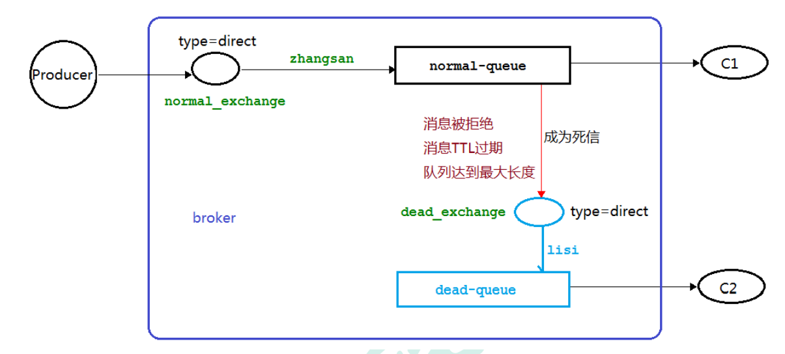

##### 一、消息队列

###### 1、MQ相关概念

- 是一种存放消息的队列，还是一种跨进程的通信机制，是常见的上下游“逻辑解耦” +“物理解耦”的消息通信服务，使消息发送上游只需要依赖MQ，不用依赖其他服务
- 功能：流量削峰、应用解耦、异步处理

###### 2、安装MQ

- 安装Erlang：`rpm -ivh erlang-21.3-1.el7.x86_64.rpm`
- 安装依赖包：`yum install socat -y`
- 安装mq：`rpm -ivh rabbitmq-server-3.8.8-1.el7.noarch.rpm`

- 添加开机启动mq服务：`chkconfig rabbitmq-server on`
- 先关闭mq服务，再安装图形化界面：`rabbitmq-plugins enable rabbitmq_management`
    - 访问图形化界面：ip+15672
- 添加用户并设置权限
    - 创建账号：`rabbitmqctl add_user root 123`
    - 设置用户角色：`rabbitmqctl set_user_tags root administrator`
    - 设置用户权限：`rabbitmqctl set_permissions -p "/" root ".*" ".*" ".*"`
    - 查看当前用户和角色：`rabbitmqctl list_users`


##### 二、RabbitMQ

###### 1、RabbitMQ概念

- 是一个消息中间件，接受、存储和转发消息数据
- MQ由数个交换机和队列组成

###### 2、四大核心概念

- 生产者：产生数据发送消息的程序
- 交换机：接受来自生产者的消息并将消息推送到队列中，一个交换机可以对应多个队列
- 队列：RabbitMQ内的一种数据结构，本质是一个大的消息缓冲区，生产者可以将消息发送到一个队列，消费者可以从一个队列中接收数据
- 消费者：一个等待接收消息的程序
- 注：
    - 同一个程序可以既是生产者也是消费者
    - 一个队列对应一个消费者，多个消费者对应同一个队列时，首位消费者可以获取到消息，而后面的取不到

###### 3、RabbitMQ的六种模式

- 简单模式（Hello World）
- 工作模式（Work Queues）
- 发布订阅模式（Publish/Subscribe）
- 路由模式（Routing）
- 主题模式（Topics）
-  发布确认模式（Publisher Confirms）


##### 三、简单模式（hello world）

###### 1、生产者代码

```java
/**
 * 生产者，发送消息
 */
public class Producer {
    public static final String QUEUE_NAME = "hello";//队列名称

    public static void main(String[] args) throws IOException, TimeoutException {
        //创建连接工厂
        ConnectionFactory factory = new ConnectionFactory();
        //工厂IP连接RabbitMQ队列
        factory.setHost("192.168.63.100");
        factory.setUsername("root");
        factory.setPassword("123");
        //创建连接
        Connection connection = factory.newConnection();
        //获取信道
        Channel channel = connection.createChannel();
        /**
         * 生成一个队列
         * 1、队列名称
         * 2、队列中的消息是否持久化（存放在磁盘内），否则存放在内存中
         * 3、该队列是否进行消息共享，false：多个消费者消费 true：只能一个消费者消费
         * 4、最后一个消费者断开连接之后，该队列是否自动删除
         * 5、其他参数
         */
        channel.queueDeclare(QUEUE_NAME, false, false, false, null);
        //定义要发送的消息
        String msg = "hello world";
        /**
         * 使用信道发送消息
         * 1、发送到哪个交换机
         * 2、路由的key值，本次是队列名称
         * 3、其他参数
         * 4、发送消息的消息体
         */
        channel.basicPublish("", QUEUE_NAME, null, msg.getBytes());

        System.out.println("消息发送完毕");
    }
}
```

###### 2、消费者代码

```java
/**
 * 消费者，接收消息
 */
public class Consumer {
    public static final String QUEUE_NAME = "hello";//队列名称

    public static void main(String[] args) throws Exception {
        //创建连接工厂
        ConnectionFactory factory = new ConnectionFactory();
        //工厂IP连接RabbitMQ队列
        factory.setHost("192.168.63.100");
        factory.setUsername("root");
        factory.setPassword("123");
        //创建连接
        Connection connection = factory.newConnection();
        //获取信道
        Channel channel = connection.createChannel();
        /**
         * 消费者接收消息
         * 1、消费哪个队列
         * 2、消费成功之后是否要自动应答
         * 3、消费者未成功消费的回调
         * 4、消费者取消消费的回调
         */
        channel.basicConsume(
                QUEUE_NAME,
                true,
                (consumerTag, msg) -> System.out.println(new String(msg.getBody())),
                (consumerTag) -> System.out.println("消费消息被中断"));

    }
}
```


##### 四、工作队列模式（Work Queues）

- 工作队列(又称任务队列)的主要思想是避免立即执行资源密集型任务，而不得不等待它完成。 相反我们安排任务在之后执行。我们把任务封装为消息并将其发送到队列。在后台运行的工作进程将弹出任务并最终执行作业。当有多个工作线程时，这些工作线程将一起处理这些任务

###### 1、轮询分发消息

- 生产者发布大量消息到队列后，多个工作线程（消费者）轮询接收消息
- 多个消费者是竞争的关系
- 一个消息只能被处理一次，不可以处理多次

###### 2、消息应答

- 消费者在接收到信息并且**处理完该消息之后**，告诉Rabbitmq已经处理了，Rabbitmq就可以把该消息删除了
- 自动应答：仅在消费者可以高效并以某种速率能够处理这些消息的情况下使用（一般是接收到消息时就会ack，不去管是否处理完成）
- 手动应答：
    - 肯定确认：basicAck，rabbitmq已知该消息并且成功的处理消息，可以将其丢弃
    - 否定确认：不处理该信息了并直接拒绝，可以将其丢弃
        - basicNack
        - basicReject：比上者少一个批量处理的参数

###### 3、Multiple参数

- true代表批量应答channel上未应答的消息
    - 如channel上有传送的消息，5,6,7,8，且当前flag为8，那么此时5-8的这些还未应答的消息都会被确认收到消息应答
- false相反
    - 只会应答flag=8的消息，5,6，7三个消息依然不会被确认收到消息应答

###### 4、消息重新入队

- 如果消费者由于某些原因失去连接(其通道已关闭，连接已关闭或 TCP 连接丢失)，导致消息未发送 ACK 确认，RabbitMQ 将了解到消息未完全处理，并将对其重新排队。

###### 5、RabbitMQ持久化

- Rabbitmq在退出或崩溃时，会丢失队列和其中的消息，因此确保不会丢失，需要将队列和消息都标记为持久化

- 队列实现持久化

    - 已有的队列如果不是持久化，需要先删除队列才可以更改成持久化，否则会报错

    - 在`queueDeclare`创建队列时，持久化参数设为true


- 消息实现持久化

    - 生产者在发布消息时，添加参数`MessageProperties.PERSISTENT_TEXT_PLAIN`

    - 但不能保持一定持久化成功，比如在刚准备存储在disk还没存储完，消息还在缓存的一个间隔点时，此时并没有真正写入磁盘


###### 6、不公平分发

- 在消费者方设置不公平分发模式`channel.basicQos(1);`如果是0的话也是公平分发（轮询）
- 意思就是如果这个任务我还没有处理完或者我还没有应答你，你先别分配给我，我目前只能处理一个任务，然后 rabbitmq 就会把该任务分配给没有那么忙的那个空闲消费者，当然如果所有的消费者都没有完成手上任务，队列还在不停的添加新任务，队列有可能就会遇到队列被撑满的情况，这个时候就只能添加 新的 worker 或者改变其他存储任务的策略。

###### 7、预取值

- 在消费者方设置`channel.basicQos(foo);`foo值就是定义通道中允许的未确认消息的最大数量
- 如消费者A为5，消费者B为2，那么不管A处理消息的快慢，A中未确认消息的最大数量为5，若此时B在处理1条消息，之后新来一条消息，会分发到消费者B


##### 五、发布确认

###### 1、发布确认原理

- 发布确认：生产者发送消息到队列之后，**队列**和**消息**都到达磁盘上**并达成持久化的目标**之后，队列向生产者反馈发布已确认

###### 2、发布确认策略

- 生产者发送消息时，信道开启发布确认`channel.confirmSelect()`
- 单个确认发布
    - 是一种同步的确认发布方式，也就是发布一个消息之后只有他在被确认发布，后续的消息才能继续发布
    - `waitForConfirmsOrDie()`这个方法只有在消息被确认的时候才返回true，如果在指定时间范围内这个消息没有被确认那么它将抛异常
    - 缺点是发布速度特别慢
- 批量确认发布
    - 是一种同步的确认发布方式，先发布一批消息然后一起确认，可以极大地提高吞吐量
    - 批量发布之后，执行`waitForConfirmsOrDie()`进行确认
    - 缺点是发生故障导致发布出现问题时，不知道是哪个消息出现问题
- 异步确认发布
    - 可靠性和效率高，可以利用回调函数来达到消息的可靠性传递（即确认和确认失败都会通过回调函数来通知，并表明是哪一条消息失败）
    - 准备消息的监听器`channel.addConfirmListener()`，其中两个参数为：消息确认成功的回调函数、消息确认失败的回调函数
    - 处理异步未确认的消息
        - 把未确认的消息放到一个基于内存的能被发布线程访问的队列，比如用ConcurrentLinkedQueue，这个队列在消息确认回调函数与发布线程之间进行消息传递


##### 六、交换机（exchange）

- 一个队列的消息只能被消费一次，生产者可以将消息发给交换机，交换机将消息通过绑定发送给两个队列，两个队列就可以被两个消费者消费，相当于同一个消息被消费了两次

###### 1、概念

- 生产者生产的消息从不会直接发送到队列，只能将消息发送到交换机，即使不指定交换机，Rabbitmq也会使用默认的交换机
- 交换机一方面接收来自生产者的消息，另一方面将消息推送到队列
- 交换机必须确切知道如何处理收到的消息，是应该把消息放到特定的队列还是放到许多队列还是丢失，这由交换机的类型来决定
- 交换机类型
    - 直接类型（direct）-路由类型
    - 主题类型（topic）
    - 标题类型（headers）
    - 扇出类型（fanout）-发布/订阅类型
    - 无名类型（用空串表示）-默认交换类型
- 消息能路由发送到队列中其实是routingKey绑定key指定的

###### 2、临时队列

- 没有持久化，一旦断开消费者的连接，将被自动删除的队列，如`channel.queueDeclare().getQueue()`

###### 3、绑定

- 交换机与队列之间的桥梁，用来表明交换机和哪个队列进行了绑定关系。即交换机通过RoutingKey来将消息路由到对应的队列中

###### 4、fanout交换机（发布/订阅模式）

- 将接收到的所有消息广播到它知道的所有队列中
- 即routingkey相同，交换机将消息发送到所有routingkey相同的队列，达成消息共享的功能
- 消费者
    - 声明一个fanout类型的交换机`channel.exchangeDeclare(EXCHANGE_NAME, "fanout");`
    - 将交换机与队列通过routingKey（可以为空串）进行绑定`channel.queueBind(QUEUE_NAME,EXCHANGE_NAME, "");`
    - 接收消息`channel.basicConsume()`
- 生产者
    - 声明一个fanout类型的交换机`channel.exchangeDeclare(EXCHANGE_NAME, "fanout");`（如果已经有了声明，就可以不用再声明）
    - 通过routingKey值，将消息发送到绑定的交换机`channel.basicPublish(EXCHANGE_NAME, "", null, message.getBytes("UTF-8"));`

###### 5、direct交换机（路由模式）

- 一个交换机绑定多个队列，且routingkey不同。达成消息不共享的功能
- 如果routingkey没有绑定队列，那么通过该routingkey发送的消息将会丢失

###### 6、Topics交换机

- topic交换机routingkey的规则
    - 必须是一个单词列表，以点号分隔开，如“stock.order.user”
    - 星号可以代替一个单词
    - 井号可以代替零个或多个单词
- 如，有以下三个routingkey
    - \*.orange.\*，路由队列为Q1
    - \*.\*.rabbit ，路由队列为Q2
    - lazy.#，路由队列为Q2
    - quick.orange.rabbit 被队列 Q1Q2 接收到
    - lazy.orange.elephant 被队列 Q1Q2 接收到
    - quick.orange.fox 被队列 Q1 接收到
    - lazy.brown.fox 被队列 Q2 接收到
    - azy.pink.rabbit 虽然满足两个绑定但只被队列 Q2 接收一次
    - quick.brown.fox 不匹配任何绑定不会被任何队列接收到会被丢弃
    - quick.orange.male.rabbit 是四个单词不匹配任何绑定会被丢弃
    - lazy.orange.male.rabbit 是四个单词但匹配 Q2
- 特殊情况
    - 当一个队列的绑定键是#，那么这个队列将接收所有的数据，退化为fanout
    - 当一个队列绑定键中，没有#和*，那么这个队列退化为direct


##### 七、死信队列

###### 1、概念

- 由于特定的原因导致queue中的某些消息无法被消费，这样的消息如果没有后续的处理，就变成了死信
- 应用场景
    - 当消息消费发生异常时，将消息投入到死信队列，保证订单业务的消息数据不丢失
    - 用户在商城下单成功并点击去支付后，在指定的时间未支付自动失效

- 死信的来源
    - 消息TTL过期，还没来得及消费就过期了
    - 队列达到最大长度，队列满了，无法再添加数据到mq中
    - 消息被拒绝（reject或nack），并且不再放回到队列中（requeue=false），**此时放入死信队列，后续处理**

###### 2、消息TTL过期

- 简单死信架构



- 消费者C1
    - 声明普通交换机
    - 声明死信交换机
    - 声明普通队列：`Map<String, Object> args = new HashMap<>()`（以TTL过期为例）
        - TTL过期时间可以由生产者指定，也可以普通队列指定
        - 普通队列设置死信交换机：args.put("x-dead-letter-exchange", "死信交换机名称如dead-exchange")
        - 普通队列设置死信routingKey：args.put("x-dead-letter-exchange", "自定义routingKey如lisi")
        - 完成声明普通队列：queueDeclare(参数1, 参数2, 参数3, 参数4, args );
    - 声明死信队列
    - 通过routingKey绑定普通队列和普通交换机
    - 通过routingKey绑定死信队列和死信交换机
    - 消费者C1接收消息
- 生产者Producer
    - 设置TTL：`AMQP.BasicProperties properties = new AMQP.BasicProperties().builder.exiration("10*1000").build()`
    - 发送死信消息：basicPublish(参数1，参数2，properties，参数4)
- 消费者C2
    - 消费者C2接收消息：basicConsume("死信队列名称"，参数2，参数3，参数4)

###### 3、队列达到最大长度

- 消费者C1在设置普通队列时，增加参数：`args.put("x-max-length", 6)`，代表这个队列最多只能容纳6个消息

###### 4、消息被拒

- 消息被消费者C1拒绝`basicReject(msg.getEnvelope().getDeliveryTag(), false)`，参数一为拒绝的消息的标签，参数二为不再放回普通队列
- 开启手动应答才能拒绝消息


##### 八、延迟队列

###### 1、概念

- 队列内部是有序的
- 延迟队列中的元素是希望在指定时间到了以后或之前取出和处理，简单来说就是用来存放需要在指定时间被处理的元素的队列
- 基于死信队列去实现，会存在执行顺序的问题
- 基于插件去实现（不经过死信队列），解决了执行顺序的问题

###### 2、使用场景

- 如果使用定时器去轮询的查看是否执行任务，则会对数据库造成巨大的压力，可以选择消息队列来处理
- 订单在十分钟内未支付则自动取消
- 新创建的店铺，如果在十天内没有更新商品，则发送消息提醒
- 用户注册成功之后，如果三天内没有登录则进行短信提醒
- 用户发起退款，如果三天内没有得到处理则通知相关人员
- 预定会议后，需要在预定的时间点前十分钟通知参会人员

###### 3、RabbitMQ中的TTL

- TTL是RabbitMQ中一个消息或者队列的属性，表明一条消息或者该队列中的所有消息的最大存活时间
- 如果消息设置了TTL或者进入了设置了TTL的队列，且在TTL内未消费，则进入死信队列
- 如果同时配置了队列的TLL和消息的TLL，那么会使用较小的那个值
- 设置TTL的两种方式
    - 消息设置TTL，在发送消息的时候，设置参数
        - 消息过期，也不一定会被马上丢弃，因为消息是否过期是在即将投递到消费者之前判定的，如果此时队列有严重的消息积压，则已过期的消息还能存活一段时间
    - 队列设置TTL，在创建队列的时候，添加“x-message-ttl”属性
        - 一旦消息过期，消息就会被丢弃（如果配置了死信则会推到死信队列中）
- 特殊的TTL
    - 不设置TTL，则不会过期
    - 设置TTL为0，则表示除非此时可用直接投递到消费者，否则丢弃
- 存在的问题：RabbitMQ只会检查第一个消息是否过期，如果第一个消息的延时时间很长，而第二个消息的延时时间很短，那么第二个消息并不会优先得到执行，是因为队列先进先出的特性

###### 4、使用插件实现延迟队列

- 使用插件实现在消息粒度上的TTL，并使其在设置的TTL时间内及时死亡
- 安装插件
    - 将插件放到该目录`/usr/lib/rabbitmq/lib/rabbitmq_server-3.8.8/plugins`
    - 安装插件`rabbitmq-plugins enable rabbitmq_delayed_message_exchange`
    - 重启RabbitMQ即可生效
    - 安装完成后，新增交换机时，会多一个`x-delayed-message`类型


##### 九、发布确认（高级）

###### 1、发布确认机制

- 在生产环境中由于一些不明原因，导致 rabbitmq 重启，在 RabbitMQ 重启期间生产者消息投递失败，导致消息丢失，需要手动处理和恢复。
- 交换机和队列，只要其一不可用，那么消息投递就会失败，此时应该设立缓存机制，如果不可投递，则临时放到缓存中，等RabbitMQ可用时，缓存通过定时任务对未成功发送的消息重新投递

###### 2、回调接口

- 交换机确认回调方法
    - 发消息且交换机接收到，触发成功回调
        - 返回回调消息的ID以及相关信息、返回ack为true、返回失败原因为null
    
    
    
    - 发消息且交换机接收失败，触发失败回调
        - 返回回调消息的ID以及相关信息、返回ack为false、返回失败原因
- 其中返回回调消息的ID以及相关信息需要在生产者发送消息时，将参数传入
- 需要在yaml文件中开启发布确认配置，否则不会触发回调方法`spring.rabbitmq.publisher-confirm-type=correlated`
- 成功回调和失败回调是针对消息推送到交换机的，消息正常到达交换机后，会触发成功回调，但之后如果交换机无法将消息路由到队列，并不会触发任何回调，会造成消息的丢失

###### 3、回退消息

- 在仅开启了生产者确认机制的情况下，交换机接收到消息后，会直接给消息生产者发送确认消息，如果发现该消息不可路由，那么消息会被直接丢弃，此时生产者是不知道消息被丢弃这个事件的（即传达到了交换机，但是没有到达队列）
- 通过设置 mandatory 参数可以在当消息传递过程中不可达目的地时将消息返回给生产者。
    - 在yaml中设置参数`spring.rabbitmq.publisher-returns=true`，来表示如果消息投递失败，会告知生产者
    - 实现回退接口`RabbitTemplate.ReturnCallback`，重写回调的方法，只有在消息不可达到目的地时才能触发回调方法，并返回错误信息

###### 4、备份交换机

- 用来处理因无法送达交换机或队列而被退回的消息，通常情况下，是返回到生产者
- 可以使用备份交换机，在消息无法送达时，将消息投递到备份交换机，然后再由备份交换机路由到自定义的队列（类似死信队列）
- 备份交换机可以实现监测、报警和备份消息的功能
- 通常备份交换机为fanout类型，方法将所有消息都投递到与其绑定的队列中
- 在声明交换机时，链式调用`.alternate(备份交换机名)`
- 备份交换机的优先级要高于回退消息


##### 十、RabbitMQ其他知识

###### 1、幂等性

- 用户对于同一操作发起的一次请求或者多次请求的结果是一致的
    - 如Get请求，用于获取资源，不会对系统资源进行改变，是幂等操作
    - 如Post请求，一般用于创建资源，每次执行都会新增数据，是非幂等操作
- MQ中消息重复消费
    - MQ已经把消息发送给了消费者，但是消费者在给MQ返回ack时网络中断，此时MQ未收到确认消息，该条消息就会重新发给其他消费者，或者在网络重连之后再次发送给该消费者，但实际上消费者已经完成了消息的消费，从而造成了消息的重复消费
- 解决方案：
    - 唯一ID：通过业务规则等给消息拼接出一个唯一的id，消费消息时，利用查询语句判断这个id是否已经存在数据库中
        - 缺点是高并发时，数据库会有性能瓶颈
    - Redis的原子性：执行setnx命令，即key存在时不可赋值（分布式锁的原理）

###### 2、优先级队列

- 队列本身的属性是消息先进先被消费，后进后消费，优先级队列可以将该队列的消息标记0-255优先度，值越大越优先，优先级高的优先被消费
- 优先级设置
    - 在声明队列时，添加参数"x-max-priority"，值为0-255任意一个，表明优先级的最高值
    - 在发送消息时，添加该消息的优先级`AMQP.BasicProperties().builder().priority(5).build()`
    - 消费者需要等待消息已经发送到队列中才去消费，因为这样才有机会对消息进行排序

###### 3、惰性队列

- 惰性队列会将接收到的消息直接存入磁盘，不管是否为持久化的，减少了内存消耗，但增加了I/O的使用
- 当消费者由于各种原因（如下线、宕机、维护关闭）而导致长时间不能消费消息造成消息堆积时，就可以使用惰性队列来减轻内存的压力
- 设置惰性队列：在创建队列时，使用"x-queue-mode"，值为"lazy"来设置为惰性队列


##### 十一、RabbitMQ集群

###### 1、集群

搭建。。。

###### 2、镜像队列

- 普通集群的局限性：在哪个节点上创建了队列，就只存在于哪个节点，节点间的队列不共享，如果其中节点挂掉，则其中的队列中的消息会全部丢失
- 可以将一个节点的队列、交换机备份到另一个节点，同步模式可以选择自动同步

###### 3、Federation Queue

- 上游节点：复制的源端被称为 upstream
- 下游节点：复制的目的端被称为 downstream
- Federation 插件可以将消息从一个 Exchange 复制到另一个 Exchange，或从一个 Queue 分发到另一个 Queue
- 需要在两个集群（或两个节点）都开启 Federation 插件，并且在 downstream 集群创建 Federation，配置 upstream
- 种类
    - Exchange Federation：可以实现消息在 Exchange 间的复制（同步）
        - 可以将消息发到其他集群。当消息发送到被联邦的 Exchange 时，消息会被发送到本地的 Exchange 和 下游的集群。这样就可以在不同的集群多次消费消息
    - Queue Federation：效果是消息的负载均衡，它只会将消息发往有空闲消费者的下游集群。也就是说，消息不会被复制
        - 常被用于分散压力和集群消息转移

###### 4、Shovel

- 可以从一个节点中的队列(作为源端，即source)拉取数据并转发至另一个节点中的交换器(作为目的端，即 destination)
- 作为源端的队列和作为目的端的交换器可以同时位于同一个节点，也可以位于不同的节点上
