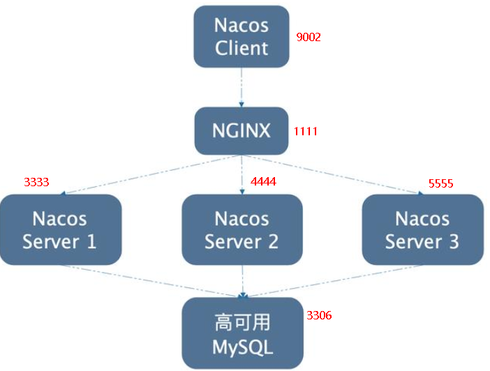

##### 一、SpringCloud-H版组件

###### 1、服务注册中心

- × Eureka
- √ zookeeper、Consul、Nacos

###### 2、服务调用1

- √ Ribbon、LoadBalancer

###### 3、服务调用2

- × Feign
- √ OpenFeign

###### 4、服务降级

- × Hystrix
- √ Resilience4j、sentinel

###### 5、服务网关

- × Zuul
- ? Zuul2
- √ GateWay

###### 6、服务配置

- × Config
- √ Nacos

###### 7、服务总线 

- × Bus
- √ Nacos


##### 二、微服务架构编码构建

###### 1、IDEA新建Project工作空间

- 微服务cloud整体聚合父工程Project

###### 2、父工程POM

- 进行依赖版本的约束

###### 3、Rest微服务工程构建

- cloud-provider-payment9001，微服务提供者支付Module模块
    - 建cloud-provider-payment9001模块
    - 改POM，将依赖引入到模块中
    - 写Yml，在类路径中新建配置文件
    - 新建SpringBoot主启动类
    - 业务类
        - 实体类Entity、Json封装体返回类
        - 数据库访问对象类dao、mybatis的映射文件
        - 模块功能接口service、实现类serviceImpl
        - 模块功能控制器controller
- cloud-consumer-order9000，微服务消费者订单Module模块（80端口被占用了）
    - 建cloud-consumer-order9000模块
    - 改POM，将依赖引入到模块中
    - 写Yml，在类路径中新建配置文件，只需要写端口即可
    - 新建SpringBoot主启动类
    - 业务类
        - 实体类Entity、Json封装体返回类
        - 模块功能控制器controller（只需要Controller即可，因为功能的实现在提供者内）
        - 配置RestTemplate，通过RestTemplate进行消费者对提供者的远程调用（使用RestTemplate远程调用一个HTTP接口）
- 工程重构
    - 有重复的类，新建cloud-api-commons，放服务接口、第三方接口、工具类、重复使用的类，不对外暴露，因此没有端口设置
    - maven命令：clean、install进行打包，供其他的项目使用
    - 每个模块的POM中，引入maven打包的自定义通用api的依赖，然后删除冗余的类即可


##### 三、Eureka服务注册与发现

###### 1、基础

- 服务治理：传统的RPC远程调用框架中，管理每个服务与服务之间的依赖关系比较复杂，所以需要服务治理，管理服务与服务之间的依赖关系，可以实现服务调用、负载均衡、容错等，实现服务发现与注册
- 服务注册与发现
    - Eureka Server 作为服务注册功能的服务器，它是服务注册中心。而系统中的其他微服务，使用 Eureka的客户端连接到 Eureka Server并维持心跳连接
    - 在服务注册与发现中，有一个注册中心。当服务器启动的时候，会把当前自己服务器的信息 比如 服务地址通讯地址等以别名方式注册到注册中心上。
    - 总结
        - 服务注册：将服务信息注册到注册中心
        - 服务发现：从注册中心上获取服务信息
- Eureka包含两个组件：Eureka Server和Eureka Client
    - Eureka Server提供服务注册服务：各个微服务节点通过配置启动后，会在EurekaServer中进行注册，这样EurekaServer中的服务注册表中将会存储所有可用服务节点的信息，服务节点的信息可以在界面中直观看到。
    - EurekaClient通过注册中心进行访问：是一个Java客户端，用于简化Eureka Server的交互，客户端同时也具备一个内置的、使用轮询(round-robin)负载算法的负载均衡器。在应用启动后，将会向Eureka Server发送心跳(默认周期为30秒)。如果Eureka Server在多个心跳周期内没有接收到某个节点的心跳，EurekaServer将会从服务注册表中把这个服务节点移除（默认90秒）

###### 2、单机构建Eureka

- IDEA生成EurekaServer服务端注册中心
    - 建module：cloud-eureka-server7001
    - 改pom：将Eureka的服务端的依赖添加进去
    - 写yml：配置端口以及Eureka服务端配置
    - 主main类：添加注解`@EnableEurekaServer`，表明本服务就是Eureka的服务端
- EurekaClient端cloud-provider-payment9001将注册进EurekaServer成为服务提供者provider
    - 改pom：将Eureka的客户端的依赖添加进去
    - 写yml：写Eureka服务端配置
    - 主main类：添加注解`@EnableEurekaClient`，表明本服务就是Eureka的客户端
- EurekaClient端cloud-consumer-order9000将注册进EurekaServer成为服务消费者consumer
    - 改pom：将Eureka的客户端的依赖添加进去
    - 写yml：写Eureka服务端配置
    - 主main类：添加注解`@EnableEurekaClient`，表明本服务就是Eureka的客户端

###### 3、集群构建Eureka

- 原理
    - 启动注册中心后，提供者会把自身信息注册到eureka
    - 消费者在需要调用接口时，使用服务别名去注册中心获取实际的RPC远程调用地址
    - 消费者获得调用地址后，底层实际使用httpClient技术实现远程调用，且获得调用地址后，会缓存到本地的JVM内存中，默认每间隔30s更新一次服务调用地址
- Eureka集群环境构建步骤
    - 建module：cloud-eureka-server7002
    - 改pom：将Eureka的服务端的依赖添加进去，并在父POM中添加子module
    - 修改host文件：使localhost不同的端口号映射同一个地址（不同域名用一个ip地址）
    - 写yml：遵循“相互守望、相互注册”的原则，将另一台Eureka注册到自己的yml中
    - 主main类：添加注解`@EnableEurekaServer`，表明本服务就是Eureka的服务端
- 将提供者和消费者发布到集群配置中
    - 修改yml中的defaultZone，指向两台服务器的地址
- 启动顺序：
    - eureka服务端
    - 服务提供者
    - 服务消费者
- 提供者服务集群环境构建
    - 建module：cloud-provider-payment9002
    - 改pom：将Eureka的客户端的依赖添加进去，并在父POM中添加子module
    - 写yml：改端口，其余跟9001相同
    - 主main：添加注解`@EnableEurekaClient`，表明本服务就是Eureka的客户端
    - 业务类：与9001相同
- 负载均衡
    - 订单访问服务地址不能写死成id+端口，而是通过在Eureka上注册过的微服务名称调用
    - @LoadBalanced注解在config中的RestTemplate上，使RestTemplate实现负载均衡的能力
    - Ribbon和Eureka整合后，消费者可以直接调用服务而不用关心地址和端口号，且该服务还有负载均衡的功能
- actuator微服务信息完善
    - 修改主机：服务名称
        - 在注册中心中，应用会显示主机名+服务名，不规范
        - 在提供者yml中，添加instance-id，设置的名称即在注册中心中显示的名称
    - 访问路径显示ip地址
        - 现在显示的是主机名+端口，不方便找具体的服务（规范应该是ip：port：服务名称）
        - 在提供者yml中，设置prefer-ip-address为true，即可在访问路径中显示ip地址
    - 总结：pom中的spring-boot-starter-actuator、spring-boot-starter-web和yml中的instance-id、prefer-ip-address完善了微服务的信息
- 服务发现Discovery
    - 对于注册进Eureka里面的微服务，可以通过服务发现来获得该服务的信息
    - 注入DiscoveryClient，来获得每个实例、服务的信息
    - 主启动类，使用注解`@EnableDiscoveryClient`
- Eureka自我保护机制
    - 现象和原因
        - 某时刻某一个微服务不可用了，Eureka不会立即清理，依旧会对该微服务的信息进行保存
        - 在自我保护模式中，Eureka服务器会保护服务注册表中的信息，不再注销任何服务实例
        - 因为微服务与Eureka服务器没有心跳连接的原因，可能只是网络故障，而非微服务实例本身健康度出现问题，，而不应该注销这个微服务。因此，当EurekaServer节点在短时间内丢失过多客户端时（可能发生了网络分区故障），那么这个节点就会进入自我保护模式。
        - 属于CAP里面的AP分支
    - 怎么禁止自我保护
        - 在Eureka服务端中，配置enable-self-preservation为false，eviction-interval-timer-in-ms为清理无效节点的频率，可以手动降低
        - 在Eureka客户端中，eureka.instance.lease-renewal-interval-in-seconds为客户端发送心跳间隔，eureka.instance.lease-expiration-duration-in-seconds为未发送心跳的超时时间


##### 四、Zookeeper服务注册与发现

- 使用SpringCloud整合zookeeper代替Eureka
- 服务配置注册中心


##### 五、Consul服务注册与发现

- 使用SpringCloud整合Consul代替Eureka
- 服务配置注册中心


##### 六、三个注册中心总结

###### 1、CAP理论

- C：Consistency（一致性）、A：Availability（可用性）、P：Partition Tolerance（分区容错性）
- CAP理论关注的颗粒度是数据，而不是整体系统设计的策略
- 微服务架构永远要保证P，因此微服务系统要么是AP，要么是CP
- 一个分布式系统不可能同时很好的满足一致性、可用性、分区容错性三个需求，最多只能同时较好的满足两个
- CA：单点集群，满足一致性、可用性的系统，通常在可扩展性上不太强大
- CP：满足一致性、分区容错性的系统，通常性能不是特别高，如Zookeeper、Consul、Redis
- AP：满足可用性、分区容错性的系统，通常对一致性要求低一点，如Eureka


##### 七、Ribbon负载均衡服务调用

###### 1、基础

- 是一套客户端负载均衡的工具，主要功能是提供客户端的软件负载均衡算法和服务调用

###### 2、负载均衡

- 将用户的请求平摊分配到多个服务器上，从而达到系统的HA（高可用）
- 与Nginx的区别
    - Nginx是服务器负载均衡，客户端的所有请求交给Nginx，然后通过转发请求实现负载均衡
    - Ribbon是本地（客户端）负载均衡，在调用微服务接口时，会在注册中心上获取注册信息服务列表之后缓存到本地JVM，从而在本地实现RPC远程调用
- 集中式LB
    - 在服务的消费方和提供方之间使用独立的LB设施，如Nginx，由该设施负责把访问请求通过某种策略转发给服务的提供方
- 进程内LB
    - 将LB逻辑集成到消费方，消费方从服务注册中心获知有哪些地址可用，然后自己再从这些地址中选择出一个合适的服务器，如Ribbon，只是一个类库，集成于消费方进程，消费方通过它来获取到服务提供方的地址
- 总结：Ribbon就是一个软负载均衡的客户端组件，可用和其他所需请求的客户端结合使用

###### 3、RestTemplate的使用

- getForObject，返回对象为响应体中数据转化成的对象，基本上可以理解为Json
- getForEntity，返回对象为ResponseEntity对象，包含了响应中的一些重要信息，比如响应头、响应状态码、响应体等

###### 4、Ribbon核心组件IRule

- 根据特定算法中从服务列表中选取一个要访问的服务
    - RoundRobinRule：轮询（默认）
    - RandomRule：随机
    - RetryRule：先按照轮询的策略获取服务，如果获取服务失败则在指定时间内进行重试，获取可用的服务
    - ResponseTimeRule：对轮询策略的扩展，响应速度越快的实例选择权重越大，越容易被选择
    - BestAvailableRule：会先过滤掉由于多次访问故障而处于断路器跳闸状态的服务，然后选择一个并发量最小的服务
    - AvailabilityFilteringRule：先过滤掉故障实例，再选择并发较小的实例
    - ZoneAvoidanceRule：复合判断server所在区域的性能和server的可用性选择服务器
- 如何替换规则
    - 自定义配置类不能处在@component的扫描范围内，即不能跟主启动类一个包，否则起不到特殊定制化的作用
    - 在主启动类添加注解`@RibbonClient(name = "CLOUD-PAYMENT-SERVICE",configuration=MySelfRule.class)`，用来指定使用自定义的Ribbon配置类，且访问的服务为CLOUD-`PAYMENT-SERVICE`微服务

###### 5、Ribbon负载均衡算法

- 轮询算法原理
    - rest接口第几次请求数 % 服务器集群总数 = 实际调用服务器位置下标
    - 如：
        - 名为CLOUD-PAYMENT-SERVICE的微服务有三台服务器，即instance实例数为3
        - 且假设instance[0]的地址为A，instance[1]的地址为B，instance[2]的地址为C
        - 请求数为1时：1 % 3 = 1，下标为1，则获得的服务地址为B
        - 类推。。。
        - 每次服务重启后，请求次数重置为1


##### 八、OpenFeign服务接口调用

###### 1、概述

- OpenFeign是一个声明式的Web服务客户端，让编写Web服务客户端变得非常容易，只需创建一个接口并在接口上添加注解即可
- 使用Ribbon+RestTemplate时，是利用RestTemplate对http请求进行封装处理。而OpenFeign是进一步封装，只需要创建一个接口并使用注解的方式来配置，就可以完成对服务提供方的接口绑定
- 同时OpenFeign集成了Ribbon，因此实现了客户端的负载均衡

###### 2、OpenFeign使用步骤

- 新建cloud-consumer-feign-order9000
    - 在yml中，连接到Eureka注册中心
    - 在主启动类上，添加注解@EnableFeignClients，激活OpenFeign
    - 新建接口PaymentFeignService，并添加注解`@Component`使IOC容器能扫描到、添加`@FeignClient("CLOUD-PAYMENT-SERVICE")`表明这个是Feign组件使用的接口并指定服务提供者
    - Controller中的接口去调用本消费者的Feign接口，然后通过Feign接口去注册中心找到对应的提供者，再调用提供者对应的暴露出的接口（即中间隔了一层Feign）

###### 3、OpenFeign超时控制

- 远程调用提供者接口时，因为OpenFeign默认支持Ribbon，因此OpenFeign也会默认等待1s钟，提供者接口没有返回时，报超时错误 
- 简单来说，客户端只会等待1s，但是服务端处理需要超过1s钟，此时就会导致OpenFeign客户端超时等待，直接返回报错
- 可以在消费端yml文件中，设置ribbon:ReadTimeout来指定建立连接后从服务器读取到可用资源所用的时间，ribbon:ConnectTimeout来指定建立连接所用的最大时间

###### 4、OpenFeign日志打印功能

- 通过配置来调整日志级别，了解OpenFeign中Http请求的细节，从而对OpenFeign接口调用的情况进行监控和输出
- 在yml中配置OpenFeign日志以什么级别监控哪个接口


##### 九、Hystrix断路器

###### 1、概述

- 一个模块下某个实例失败后，这个模块依然还会接收流量，然后这个有问题的模块还调用了其他的模块，这样就会发生级联故障
- Hystrix是一个用于分布式系统的延迟和容错的开源库 ，能保证在一个依赖出现问题的情况下，不会导致整体服务失败，避免级联故障，以提高分布式系统的弹性
- 断路器是一种开关装置，当某个服务单元发生故障之后，通过断路器的故障监控，向调用方返回一个符合预期的、可处理的备选响应（FallBack），而不是长时间的等待或者抛出调用方无法处理的异常，保证服务调用方的线程不会被长时间、不必要的占用，从而避免故障在分布式系统中的蔓延
- 功能：服务降级、服务熔断、实时监控等

###### 2、Hystrix重要概念

- 服务降级（fallback）：
    - 服务出现故障或不可用时，向调用方返回一个符合预期的、可处理的备选响应
    - 触发降级的情况：程序运行异常、超时、服务熔断触发服务降级、线程池\信号量打满
- 服务熔断（break）
    - 类似保险丝达到最大服务访问后，直接拒绝访问（然后调用服务降级并返回友好提示）
- 服务限流（flowlimit）
    - 秒杀等高并发操作等，防止海量的请求直接打在服务器上

###### 3、Hystrix案例

- 构建hystrix服务提供方
    - 新建cloud-provider-hystrix-payment9001
- 构建hystrix服务消费方
    - 新建cloud-consumer-feign-hystrix-order9000
- 高并发问题
    - 如暴露出的Controller中有A、B两个接口，其中调用A接口的只有1个线程，而调用B接口的有巨量线程，此时就会拖慢A接口的返回速度（即大多数线程都去处理B线程了，可能暂时没有空闲的线程去处理A线程，需要线程空闲才行）
    - 是因为同一层此次的其他接口服务被困死，服务器线程池里面的工作线程已经被挤占完毕，没有多余的线程来分解压力和处理
- 解决方案：
    - 超时导致服务器变慢（请求转圈）：超时不再等待
    - 出错（宕机或程序运行出错）：出错要有兜底
    - 解决：
        - 服务超时、宕机，调用者不能一直卡死等待，必须有服务降级
        - 服务ok，调用者自己出故障或有自我要求（自己的等待时间小于服务提供者），自己处理降级

###### 4、服务降级

- 使用降级配置注解

    ```java
    @HystrixCommand(fallbackMethod = "paymentInfo_TimeOutHandler",
                    commandProperties = {@HystrixProperty(name="execution.isolation.thread.timeoutInMilliseconds", value = "3000")})
    @Override
    public String paymentInfo_TimeOut(Integer id) {
        try {
            TimeUnit.SECONDS.sleep(5);
        } catch (InterruptedException e) {
            e.printStackTrace();
        }
        return "线程池：" + Thread.currentThread() +
            " paymentInfo_OK，id：" + id +
            " 耗时: 5s";
    }
    ```

    - fallbackMethod表明该方法执行错误或超时，则调用目标方法进行兜底
    - `@HystrixProperty`表示该方法的自身调用超时峰值为3000ms，超时则调用服务降级fallback

- 在主启动类激活降级配置注解，`@EnableCircuitBreaker`

- 服务降级一般放在客户端，以上的服务端只是为了演示（而且客户端使用了OpenFeign，因此与服务端的注解不同）

    - 在yml中添加配置：feign:hystrix:enabled:true，开启Hystrix服务降级
    - 主启动类：添加注解`@EnableHystrix`

- 需要解决的问题

    - 每个方法都需要配置一个fallback方法，导致代码膨胀
        - 设置全局的fallback方法，在没有单独指定时，将该方法作为默认fallback方法
        - 类上添加注解`@DefaultProperties(defaultFallback = "payment_Global_FallbackMethod")`，表明该类中有默认的全局fallback方法payment_Global_FallbackMethod
        - 在方法上添加注解`@HystrixCommand`，表明该方法没有单独指定，将默认的方法作为fallback
    - fallback方法跟业务逻辑混在一起，造成代码混乱
        - 为Feign客户端定义的接口添加一个服务降级处理的实现类即可实现解耦
        - 异常类型：运行时异常、超时、服务器宕机
        - 新建一个类，并实现Feign接口，为接口里的每一个方法进行异常处理
        - 在Feign接口上更改注解：`@FeignClient(value = "CLOUD-PROVIDER-HYSTRIX-PAYMENT", fallback = PaymentFallbackService.class)`，表明fallback的位置

###### 5、服务熔断

- 应对雪崩效应的一种微服务链路保护机制，当链路的某个微服务出错不可用或者响应时间太长时，会进行服务降级，进而熔断该节点微服务的调用，快速返回错误的响应信息，**当检测到该节点微服务响应正常后，恢复调用链路**

- Hystrix会监控微服务间的调用状况，当失败的调用到一次阈值，缺省是5s内20次调用失败，就会启动熔断机制

- 服务熔断注解

    ```java
    //在60s内，至少有10次请求且失败率在60%时，就会触发断路器。就算有9次请求，且全部失败，也不会触发断路器
    @HystrixCommand(fallbackMethod = "paymentCircuitBreaker_fallback", commandProperties = {
        //是否开启断路器
        @HystrixProperty(name = "circuitBreaker.enabled", value = "true"),
        //熔断判断逻辑中最小的请求数
        @HystrixProperty(name = "circuitBreaker.requestVolumeThreshold", value = "10"),
        //时间窗口期（时间范围）
        @HystrixProperty(name = "circuitBreaker.sleepWindowInMilliseconds", value = "10000"),
        //失败率到达多少后跳闸
        @HystrixProperty(name = "circuitBreaker.errorThresholdPercentage", value = "60")
    })public String paymentCircuitBreaker(@PathVariable("id") Integer id) {
        
    }
    ```

- 服务降级->进而熔断->恢复调用链路

    - 服务降级：当运行时异常、超时或服务器宕机时，会调用声明的fallback方法，即服务降级
    - 进而熔断：当请求的次数和失败率到达阈值时，断路器触发，此时就算没有运行异常、超时、服务器恢复，所有的请求也会处于服务降级状态
    - 恢复调用链路：在熔断情况下，如果有持续的请求进来，且成功率不断上升时，会自动关闭断路器，链路调用恢复

- 熔断类型

    - 熔断打开：请求不再进行调用当前服务，内部设置时钟一般为MTTR（平均故障处理时间），当打开时长达到所设时钟则进入半熔断状态
    - 熔断关闭：熔断关闭时不会对服务进行熔断
    - 熔断半开：部分请求根据规则调用当前服务，如果请求成功且符合规则就认为当前服务恢复正常，关闭熔断

- 在熔断后关闭的一段时间内（默认5s，可以自定义），这个时候断路器处于半开状态，会让其中一个请求进行转发，如果成功，断路器关闭，若失败，断路器继续开启，所有请求都不会进行转发（即不会调用主逻辑，而是直接调用降级fallback）

###### 6、服务限流（SpringCloud Alibab的Sentinel讲解）

###### 7、服务监控HystrixDashboard

。。。


##### 十、Gateway路由网关

###### 1、概述

- SpringCloud Gateway是基于WebFlux框架实现的，而WebFlux框架底层则使用了高性能的Reactor模式通信框架Netty（即基于非阻塞模型进行开发）
- 功能：反向代理、鉴权、流量控制、熔断、日志监控等
- 在微服务架构中，一般是：外部请求->负载均衡->网关->每个微服务
- 特性
    - 基于Spring5、Reactor和SpringBoot2构建
    - 动态路由，能够匹配任何请求属性
    - 可以对路由指定Predicate（断言）和Filter（过滤器）
    - 集成Hystrix的断路器功能
    - 集成SpringCloud服务发现功能
    - 请求限流功能
    - 支持路径重写
- 与Zuul的区别
    - Zuul使用的是阻塞架构，性能差
    - Gateway支持非阻塞API、长连接、websocket 

###### 2、三大核心概念

- 路由（route）：是构建网关的基本模块，由ID、目标URI、一系列的断言和过滤器组成，如果断言为true则匹配该路由
- 断言（predicate）：匹配HTTP请求中的所有内容（如请求头或请求参数），如果请求与断言相匹配则进行路由
- 过滤（filter）：指Spring框架中GatewayFilter的实例，使用过滤器，可以在请求被路由前或者之后对请求进行修改

###### 3、Gateway工作流程

- 客户端向SpringCloud Gateway发出请求，然后在Gateway Handler Mapping中找到与请求相匹配的路由，将其发送到Gateway Web Handler，Handler再通过指定的过滤器链来将请求发送到我们实际的服务执行业务逻辑，然后返回（过滤器可能会在发送代理请求之前pre或之后post执行业务逻辑）
- Filter在pre类型的过滤器可以做参数校验、权限校验、流量监控、日志输出、协议转换等等，在post类型的过滤器中可以做响应内容 、响应头的修改、日志的输出、流量监控等
- 核心逻辑：路由转发+执行过滤器链

###### 4、入门配置

- 新建Module：cloud-gateway-gateway9527

- 配置yml：配置端口、注册进Eureka

- 主启动类：标记`@EnableEurekaClient`注解

- 业务类：只是一个网关，因此不需要业务逻辑

- 9527网关如何做路由映射
    - 目前不想暴露9001端口，希望在9001外面多一层9527
    - yml新增网关配置

- GateWay网关路由的两种配置方式

    - yml文件中配置

    - 代码中注入RouteLocator的Bean

        ```java
        @Configuration
        public class GatewayConfig {
            /**
             * 配置了一个id为foo_id的路由规则
             * 当访问地址http://localhost:9527/872时，会自动转发到地址http://www.baidu.com
             * @param builder
             * @return
             */
            @SuppressWarnings("all")
            @Bean
            public RouteLocator customRouteLocator(RouteLocatorBuilder builder) {
                RouteLocatorBuilder.Builder routes = builder.routes();
                routes.route("foo_id", r ->
                    r.path("/872").uri("http://www.baidu.com")).build();
        
                return routes.build();
            }
        }
        ```

###### 5、通过微服务名实现动态路由

- 默认情况下，Gateway会根据注册中心注册的服务列表，以注册中心上微服务名为路径创建**动态路由进行转发，从而实现动态路由的功能**

- 修改yml配置

    不再uri将地址写死，而是通过微服务名去调用请求，且前缀`lb:`的意思的是要在CLOUD-PAYMENT-SERVICE找到的服务中进行负载

    ```yaml
    cloud:
        gateway:
          discovery:
            locator:
              enabled: true #开启从注册中心动态创建路由的功能，利用微服务名进行路由
          routes:
            - id: payment_routh #payment_route  #路由的id，没有固定规则但要求唯一，建议配合服务名
              #uri: http://localhost:9001  
              uri: lb://CLOUD-PAYMENT-SERVICE #匹配后提供服务的路由地址
              predicates:
                - Path=/payment/get/**  #断言，路径相匹配的进行路由
            - id: payment_routh2
              #uri: http://localhost:9001
              uri: lb://CLOUD-PAYMENT-SERVICE #匹配后提供服务的路由地址
              predicates:
                - Path=/payment/lb/**
    ```

###### 6、Predicate的使用

- 相当于路径匹配条件或限制条件，如路径名包含xx的、限定某个日期后才生效等
- RoutePredicateFactory举例
    - \- After=2019-09-15T20:58:18.786182+08:00[Asia/Shanghai]：在指定时间（默认时区时间）之后，路由匹配才会生效
    - \- Before、Between同理，限定路由的生效时间
    - \- Cookie：带Cookie能访问、不能Cookie能访问、带什么样的Cookie能访问
    - \- Header、Host、：与Cookie原理相同
    - \- Method：限定Get或Post等请求才能访问
    - \- Path：微服务名下，有匹配路径的才能访问
    - \- Query：要有参数名且值匹配自定义规则才能匹配
- 总结：Predicate就是为了实现一组匹配规则，让请求过来找到对应的Route进行处理

###### 7、Filter的使用

- 路由过滤器可用于修改进入的HTTP请求和返回的HTTP响应，路由过滤器只能指定路由进行使用

- SpringCloudGateway的Filter

    - 生命周期只有两个：pre、post
    - 种类只有两种：GatewayFilter（单一的）、GlobalFilter（全局的）

- 自定义全局GlobalFilter

    - 需要实现两个接口GlobalFilter和Ordered

    ```java
    @Component
    @Slf4j
    public class MyLogGatewayFilter implements GlobalFilter, Ordered {
        @Override
        public Mono<Void> filter(ServerWebExchange exchange, GatewayFilterChain chain) {
            String name = exchange.getRequest().getQueryParams().getFirst("userName");
            if (name == null) {
                log.info("用户名为空，非法用户");
                exchange.getResponse().setStatusCode(HttpStatus.NOT_ACCEPTABLE);
                //请求不合法，过滤请求
                return exchange.getResponse().setComplete();
            }
            //请求合法，继续过滤器链
            return chain.filter(exchange);
        }
    
        //表示该过滤器的优先级，数字越低优先级越高，通常全局过滤器是最高优先级
        @Override
        public int getOrder() {
            return 0;
        }
    }
    ```
    
- 作用：全局日志记录、统一网关鉴权等


##### 十一、SpringCloud Config分布式配置中心

###### 1、概述

- 微服务中的每个子服务都需要必要的配置才能运行，所以一套集中式的、动态的配置管理设施必不可少，SpringCloud提供了ConfigServer来解决这个问题
- SpringCloud Config为微服务架构中的微服务提供集中化的外部配置支持，配置服务器为各个不同微服务应用的所有环境提供了一个**中心化的外部配置**(如上传到Git)
- SpringCloud Config分为服务端和客户端两部分
    - 服务端：分布式配置中心，是一个独立的微服务应用，用来连接配置服务器并为客户端提供**获取配置信息**、**加密\解密信息**等访问接口
    - 客户端：通过指定的配置中心来管理应用资源，以及与业务相关的配置内容，并在启动的时候从配置中心获取和加载配置信息。配置服务器默认采用git来存储配置信息，有助于对环境配置进行版本管理，并且可以通过git工具方便管理和访问配置内容
- 功能：
    - 集中管理配置文件
    - 不同环境不同配置，动态化的配置更新，分环境部署如dev/test/prod/beta/release
    - 运行期间动态调整配置，不再需要在每个服务器部署的机器上编写配置文件，服务会向配置中心统一拉取配置自己的信息
    - 当配置发生变动时，服务不再需要重启即可感知到配置的变化并应用新的配置
    - 将配置信息以REST接口的形式暴露

###### 2、Config服务端配置

- 在Git上建立配置中心仓库，存放config-dev、test、prod.yml配置文件
- 新建Module：cloud-config-center-3344
    - 修改Yml：添加中心化的外部配置路径
    - 主启动类：添加注解`@EnableConfigServer`，其中`@EnableEurekaClient`也可也不加，因为已经在yml里配置了注册进Eureka
    - 修改host：127.0.0.1 config-3344.com，添加映射，当访问config-3344.com时实际访问的是127.0.0.1

###### 3、Config客户端配置

- 新建Module：cloud-config-client-3355
    - 新建bootstrap.yml，bootstrap是系统级的，优先级更高，application是用户级的资源配置项
        - bootstrap context负责从**外部源**加载配置属性并解析配置，优先加载。
        
        - 其后加载自身的application，随后加载。
        
        - 两次加载组成了自身完成的配置文件
        
        - ```yaml
            cloud:
                config:
                  label: note #分支名称
                  name: config  #配置文件名称
                  profile: dev  #读取后缀名称
                  uri: http://localhost:3344  #配置中心地址
                  #读取位置为：http://localhost:3344/note/config-dev.yml
            ```

- 向外部暴露一个rest接口，用来获取配置中心中的信息
- 动态刷新的问题：手动在外部配置中心修改数据后，刷新3344（Config服务端）会得到修改的数据， 但3355（Config客户端）刷新并不会获取的新的数据

###### 4、Config客户端的动态刷新

- 避免每次更新配置都需要重启Config客户端微服务

- 动态刷新步骤(手动版)

    - 在POM中引入actuator监控

    - 修改yml，暴露监控端口

        ```yaml
        # 暴露监控端点
        management:
          endpoints:
            web:
              exposure:
                include: "*"
        ```

    - 在业务类（即需要从服务端获取配置的controller类）上添加注解`@RefreshScope`

    - 发送post请求刷新3355，`curl -X POST "http://localhost:3355/actuator/bus-refresh"`

- 手动动态刷新存在的问题：如果微服务很多，需要发多次post请求，因此引入消息总线


##### 十二、SpringCloud Bus消息总线

###### 1、概述

- 分布式自动刷新配置功能，SpringCloud Bus配合SpringCloud Config使用可以实现配置的全自动动态刷新
- Bus支持两种消息代理：RabbitMQ、Kafka（SpringCloud Alibaba会支持的多一点）
- SpringCloud Bus是用来将分布式系统的**节点**与轻量级**消息系统**链接起来的**框架**，它整合了Java的事件处理机制和消息中间件的功能
- 功能
    - Spring Cloud Bus能管理和传播分布式系统间的消息，就像一个分布式执行器，可用于广播状态更改、事件推送等，也可以当作微服务间的通信通道
- 什么是总线：
    - 在微服务架构的系统中，通常会使用轻量级的消息代理来构建一个共用的消息主题，并让系统中所有微服务实例都连接上来
    - 由于该主题中产生的消息会被所有实例监听和消费，所以被称为消息总线
    - 在总线上的各个实例，都可方便地广播一些需要让其他连接在该主题上的实例都知道的消息
- 基本原理：
    - ConfigClient实例都监听MQ中同一个exchange交换机（默认是SpringCloudBus），当一个服务刷新数据的时候，它会把这个信息放入到exchange交换机中，这样其它监听同一exchange交换机的服务就能得到通知，然后去更新自身的配置

###### 2、RabbitMQ环境配置

- 安装RabbitMq+配置等，简单

###### 3、SpringCloud Bus动态刷新全局广播

- 新建Module：cloud-config-client-3366，作为另一个config客户端
- 设计思想：
    - 方案一：利用消息总线触发一个客户端/bus/refresh，从而刷新所有的客户端配置
    - 方案二：利用消息总线触发一个服务端ConfigServer的/bus/refresh断点，而刷新所有的客户端配置
    - 不使用方案一的原因：
        - 打破了微服务的职责单一性，因为微服务本身是业务模块，不应该承担配置刷新的职责
        - 破坏了微服务各节点的对等性
        - 有一定的局限性：如微服务在迁移时，网络地址会发生变化，此时如果想要做到自动刷新，那就会增加更多的修改
- 给3344配置中心服务端添加消息总线支持
    - 添加pom：`spring-cloud-starter-bus-amqp`
    - 修改yaml：添加rabbitmq的配置、暴露bus刷新配置的端点
- 给3355、3366客户端添加消息总线支持
    - 添加pom：`spring-cloud-starter-bus-amqp`
    - 修改yaml：添加rabbitmq的配置（前面已经配置过暴露监控端口）
- 此时，只需要往3344发送POST请求refresh就可以实现，一次发送处处生效：`curl -X POST "http://localhost:3344/actuator/bus-refresh`

###### 4、SpringCloud Bus动态刷新定点通知

- 指定某一个实例生效，而不是全部
- 使用`curl -X POST "http://localhost:配置中心的端口号/actuator/bus-refresh/微服务名称:端口号"`，如`curl -X POST "http://localhost:3344/actuator/bus-refresh/config-client:3355"`


##### 十三、SpringCloud Stream消息驱动

###### 1、概述

- 屏蔽底层消息中间件的差异，降低切换成本，统一消息的编程模型（是一个构建消息驱动微服务的框架）
- 应用程序通过 inputs（消费者）或者 outputs（生产者）来与 Spring Cloud Stream中binder对象交互。通过我们配置来binding(绑定) ，而 Spring Cloud Stream 的 binder对象负责与消息中间件交互。所以，我们只需要搞清楚如何与 Spring Cloud Stream 交互就可以方便使用消息驱动的方式。

- 通过定义绑定器（Binder）作为中间层，实现了应用程序与消息中间件细节之间的隔离
- 通过向应用程序暴露统一的Channel通道，使应用程序不需要再考虑各种不同的消息中间件实现
- SpringCloud Stream标准流程套路
    - Binder：很方便的连接中间件，屏蔽差异
    - Channel：是队列Queue的一种抽象，在消息通讯系统中就是实现存储和转发的媒介，通过Channel对队列进行配置
    - Source和Sink：参照对象是SpringCloudStream自身，从Stream发布消息就是输出，接受消息就是输入

###### 2、案例说明

- 新建三个子模块
    - cloud-stream-rabbitmq-provider8801，作为生产者进行发消息模块
    - cloud-stream-rabbitmq-consumer8802，作为消息接收模块
    - cloud-stream-rabbitmq-consumer8803， 作为消息接收模块

###### 3、消息驱动之生产者

- 新建module：cloud-stream-rabbitmq-provider8801
    - 添加pom：`spring-cloud-starter-stream-rabbit`
    - 修改yml：有丶多的，看自己怎么配置的
    - 业务类：
        - 在实现类中，添加注解`@EnableBinding(Source.class)`来定义消息的推送管道
        - 定义消息发送管道`private MessageChannel output`
        - 使用`output.send()`发送消息

###### 4、消息驱动之消费者

- 新建module：cloud-stream-rabbitmq-consumer8802
    - 添加pom：`spring-cloud-starter-stream-rabbit`
    - 修改yml：跟8801生产者差不多，唯一变动是output改成input（注：如果使用虚拟机中的mq，需要再单独配置一下mq）
    - 业务类
        - 只有一个controller，在类上添加注解`@EnableBinding(Sink.class)`来绑定监听的管道
        - 在接收消息的方法上添加监听注解`@StreamListener(Sink.INPUT)`

###### 5、小总结

- 屏蔽了Rabbitmq的细节，使用Stream实现了生产消息和接收消息（并没有用到Rabbitmq的api去操作）
- `@Input`，标识输入通道，通过该输入通道接收到的消息进入应用程序
- `@Output`，标识输出通道，发布的消息将通过该通道离开应用程序
- `@StreamListener`，监听队列，用于消费者的队列的消息接收
- `@EnableBinding`，指信道channel和exchange绑定在一起

###### 6、分组消费与持久化

- 新建module：cloud-stream-rabbitmq-consumer8803，与8802相同
- 存在的问题：消息重复消费（默认情况下，微服务分属不同的组）
    - 如果一个订单同时被两个服务获取到，那么就会造成数据错误
    - 简单来说，8802与8803分属于不同的组，二者处于不同的队列中
    - 不同组是可以全面消费的（重复消费），而同一组内会发生竞争关系，只有其中一个可以消费
- 自定义分组
    - 修改yml：添加group: 自定义组名

###### 7、持久化

- 假设8802没有分组属性，8803有组属性，两台消费者此时都关闭之后，生产者还在发送消息，重新启动两台消费者，8802会丢失消息，而8803重启之后会自动将消息重新消费
- 总结：一直监听队列中的消息，不能脱离绑定，否则消息丢失。


##### 十四、SpringCloud Sleuth分布式请求链路跟踪

###### 1、概述

-  存在的问题：在微服务框架中，一个由客户端发起的请求在后端系统中会经过多个不同的的服务节点调用来协同产生最后的请求结果，每一个前段请求都会形成一条复杂的分布式服务调用链路，链路中的任何一环出现高延时或错误都会引起整个请求最后的失败。
- Sleuth+zipkin可以提供链路追踪并监控调用链路
    - Sleuth来负责收集整理
    - zipkin来负责展现收集的数据

###### 2、搭建链路监控

- zipkin：

    - 运行zipkin监控后台：java -jar 

    - 打开zipkin前台：`ip:9411/zipkin`

    - 一条链路通过TranceId唯一标识，Span标识发起的请求信息（一个span就是一次请求信息），各Span通过parentId关联起来，可以将parentId理解为Span的前驱节点

- 案例：
    - 服务提供者9001：
        - 添加pom：`spring-cloud-starter-zipkin`，其中包含了sleuth和zipkin
        - 修改yml：注册到zipkin，sleuth配置采样率
    - 服务消费者9000：
        - 添加pom：`spring-cloud-starter-zipkin`，其中包含了sleuth和zipkin
        - 修改yml：注册到zipkin，sleuth配置采样率
    - 可以在前台查看链路调用


##### 十五、SpringCloud Alibaba

- 功能：
    - 服务限流降级
    - 服务注册与发现
    - 分布式配置管理
    - 消息驱动能力
    - 阿里云对象存储
    - 分布式任务调度


##### 十六、SpringCloud Alibaba Nacos服务注册和配置中心

###### 1、概述

- 注册中心 + 配置中心 = Eureka + Config + Bus

###### 2、安装Nacos

- win版：直接运行bin目录下的startup.cmd，服务端界面在8848端口

###### 3、Nacos作为服务注册中心

- 新建生产者module：cloudalibaba-provider-payment9001
    - 父pom：添加alibaba依赖，锁定版本`spring-cloud-alibaba-dependencies`
    - 本pom：添加nacos：`spring-cloud-starter-alibaba-nacos-discovery`
    - 修改yaml：将服务注册到Nacos、暴露监控端点
    - 主启动类：添加`@EnableDiscoveryClient`注解
- 新建生产者module：cloudalibaba-provider-payment9002
    - 同上，用来演示负载均衡
- 新建消费者module：cloudalibaba-consumer-nacos-order83
    - 添加pom：nacos、自定义api通用包
    - 修改yml：将服务注册到nacos、添加消费者将要去访问的微服务名称（以后就可以配置指定，而不用在controller中指定了）
    - 其中nacos中集成了ribbon，因此自带负载均衡和restTemplate调用
    - 主启动类：添加`@EnableDiscoveryClient`注解
    - config配置类：自定义RestTemplate（因为集成了ribbon）并添加注解`@LoadBalanced`
- Nacos支持AP和CP模式的切换
    - C是所有节点在同一时间看到的数据是一致的
        - 需要在服务级别编辑或存储配置信息，必须选择CP模式
        - CP模式下支持注册持久化实例
        - 在该模式下注册实例之前必须先注册服务，如果服务不存在则返回错误
    - A是所有的请求都会收到响应
        - 不需要在服务级别编辑或存储配置信息且服务实例通过nacos-client注册，并能保持心跳上报，可以选择AP模式
        - AP模式下只支持注册临时实例
    - 切换模式命令：`curl -X PUT '$NACOS_SERVER:8848/nacos/v1/ns/operator/switches?entry=serverMode&value=CP'`

###### 4、Nacos作为配置中心

- 基础配置

    - 新建module：cloudalibaba-config-nacos-client3377
        - 添加pom：nacos注册发现、nacos配置中心
        - 修改yml：
            - 有两个.yml，是因为Nacos同springcloud-config一样，在项目初始化时，要保证先从配置中心进行配置拉取，拉取配置之后，才能保证项目的正常启动。
            - springboot中配置文件的加载是存在优先级顺序的，bootstrap优先级高于application
            - bootstrap中配置端口、注册发现、配置中心地址等
            - application中配置`spring.profile.active`，表示当前是什么环境，对应什么环境的配置文件
        - 主启动类：添加`@EnableDiscoveryClient`注解
        - 业务类：添加`@RefreshScope`注解，支持Nacos的动态刷新功能

    - Nacos中的匹配规则
        - Nacos中的dataid的组成格式及与SpringBoot配置文件中的匹配规则
            - dataid的完整格式为：`${prefix}-${spring.profile.active}.${file-extension}`
                - `prefix`默认为`spring.application.name`的值，也可以通过配置项`spring.cloud.nacos.config.prefix`来配置
                - `spring.profile.active`即为当前环境对应的`profile`，如果`spring.profile.active`为空时，对应的连接符`-`也将不存在
                - `file-extension`为配置内容的数据格式，可以通过配置项`spring.cloud.nacos.config.file-extesion`来配置，目前只支持`properties`和`yaml`
                - 通过SpringCloud原生注解`@RefreshScope`实现配置自动更新
                - 因此可以得出，需要配置的文件名为：`nacos-config-client-dev.yaml`

- 分类配置
    - 三级：Namespace-Group-Service，namespace可以用于区分部署环境，Group和DataID逻辑上区分两个目标对象
    - Namespace默认是public，NameSpace主要用来实现隔离
    - Group默认是DEFAULT_GROUP，Group可以把不同的微服务划分到同一个分组里面去
    - Service就是微服务，一个Service可以包含多个Cluster（集群），Nacos默认Cluster是DEFAULT，Cluster是对指定微服务的一个虚拟划分。
    - dataid配置（默认命名空间、默认分组下）
        - 通过`spring.profile.active`属性进行多环境（dev、poc、prd等）下配置文件的读取
    - Group分组配置（dataid相同，但Group不同）
        - 在bootstrap中的`config`下，添加`group`分组，将nacos中指定的分组名配置进去
        - 在application中，修改`spring.profile.active`指定要获取的配置文件名称
        - 二者配合下，会去找对应分组下的对应配置文件
    - Namespace命名空间配置
        - 在bootstrap中的`config`下，添加`namespace`命名空间，将nacos中生成的id配置进去
        - 在application中，修改`spring.profile.active`指定要获取的配置文件名称
        - 二者配合下，会去找对应命名空间下对应分组下的对应配置文件

###### 5、Nacos集群和持久化配置

- Nacos默认使用自带的嵌入式数据库实现数据的存储（持久化），因此如果启动多个默认配置下的Nacos节点，会存在数据存储一致性的问题，因此Nacos采用了集中式存储的方式来支持集群化部署，如mysql

- 1个Nginx、3个Nacos、1个mysql（做集中式存储，而不用自带的嵌入式数据库）

    - 将nacos自带数据库内的数据转移到mysql中，即在nacos文件夹中，自动生成了`nacos-mysql.sql`脚本，直接放入mysql执行即可

    - 切换数据库，变成连接外部的mysql数据库，在`nacos/conf`下，修改`application.properties`

        ```pro
        spring.datasource.platform=mysql
        
        db.num=1
        db.url.0=jdbc:mysql://127.0.0.1:3306/nacos_config(数据库名)?characterEncoding=utf8&connectTimeout=1000&socketTimeout=3000&autoReconnect=true
        db.user=root
        db.password=123
        ```

    - 梳理出3台nacos集群不同服务器的端口号，在`nacos/conf`下，修改`cluster.conf`

        ```properties
        192.168.63.100:3333
        192.168.63.100:4444
        192.168.63.100:5555
        #表明这三个集群节点是一组的
        ```

    - 在`nacos/bin/`，下编辑Nacos的启动脚本`startup.sh`，使它能够接受不同的启动端口，否则直接运行`startup.sh`时，并不知道是哪个Nacos实例，更改完毕后，以后启动时增加端口号，来表示是哪个端口的实例：`./startup.sh -p 端口号`

        ```shell	
        #增加参数 :p
        #在nohup中，增加 -DServer.port=${PORT}
        while getopts ":m:f:s:p" opt
        do
        	case $opt in
        	m)
        		MODE=$OPTARG;;
            f)
            	FUNCTION MODE=$OPTARG;;
            s)
            	SERVER=$OPTARG
          	p)
          		PORT=$OPTARG;;
          	?)
          		echo "Unknown parameter"
          		exit 1;;
          		
         nohup $JAVA -DServer.port=${PORT} ${JAVA_OPT} nacos.nacos>>
        ```

    - 修改Nginx中的`nginx.conf`

        ```config
        upstream cluster{
        	#因为是linux中配置，因此可以直接写127.0.0.1
        	server 127.0.0.1:3333;
        	server 127.0.0.1:4444;
        	server 127.0.0.1:5555;
        }
        server{
        	listen	1111; #从1111端口转发请求
        	server_name	localhost;
        }
        location / {
        	proxy_pass http://cluster; #代理转发
        }
        ```

    - 修改微服务的yaml文件，将注册Nacos的地址改成Linux的

        ```yaml
        spring:
        	cloud:
        		nacos:
        			discovery:
        				server-addr: 192.168.63.100:1111	#换成nginx的1111端口，做集群
        ```

    - 架构图

        


##### 十七、SpringCloud Alibaba Sentinel实现熔断与限流

###### 1、概述

- 轻量级的流量控制、熔断降级的Java库
- 用来解决服务使用中服务雪崩、服务降级、服务熔断和服务限流

###### 2、安装Sentinel控制台

- 由前台后台两部分组成
    - 核心库（Java客户端）：不依赖任何框架/库，能够运行于所有的Java运行时环境（是一个jar包，可以直接运行）
    - 控制台（Dashboard）：打包后可直接运行

###### 3、初始化演示工程

- 启动Nacos（本地8848）
- 建Module：cloudalibaba-sentinel-service8401
    - pom：添加Nacos、Sentinel依赖
    - yml：添加Sentinel配置，使Sentinel监控8401微服务
    - 主启动类：添加`@EnableDiscoveryClient`注解
- 启动Sentinel8080
- 启动微服务8401
- 注意：因为SentinelDash控制台有懒加载机制，执行一次微服务接口的请求访问即可

###### 4、流控规则（流量控制）

- 基本介绍
    - 资源名：唯一名称，默认请求路径
    - 针对来源：Sentinel可以针对调用者进行限流，填写微服务名，默认default（不区分来源）
    - 阈值类型/单机阈值：
        - QPS（每分钟的请求数量）：当调用该api的QPS到达阈值时，进行限流
        - 线程数：当调用该api的线程数到达阈值时，进行限流
    - 流控模式：
        - 直接：api到达限流条件时，直接限流
        - 关联：当关联的资源达到阈值时，就限流自己
        - 链路：只记录指定链路上的流量（指定资源从入口资源进来的流量，如果达到阈值，就进行限流）【api级别的针对来源】
    - 流控效果：
        - 快速失败：直接失败，抛异常
        - Warm Up：根据codeFactor（冷加载因子，默认3）的值，计算出阈值/coldFactor的值，经过预热时长，才达到设置的QPS阈值
        - 排队等待：匀速排队，让请求以匀速的速度通过，阈值类型必须设置为QPS，否则无效
- 流控模式（流控效果为快速失败）：
    - 直接（默认）
        - 当超过指定的QPS或线程数阈值时，会直接在页面上抛异常
        - 阈值类型为QPS时，指外部的请求数量超过阈值时，会报异常，此时请求并没有放入到服务器内
        - 阈值类型为线程数时，将外部的请求放入到服务器内，如果服务器为单线程（即线程数阈值为1），且处理一个请求的时间为5s，那么5s内除了在被处理的请求外，所有进入的请求都会抛异常
    - 关联
        - 如一个controller内，有A和B两个资源，当与A关联的资源B到达阈值时，就限流A自己（B惹事，关联的A炸了，实际应用如：支付接口达到阈值，就限流下订单的接口）
    - 链路
        - 。。。
- 流控效果
    - 快速失败：直接失败抛出异常，Blocked by Sentinel(flow limiting)
    - 预热（Warm Up）：如阈值为12，预热时长为6，其中默认的冷加载因子为3，即开始时，实际阈值为12/3=4，经过6s的时长后，慢慢的将实际阈值变为设置阈值12。
        - 目的在于让通过的流量缓慢增加，在一定时间内增加到阈值上限，而不是突然的拉高可能会瞬间把系统压垮
        - 在WarmUpController中，coldFactor写死了为3
    - 排队等待：如阈值为1，超时时间为2000，QPS为1时正常请求，超过阈值时就排队等待，等待的超时时间为2000ms
        - 目的在于严格控制请求通过的间隔时间
        - 主要用于处理间隔性突发的流量，实际应用时如MQ中，某一时间内有大量的请求，而接下来的几秒内处于空闲。排队等待可以在空闲时间内去处理请求而不是直接拒绝多余的请求

###### 5、降级规则

- 基本介绍
    - RT（平均响应时间，秒级）
        - **平均响应时间超出阈值****且在**时间窗口内通过的请求>=5**，两个条件同时满足后触发降级
        - 窗口期过后关闭断路器
        - RT最大4900，更大的需要通过设置`-Dcsp.sentinel.statistic.max.rt=XXXX`才能生效
    - 异常比例（秒级）
        - **QPS>=5**且**异常比例超过阈值**时，触发降级（异常比率的阈值范围是0%-100%）
        - 时间窗口结束后，关闭降级
    - 异常数（分钟级）
        - **当资源近1分钟的异常数超过阈值**时，触发降级
        - 时间窗口结束后，关闭降级
        - 注意：时间窗口是分钟级的（即基本单位为分钟）如果时间窗口小于60s，则熔断结束后仍可能再进入熔断状态
- 降级熔断策略
    - Sentinel熔断降级会在调用链路中某个资源出现不稳定状态时（例如调用超时或异常比例升高），对这个资源的调用进行限制，让请求快速失败，避免影响到其它的资源而导致级联错误
    - 当资源被降级后，在接下来的降级时间窗口之内，对该资源的调用都自动熔断（默认行为是抛出DegradeException）
    - Sentinel的断路器没有半开状态
    - RT：
        - 如RT设置为200，即每个请求最长的处理时间为200ms，时间窗口设置为5
        - 如果时间窗口5s内通过了6个请求（大于5个），且6个的平均响应时长超过了200ms，那么发生熔断，熔断5s
        - 注：通过了6个请求，前5个在200ms内处理完成，但是第6个请求时间很长，那么也可能会发生熔断，因为RT可能超时
    - 异常比例：
        - 如异常比例设置为0.2，即保证请求数的80%的正常率，时间窗口设置为2
        - 如果时间窗口2s内通过了10个请求（大于5个），且10个请求中，异常数大于2个，那么会触发熔断，断路2s
        - 注：如果2s内通过了4个请求（小于4个），即使4个全部异常，也不会触发熔断，如果发生异常时，会直接报error，而不是会报Sentinel友好提示界面
    - 异常数：
        - 如设置异常数为5，即一分钟内进来的请求数有5个报异常，时间窗口设置为70
        - 如果时间一分钟内进来的所有请求中，异常数超过了5个，就会触发熔断，70s后恢复

###### 6、热点key限流

- 统计某个热点数据中访问频次最高的Top K数据，并对其访问进行限制
- 热点参数限流会统计传入参数中的热点参数，并根据配置的限流阈值与模式，对包含热点参数的资源调用进行限流，即仅对包含热点参数的资源调用生效
- 示例：
    - 在要限制参数的方法上，添加注解`@SentinelResource(value = "testHotKey", blockHandler = "deal_testHotKey")`，其中value值建议与请求api值一样，用来填写热点规则中的资源名，blockHandler 指向一个fallback方法
    - 新增热点规则，如资源名就是@SentinelResource注解中的value值：testHotKey，参数索引设置为0，单机阈值为3，统计窗口时长为5，说明在testHotKey标记的方法上，且**带第一个参数值调用时**，在5s的统计窗口，调用次数超过阈值3，就会触发熔断，并去调用指定的fallback方法deal_testHotKey。然后在窗口期结束后恢复
    - 如果注解中没有指定fallback方法，那么会直接显示异常界面
- 参数例外项：
    - 普通情况：只要带指定的参数调用且超过阈值时，就限流
    - 特例情况：当指定的参数为某个值时，限流值与普通情况不同。如第一个参数值等于5时，可以设置等于5时的单机阈值可以达到500
    - 配置：
        - 参数类型：指定的限流参数的标准类型（只能为基本类型）
        - 参数值：当参数值为多少时，触发特殊情况
        - 限流阈值：触发特殊情况时，阈值可以到多少（而不是普通情况下的单机阈值）
        - 如设置参数类型为String（因为参数索引为0的参数类型是String），参数值为5，限流阈值为234，添加完规则后，当第一个参数值等于5时，限流阈值为234而非设置的单机阈值
    - 特别注意：
        - 限流规则的底层是：`com.alibaba.csp.sentinel.slots.block.BlockException`。当触发了配置的限流规则时，会被`BlockException`给catch住，然后抛Sentinel的异常（或指定的blockHandler 方法），因此程序在运行中自身发生了异常而没有触发限流规则时，会抛自身的异常，而非Sentinel的异常（或指定的blockHandler 方法）

###### 7、系统规则

- 系统自适应限流，从整体维度对应用**入口流量**进行控制
- 模式：
    - Load自适应（仅对Linux和Unix机器生效）：系统的负载作为启发指标，进行自适应系统保护。当系统负载超过设定的启发值，且系统当前的并发线程数超过估算的系统容量时才会触发系统保护（BBR阶段）。系统容量由系统的maxQPS * minRT估算得出。设定参考值一般是CPU的核心数*2.5
    - CPU usage：当系统的CPU使用率超过阈值就触发保护系统（取值范围0.0 - 1.0）
    - 平均RT：当单台机器上所有入口流量的平均RT达到阈值就触发系统保护，单位毫秒
    - 并发线程数：当单台机器上所有入口流量的并发编程数达到阈值就触发系统保护
    - 入口QPS：当单台机器上所有入口流量的QPS达到阈值就触发系统保护

###### 8、@SentinelResource注解

- 既可以通过`@GetMapping`注解中的**路径url地址**限流，也可以通过`@SentinelResource`注解中value的值即**资源名**限流

- 目前面临的问题

    - 系统默认的异常Blocked by Sentinel(flow limiting)，没有体现业务要求
    - 自定义的fallback方法会跟业务代码耦合在一起
    - 每个业务方法都添加一个fallback方法，代码膨胀
    - 全局统一的处理方法没有体现

- 客户自定义限流处理逻辑

    - 必须用`@SentinelResource`注解中value的值即**资源名**才可以自定义限流处理

        ```java
        @SentinelResource(value = "customerBlockHandler",	//声明当前的资源名
                    blockHandlerClass = CustomerBlockHandler.class,	//声明是哪个类进行fallback处理
                    blockHandler = "handlerException2")	//声明触发限流时，该类中的哪个方法为fallback方法
        ```

    - Sentinel限流的底层

        ```java
        try{
        	//todo 自己的业务代码
        } catch(BlockException e) {
            //触发了限流规则，则捕获异常
            e.printStackTrace();
        }
        ```

###### 9、服务熔断功能

- Sentinel整合Ribbon+OpenFeign+fallback
- Ribbon系列
    - 建module：新建服务提供者：cloudalibaba-provider-payment9003和9004，做负载均衡
        - 改pom：注册进nacos
    - 建module：新建服务消费者：cloudalibaba-consumer-nacos-order84
        - 改pom：注册进nacos（nacos中集成了Ribbon，因此不用单独导包）、注册进Sentinel限流
        - 业务类：配置自定义的Ribbon负载均衡配置类（即自定义RestTemplate）
    - 服务熔断无配置：
        - 会直接抛Java的运行时异常页面，不友好
    - 服务熔断只配置**fallback**：
        - fallback只负责管理运行时异常，只是Java代码出异常时的兜底方法
    - 服务熔断只配置**blockHandler**：
        - blockHandler只负责配置触发了限流的异常，Java代码出异常时不会去处理
    - 服务熔断配置**fallback**和**blockHandler**
        - 流控会触发blockHandler而不是触发fallback
        - 因为触发了blockHandler就相当于挡在了调用方法的外面，不会进入执行方法，因此也就不会出现代码异常，就不会触发fallback
    - 主动忽略异常：
        - 如果在注解中，指定异常`exceptionsToIgnore = {IllegalArgumentException.**class**}`，则假如再报`IllegalArgumentException`异常时，不会有fallback方法兜底，没有降级效果
- Feign系列
